| All 1024 components |  
|:---:|  
| 

| Component 1: Inferior occipital gyrus posterior RH |  
|:---:|  
| |

| Component 2: Superior longitudinal fasciculus II posterior RH |  
|:---:|  
| [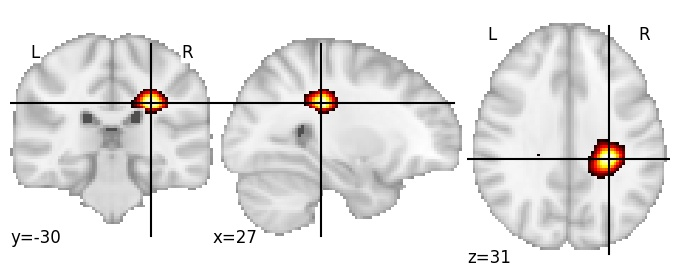](1024/html/2.html)|

| Component 3: Inferior frontal sulcus posterior RH |  
|:---:|  
| [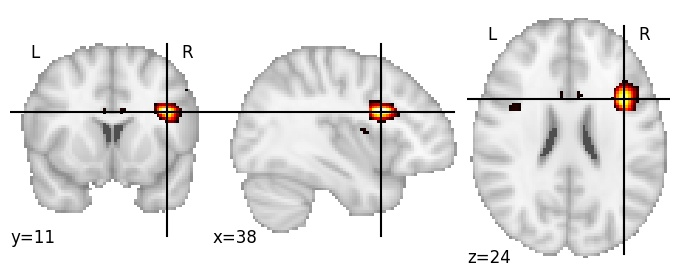](1024/html/3.html)|

| Component 4: Cerebrospinal fluid (between middle frontal gyrus anterior and skull) |  
|:---:|  
| [")](1024/html/4.html)|

| Component 5: Precentral sulcus inferior RH |  
|:---:|  
| [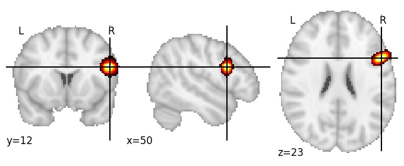](1024/html/5.html)|

| Component 6: Putamen RH |  
|:---:|  
| [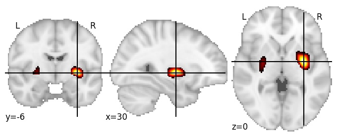](1024/html/6.html)|

| Component 7: Paracingulate gyrus posterior |  
|:---:|  
| [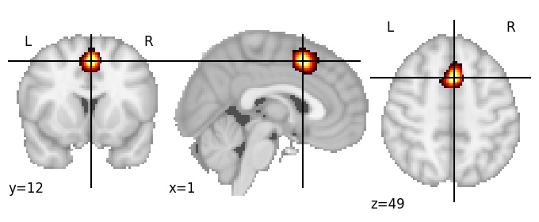](1024/html/7.html)|

| Component 8: Inferior temporal sulcus anterior RH |  
|:---:|  
| [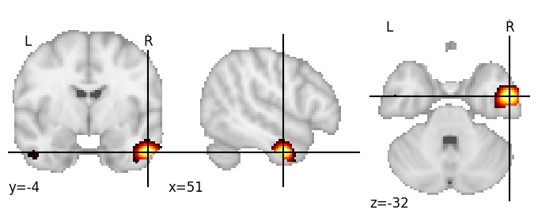](1024/html/8.html)|

| Component 9: Amygdala |  
|:---:|  
| [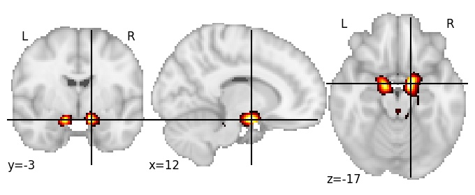](1024/html/9.html)|

| Component 10: Calcarine cortex middle RH |  
|:---:|  
| |

| Component 11: Superior frontal sulcus anterior RH |  
|:---:|  
| |

| Component 12: Superior parietal lobule posterior LH |  
|:---:|  
| [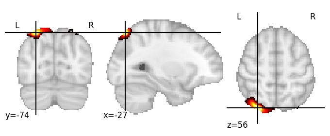](1024/html/12.html)|

| Component 13: Superior parietal lobule LH |  
|:---:|  
| [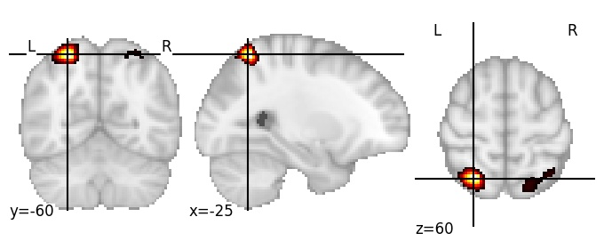](1024/html/13.html)|

| Component 14: Precentral gyrus middle |  
|:---:|  
| [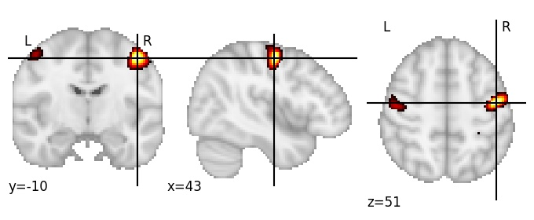](1024/html/14.html)|

| Component 15: Postcentral sulcus superior RH |  
|:---:|  
| [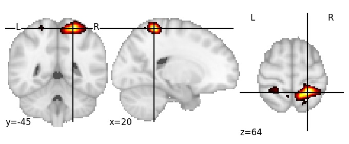](1024/html/15.html)|

| Component 16: Subcentral gyrus, RH |  
|:---:|  
| [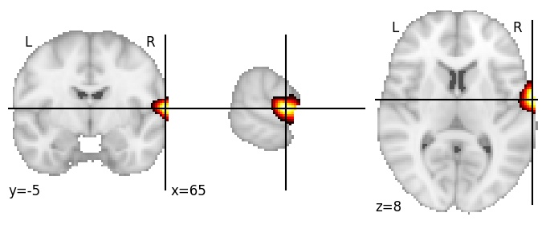](1024/html/16.html)|

| Component 17: Frontal pole lateral RH |  
|:---:|  
| [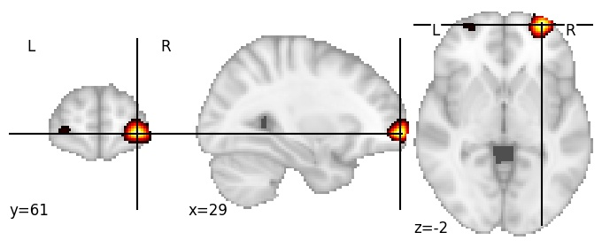](1024/html/17.html)|

| Component 18: Postcentral sulcus superior LH |  
|:---:|  
| [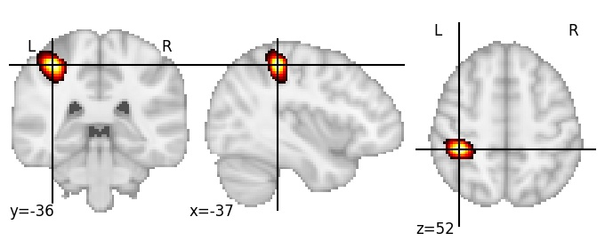](1024/html/18.html)|

| Component 19: Anterior occipital sulcus RH |  
|:---:|  
| [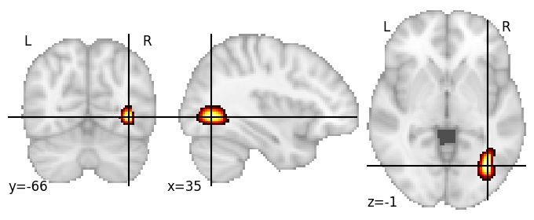](1024/html/19.html)|

| Component 20: Parieto-occipital sulcus middle |  
|:---:|  
| [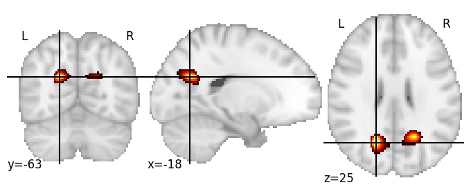](1024/html/20.html)|

| Component 21: Lateral fissure posterior limb LH |  
|:---:|  
| [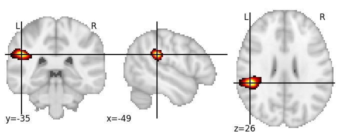](1024/html/21.html)|

| Component 22: Central sulcus superior RH |  
|:---:|  
| [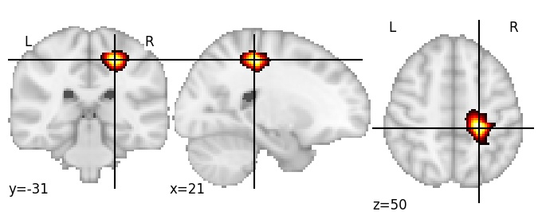](1024/html/22.html)|

| Component 23: Fusiform gyrus RH |  
|:---:|  
| |

| Component 24: Cingulate sulcus middle LH |  
|:---:|  
| |

| Component 25: Intraparietal sulcus posterior RH |  
|:---:|  
| [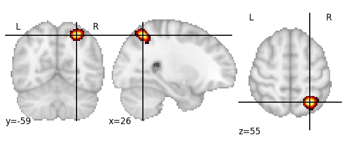](1024/html/25.html)|

| Component 26: Anterior insula RH |  
|:---:|  
| [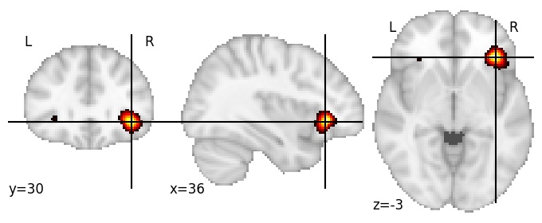](1024/html/26.html)|

| Component 27: Caudate nucleus head |  
|:---:|  
| [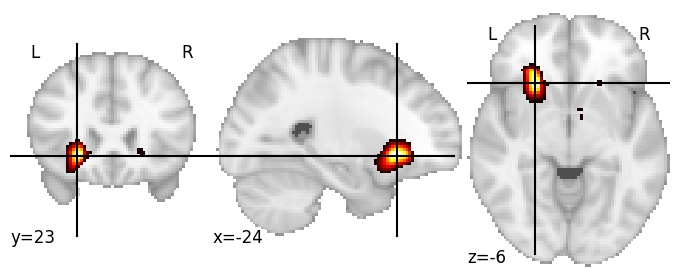](1024/html/27.html)|

| Component 28: Posterior cingulate cortex |  
|:---:|  
| |

| Component 29: Anterior limb of internal capsule |  
|:---:|  
| [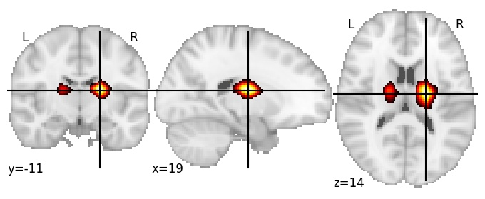](1024/html/29.html)|

| Component 30: Superior parietal lobule posterior RH |  
|:---:|  
| [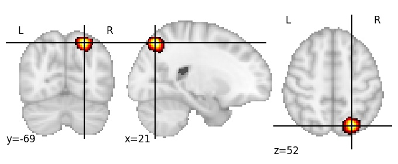](1024/html/30.html)|

| Component 31: Lateral occipital cortex anterior RH |  
|:---:|  
| |

| Component 32: Middle frontal gyrus posterior RH |  
|:---:|  
| [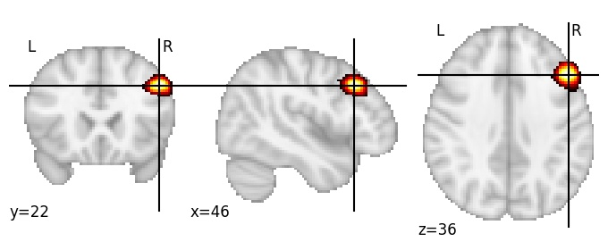](1024/html/32.html)|

| Component 33: Parieto-occipital sulcus middle LH |  
|:---:|  
| [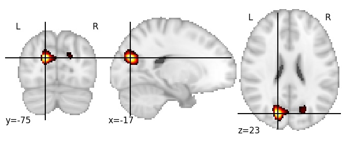](1024/html/33.html)|

| Component 34: Frontal pole LH |  
|:---:|  
| [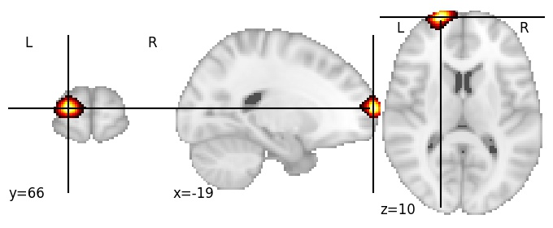](1024/html/34.html)|

| Component 35: Splenium of corpus callosum |  
|:---:|  
| [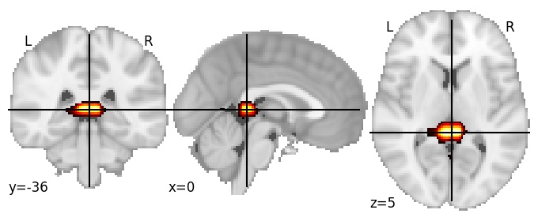](1024/html/35.html)|

| Component 36: Mid-anterior cingulate cortex LH |  
|:---:|  
| [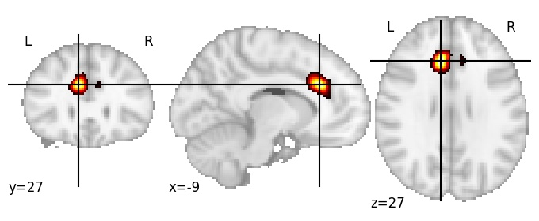](1024/html/36.html)|

| Component 37: Precentral sulcus middle RH |  
|:---:|  
| [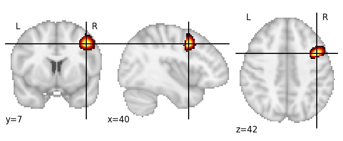](1024/html/37.html)|

| Component 38: Thalamus LH |  
|:---:|  
| [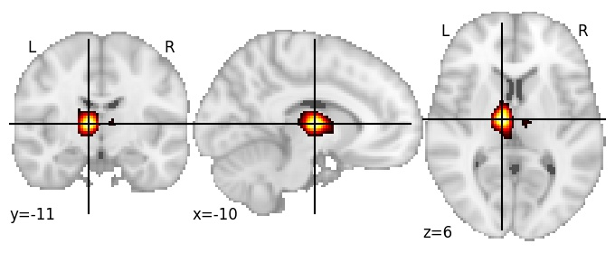](1024/html/38.html)|

| Component 39: Fusiform gyrus anterior RH |  
|:---:|  
| [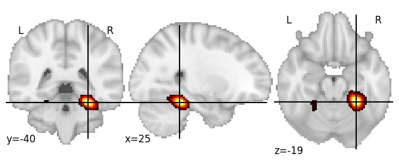](1024/html/39.html)|

| Component 40: Precentral sulcus superior LH |  
|:---:|  
| [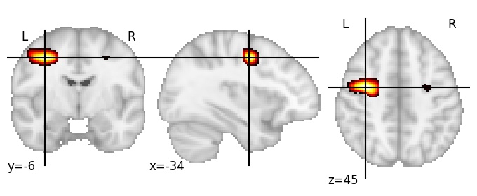](1024/html/40.html)|

| Component 41: Central opercular cortex LH |  
|:---:|  
| [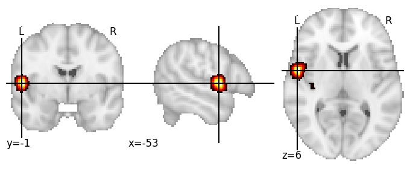](1024/html/41.html)|

| Component 42: Cerebellum VI dorsal |  
|:---:|  
| [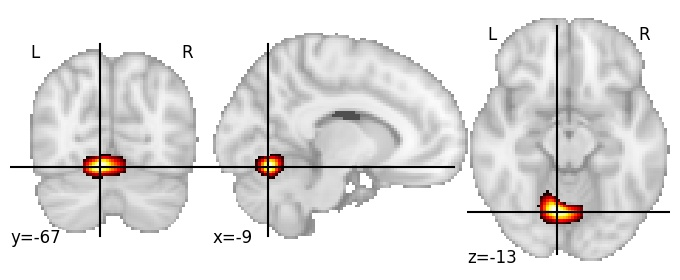](1024/html/42.html)|

| Component 43: Mid-anterior corpus callosum |  
|:---:|  
| |

| Component 44: Cerebrospinal fluid (between precentral gyrus and skull) |  
|:---:|  
| [")](1024/html/44.html)|

| Component 45: Heschl’s gyrus RH |  
|:---:|  
| |

| Component 46: Lingual gyrus posterior RH |  
|:---:|  
| [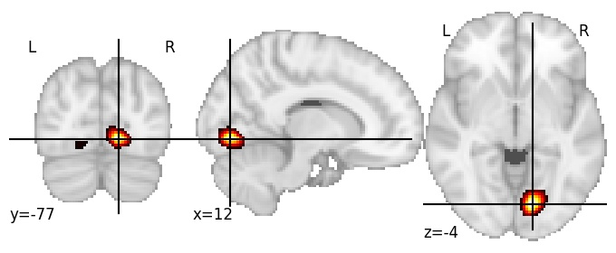](1024/html/46.html)|

| Component 47: Precentral sulcus middle RH |  
|:---:|  
| [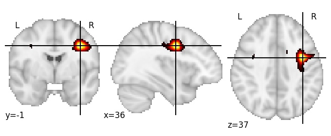](1024/html/47.html)|

| Component 48: Superior frontal sulcus posterior LH |  
|:---:|  
| |

| Component 49: Cerebellum VI superior RH |  
|:---:|  
| |

| Component 50: Third ventricle |  
|:---:|  
| [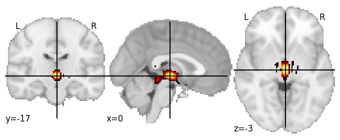](1024/html/50.html)|

| Component 51: Lateral fissure posterior limb RH |  
|:---:|  
| [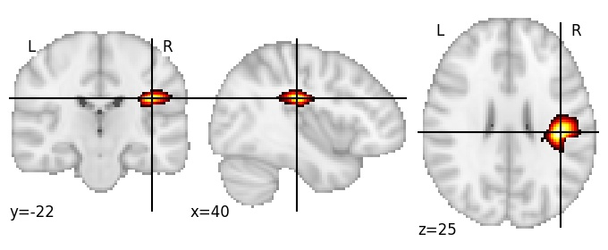](1024/html/51.html)|

| Component 52: Superior parietal lobule posterior RH |  
|:---:|  
| [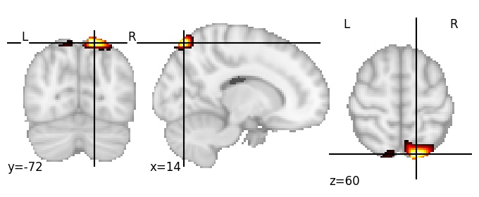](1024/html/52.html)|

| Component 53: Middle temporal gyrus anterior RH |  
|:---:|  
| [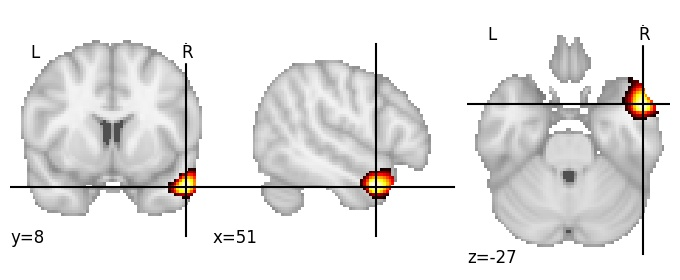](1024/html/53.html)|

| Component 54: Retrosplenial cortex |  
|:---:|  
| [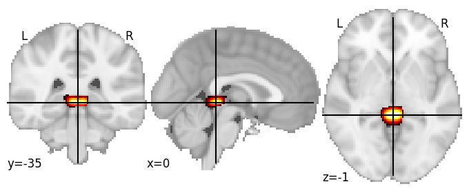](1024/html/54.html)|

| Component 55: Middle temporal gyrus middle LH |  
|:---:|  
| [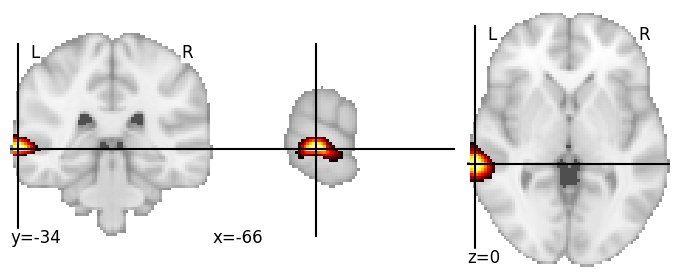](1024/html/55.html)|

| Component 56: Anterior insula ventral LH |  
|:---:|  
| |

| Component 57: Inferior frontal sulcus posterior RH |  
|:---:|  
| [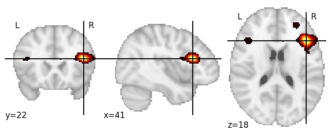](1024/html/57.html)|

| Component 58: Hippocampal fissure |  
|:---:|  
| [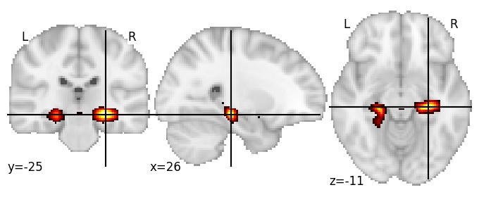](1024/html/58.html)|

| Component 59: Splenium of corpus callosum |  
|:---:|  
| [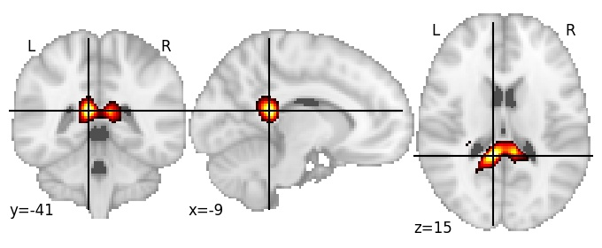](1024/html/59.html)|

| Component 60: Calcarine cortex posterior LH |  
|:---:|  
| [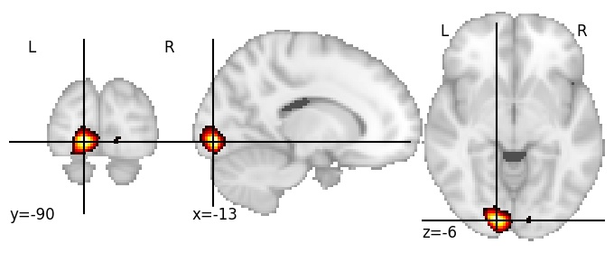](1024/html/60.html)|

| Component 61: Parieto-occipital sulcus posterior LH |  
|:---:|  
| |

| Component 62: Ventral medial prefrontal cortex posterior  |  
|:---:|  
| [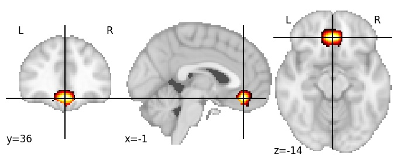](1024/html/62.html)|

| Component 63: Superior frontal sulcus middle LH |  
|:---:|  
| |

| Component 64: Cerebellum V LH |  
|:---:|  
| [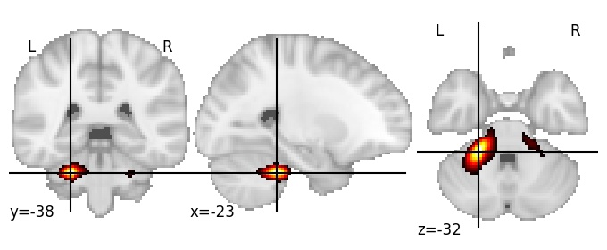](1024/html/64.html)|

| Component 65: Collateral sulcus middle |  
|:---:|  
| [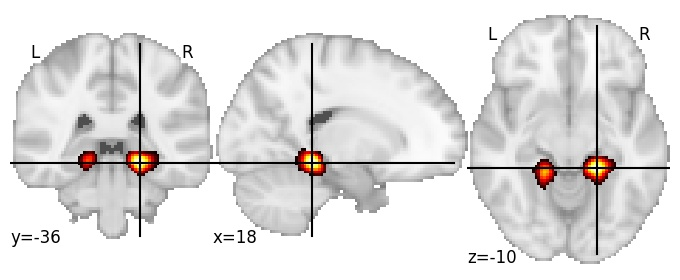](1024/html/65.html)|

| Component 66: Middle frontal gyrus anterior RH |  
|:---:|  
| [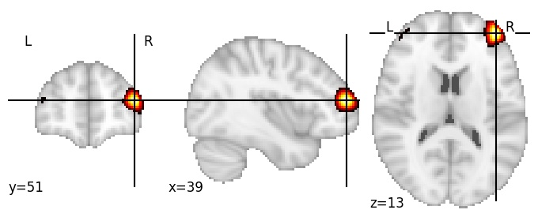](1024/html/66.html)|

| Component 67: Middle temporal gyrus mid-anterior RH |  
|:---:|  
| |

| Component 68: Dorsomedial prefrontal cortex RH |  
|:---:|  
| |

| Component 69: Putamen RH |  
|:---:|  
| |

| Component 70: Posterior cingulate cortex |  
|:---:|  
| |

| Component 71: Heschl’s gyrus LH |  
|:---:|  
| |

| Component 72: Caudate nucleus |  
|:---:|  
| |

| Component 73: Angular gyrus posterior LH |  
|:---:|  
| |

| Component 74: Central sulcus superior LH |  
|:---:|  
| |

| Component 75: Calcarine cortex, cuneal point RH |  
|:---:|  
| |

| Component 76: Fusiform gyrus anterior LH |  
|:---:|  
| |

| Component 77: Parietal operculum RH |  
|:---:|  
| |

| Component 78: Central sulcus LH |  
|:---:|  
| |

| Component 79: Cerebrospinal fluid (between Central sulcus and skull) |  
|:---:|  
| [")](1024/html/79.html)|

| Component 80: Putamen posterior RH |  
|:---:|  
| |

| Component 81: Cuneus inferior |  
|:---:|  
| |

| Component 82: Amygdala |  
|:---:|  
| |

| Component 83: Lateral fissure posterior LH |  
|:---:|  
| |

| Component 84: Cerebellum VIIIab |  
|:---:|  
| |

| Component 85: Cerebellum Crus I RH |  
|:---:|  
| |

| Component 86: Anterior cingulate RH |  
|:---:|  
| |

| Component 87: Cerebrospinal fluid (between middle frontal gyrus and skull) |  
|:---:|  
| [")](1024/html/87.html)|

| Component 88: Cerebrospinal fluid (between superior parietal lobule and skull) |  
|:---:|  
| [")](1024/html/88.html)|

| Component 89: Superior longitudinal fasciculus I anterior LH |  
|:---:|  
| |

| Component 90: Middle frontal gyrus middle LH |  
|:---:|  
| |

| Component 91: Inferior occipital sulcus RH |  
|:---:|  
| |

| Component 92: Calcarine sulcus anterior |  
|:---:|  
| |

| Component 93: Superior longitudinal fasciculus II posterior RH |  
|:---:|  
| |

| Component 94: Calcarine sulcus RH |  
|:---:|  
| |

| Component 95: Thalamus posterior |  
|:---:|  
| |

| Component 96: Cingulate anterior |  
|:---:|  
| |

| Component 97: Superior occipital gyrus RH |  
|:---:|  
| |

| Component 98: Cerebellum IX middle |  
|:---:|  
| |

| Component 99: Lateral ventricle RH |  
|:---:|  
| |

| Component 100: Central sulcus inferior |  
|:---:|  
| |

| Component 101: Angular gyrus superior RH |  
|:---:|  
| |

| Component 102: Occipital pole superior LH |  
|:---:|  
| |

| Component 103: Inferior temporal sulcus posterior LH |  
|:---:|  
| |

| Component 104: Mid-posterior cingulate |  
|:---:|  
| |

| Component 105: Angular gyrus anterior RH |  
|:---:|  
| |

| Component 106: Olfactory sulcus RH |  
|:---:|  
| |

| Component 107: Posterior horn of internal capsule LH |  
|:---:|  
| |

| Component 108: Middle cerebellar peduncle |  
|:---:|  
| |

| Component 109: Middle frontal gyrus anterior LH |  
|:---:|  
| |

| Component 110: Inferior frontal sulcus anterior LH |  
|:---:|  
| |

| Component 111: Calcarine sulcus anterior |  
|:---:|  
| |

| Component 112: Superior frontal gyrus mid-posterior RH |  
|:---:|  
| |

| Component 113: Middle temporal gyrus anterior LH |  
|:---:|  
| |

| Component 114: Inferior callosomarginal sulcus |  
|:---:|  
| |

| Component 115: Inferior frontal sulcus anterior RH |  
|:---:|  
| |

| Component 116: Pars opercularis LH |  
|:---:|  
| |

| Component 117: Lingual gyrus posterior RH |  
|:---:|  
| |

| Component 118: Pars triangularis RH |  
|:---:|  
| |

| Component 119: Fornix posterior |  
|:---:|  
| |

| Component 120: Cerebellum Crus I lateral LH |  
|:---:|  
| |

| Component 121: Fusiform gyrus RH |  
|:---:|  
| |

| Component 122: Inferior occipital gyrus anterior LH |  
|:---:|  
| |

| Component 123: Superior temporal sulcus anterior LH |  
|:---:|  
| |

| Component 124: Callosomarginal sulcus superior RH |  
|:---:|  
| |

| Component 125: Superior frontal sulcus posterior |  
|:---:|  
| |

| Component 126: Frontal pole lateral LH |  
|:---:|  
| |

| Component 127: Superior parts of central and postcentral sulci LH |  
|:---:|  
| |

| Component 128: Subparietal sulcus LH |  
|:---:|  
| |

| Component 129: Supramarginal gyrus posterior RH |  
|:---:|  
| |

| Component 130: Collateral sulcus anterior |  
|:---:|  
| |

| Component 131: Thalamus lateral LH |  
|:---:|  
| |

| Component 132: Precentral gyrus inferior LH |  
|:---:|  
| |

| Component 133: Occipitotemporal sulcus RH |  
|:---:|  
| |

| Component 134: Subgenual cortex |  
|:---:|  
| |

| Component 135: Inferior frontal gyrus anterior RH |  
|:---:|  
| |

| Component 136: Superior temporal sulcus posterior LH |  
|:---:|  
| |

| Component 137: Superior occipital gyrus |  
|:---:|  
| |

| Component 138: Frontal pole LH |  
|:---:|  
| |

| Component 139: Superior longitudinal fasciculus III posterior LH |  
|:---:|  
| |

| Component 140: Precentral sulcus superior RH |  
|:---:|  
| |

| Component 141: Intraparietal sulcus anterior LH |  
|:---:|  
| |

| Component 142: Frontal pole inferior |  
|:---:|  
| |

| Component 143: Optic radiation posterior LH |  
|:---:|  
| |

| Component 144: Superior temporal sulcus posterior RH |  
|:---:|  
| |

| Component 145: Mammillary bodies |  
|:---:|  
| |

| Component 146: Optic radiation posterior RH |  
|:---:|  
| |

| Component 147: Caudate LH |  
|:---:|  
| |

| Component 148: Parietal operculum RH |  
|:---:|  
| |

| Component 149: Putamen anterior RH |  
|:---:|  
| |

| Component 150: Intraparietal sulcus anterior RH |  
|:---:|  
| |

| Component 151: Precentral gyrus superior LH |  
|:---:|  
| |

| Component 152: Superior temporal sulcus middle LH |  
|:---:|  
| |

| Component 153: Caudate anterior |  
|:---:|  
| |

| Component 154: Superior parts of postcentral gyrus and superior parietal lobule LH |  
|:---:|  
| |

| Component 155: Occipital pole superior RH |  
|:---:|  
| |

| Component 156: Mid-anterior paracingulate gyrus LH |  
|:---:|  
| |

| Component 157: Occipitotemporal sulcus RH |  
|:---:|  
| |

| Component 158: Calcarine sulcus posterior LH |  
|:---:|  
| |

| Component 159: Parieto-occipital sulcus middle RH |  
|:---:|  
| |

| Component 160: Internal capsule anterior LH |  
|:---:|  
| |

| Component 161: Mid-posterior cingulate cortex |  
|:---:|  
| |

| Component 162: Superior frontal gyrus posterior RH |  
|:---:|  
| |

| Component 163: Superior frontal sulcus posterior LH |  
|:---:|  
| |

| Component 164: Cerebellum VIIb |  
|:---:|  
| |

| Component 165: Fusiform gyrus posterior RH |  
|:---:|  
| |

| Component 166: Callosal sulcus middle |  
|:---:|  
| |

| Component 167: Forceps major posterior LH |  
|:---:|  
| |

| Component 168: Fornix anterior |  
|:---:|  
| |

| Component 169: Temporal pole LH |  
|:---:|  
| |

| Component 170: Cerebellum VI |  
|:---:|  
| |

| Component 171: Central opercular cortex LH |  
|:---:|  
| |

| Component 172: Hippocampus |  
|:---:|  
| |

| Component 173: Lateral occipital cortex anterior LH |  
|:---:|  
| |

| Component 174: Cerebellum Crus I superior RH |  
|:---:|  
| |

| Component 175: Dorsomedial prefrontal cortex, anterocaudal |  
|:---:|  
| |

| Component 176: Superior temporal gyrus posterior LH |  
|:---:|  
| |

| Component 177: Inferior occipital gyrus LH |  
|:---:|  
| |

| Component 178: Intraparietal sulcus posterior RH |  
|:---:|  
| |

| Component 179: Inferior temporal sulcus posterior LH |  
|:---:|  
| |

| Component 180: Cerebrospinal fluid (between precentral gyrus and skull RH) |  
|:---:|  
| [")](1024/html/180.html)|

| Component 181: Globus pallidus |  
|:---:|  
| |

| Component 182: Medial orbital cortex LH |  
|:---:|  
| |

| Component 183: Central sulcus inferior LH |  
|:---:|  
| |

| Component 184: Anterior insula posterodorsal RH |  
|:---:|  
| |

| Component 185: Middle frontal gyrus posterior RH |  
|:---:|  
| |

| Component 186: Superior frontal gyrus posterior LH |  
|:---:|  
| |

| Component 187: Posterior limb of internal capsule LH |  
|:---:|  
| |

| Component 188: Lateral occipital cortex superior LH |  
|:---:|  
| |

| Component 189: Precuneus posterior LH |  
|:---:|  
| |

| Component 190: Middle cerebellar peduncle |  
|:---:|  
| |

| Component 191: Superior frontal gyrus posterior RH |  
|:---:|  
| |

| Component 192: Angular gyrus posterior RH |  
|:---:|  
| |

| Component 193: Cerebrospinal fluid (between superior frontal sulcus and skull LH) |  
|:---:|  
| [")](1024/html/193.html)|

| Component 194: Superior parietal lobule RH |  
|:---:|  
| |

| Component 195: Frontal pole superior RH |  
|:---:|  
| |

| Component 196: Lateral ventricles  |  
|:---:|  
| |

| Component 197: Cuneus anterior |  
|:---:|  
| |

| Component 198: Postcentral sulcus inferior LH |  
|:---:|  
| |

| Component 199: Intraparietal sulcus posterior LH |  
|:---:|  
| |

| Component 200: Thalamus lateral |  
|:---:|  
| |

| Component 201: Amygdala RH |  
|:---:|  
| |

| Component 202: Subcentral gyrus LH |  
|:---:|  
| |

| Component 203: Precuneus medial LH |  
|:---:|  
| |

| Component 204: Mid-anterior cingulate cortex |  
|:---:|  
| |

| Component 205: Heschl’s gyrus LH |  
|:---:|  
| |

| Component 206: Superior temporal sulcus posterior RH |  
|:---:|  
| |

| Component 207: Superior frontal sulcus middle RH |  
|:---:|  
| |

| Component 208: Inferior temporal sulcus posterior LH |  
|:---:|  
| |

| Component 209: Superior frontal sulcus posterior LH |  
|:---:|  
| |

| Component 210: Anterior horns of internal capsule |  
|:---:|  
| |

| Component 211: Precuneus posterior RH |  
|:---:|  
| |

| Component 212: Cingulate anterior RH |  
|:---:|  
| |

| Component 213: Precentral sulcus inferior RH |  
|:---:|  
| |

| Component 214: Angular sulcus inferior RH |  
|:---:|  
| |

| Component 215: Frontal pole medial |  
|:---:|  
| |

| Component 216: Cerebellum X |  
|:---:|  
| |

| Component 217: Cerebellum Crus I LH |  
|:---:|  
| |

| Component 218: Pars triangularis RH |  
|:---:|  
| |

| Component 219: Superior occipital sulcus inferior RH |  
|:---:|  
| |

| Component 220: Corpus callosum isthmus |  
|:---:|  
| |

| Component 221: Planum polare |  
|:---:|  
| |

| Component 222: Precentral gyrus superior RH |  
|:---:|  
| |

| Component 223: Subparietal sulcus RH |  
|:---:|  
| |

| Component 224: Lateral occipital cortex superior LH |  
|:---:|  
| |

| Component 225: Parietal operculum RH |  
|:---:|  
| |

| Component 226: Angular gyrus posterior LH |  
|:---:|  
| |

| Component 227: Anterior commissure |  
|:---:|  
| |

| Component 228: Cerebrospinal fluid (between superior occipital gyrus and skull LH) |  
|:---:|  
| [")](1024/html/228.html)|

| Component 229: Anterior insula ventral |  
|:---:|  
| |

| Component 230: Superior temporal sulcus posterior RH |  
|:---:|  
| |

| Component 231: Angular gyrus inferior RH |  
|:---:|  
| |

| Component 232: Precentral sulcus superior RH |  
|:---:|  
| |

| Component 233: Precentral gyrus superior LH |  
|:---:|  
| |

| Component 234: Precentral gyrus mid-superior LH |  
|:---:|  
| |

| Component 235: Anterior cingulate cortex |  
|:---:|  
| |

| Component 236: Cerebellum horizontal fissure LH |  
|:---:|  
| |

| Component 237: Central sulcus inferior LH |  
|:---:|  
| |

| Component 238: Lateral fissure anterior rami RH |  
|:---:|  
| |

| Component 239: Anterior insula RH |  
|:---:|  
| |

| Component 240: Middle frontal gyrus posterior RH |  
|:---:|  
| |

| Component 241: Cerebrospinal fluid (between Precentral sulcus and skull) |  
|:---:|  
| [")](1024/html/241.html)|

| Component 242: Supramarginal gyrus inferior LH |  
|:---:|  
| |

| Component 243: Parieto-occipital sulcus middle LH |  
|:---:|  
| |

| Component 244: Paracentral lobule inferior |  
|:---:|  
| |

| Component 245: Fusiform gyrus LH |  
|:---:|  
| |

| Component 246: Inferior temporal sulcus middle RH |  
|:---:|  
| |

| Component 247: Fusiform gyrus posterior LH |  
|:---:|  
| |

| Component 248: Fluid between cerebellum and occipital cortex |  
|:---:|  
| |

| Component 249: Angular sulcus inferior LH |  
|:---:|  
| |

| Component 250: Hippocampus LH |  
|:---:|  
| |

| Component 251: Caudate posterior  |  
|:---:|  
| |

| Component 252: Cerebellum Crus I LH |  
|:---:|  
| |

| Component 253: Supramarginal gyrus posterior LH |  
|:---:|  
| |

| Component 254: Middle frontal gyrus anterior RH |  
|:---:|  
| |

| Component 255: Precuneus anterior LH |  
|:---:|  
| |

| Component 256: Fornix |  
|:---:|  
| |

| Component 257: Heschl’s gyrus RH |  
|:---:|  
| |

| Component 258: Fluid between cerebellum and peduncle |  
|:---:|  
| |

| Component 259: Superior temporal sulcus posterior RH |  
|:---:|  
| |

| Component 260: Intraparietal sulcus LH |  
|:---:|  
| |

| Component 261: Cerebellum Vermis X |  
|:---:|  
| |

| Component 262: Midbrain  |  
|:---:|  
| |

| Component 263: Middle cingulate RH |  
|:---:|  
| |

| Component 264: Anterior cingulate cortex superior |  
|:---:|  
| |

| Component 265: Precentral sulcus RH |  
|:---:|  
| |

| Component 266: Parieto-occipital sulcus anterior |  
|:---:|  
| |

| Component 267: Parieto-occipital sulcus posterior |  
|:---:|  
| |

| Component 268: Postcentral gyrus LH |  
|:---:|  
| |

| Component 269: Lateral occipital cortex superior LH |  
|:---:|  
| |

| Component 270: Postcentral sulcus  RH |  
|:---:|  
| |

| Component 271: Inferior occipital sulcus RH |  
|:---:|  
| |

| Component 272: Frontal pole RH |  
|:---:|  
| |

| Component 273: Anterior insula ventral LH |  
|:---:|  
| |

| Component 274: Lateral occipital sulcus LH |  
|:---:|  
| |

| Component 275: Postcentral gyrus superior |  
|:---:|  
| |

| Component 276: Superior parietal lobule LH |  
|:---:|  
| |

| Component 277: Superior frontal gyrus middle LH |  
|:---:|  
| |

| Component 278: Cerebrospinal fluid (between pre and postcentral gyri and skull LH) |  
|:---:|  
| [")](1024/html/278.html)|

| Component 279: Supramarginal gyrus anteroventral LH |  
|:---:|  
| |

| Component 280: Midbrain  |  
|:---:|  
| |

| Component 281: Thalamus |  
|:---:|  
| |

| Component 282: Cerebrospinal fluid (between frontal pole and skull RH) |  
|:---:|  
| [")](1024/html/282.html)|

| Component 283: Cerebellum VI |  
|:---:|  
| |

| Component 284: Superior occipital gyrus RH |  
|:---:|  
| |

| Component 285: Superior temporal gyrus middle RH |  
|:---:|  
| |

| Component 286: Superior frontal sulcus middle RH |  
|:---:|  
| |

| Component 287: Collateral sulcus anterorior LH |  
|:---:|  
| |

| Component 288: Cuneus superior |  
|:---:|  
| |

| Component 289: Ventral medial prefrontal cortex posterior RH |  
|:---:|  
| |

| Component 290: Cerebellum VI |  
|:---:|  
| |

| Component 291: Cerebellum VIIb |  
|:---:|  
| |

| Component 292: Thalamus RH |  
|:---:|  
| |

| Component 293: Inferior frontal gyrus anterior LH |  
|:---:|  
| |

| Component 294: Angular gyrus superior RH |  
|:---:|  
| |

| Component 295: Lateral fissure middle RH |  
|:---:|  
| |

| Component 296: Parieto-occipital sulcus superior |  
|:---:|  
| |

| Component 297: Cuneus middle LH |  
|:---:|  
| |

| Component 298: Intraparietal sulcus posterior LH |  
|:---:|  
| |

| Component 299: Middle frontal gyrus posterior RH |  
|:---:|  
| |

| Component 300: Cerebellum Crus II |  
|:---:|  
| |

| Component 301: Superior frontal gyrus middle |  
|:---:|  
| |

| Component 302: Cerebellum IV |  
|:---:|  
| |

| Component 303: Anterior horizontal ramus of the Lateral fissure RH |  
|:---:|  
| |

| Component 304: Supramarginal gyrus superior LH |  
|:---:|  
| |

| Component 305: Posterior insula dorsal LH |  
|:---:|  
| |

| Component 306: Intracalcarine cortex |  
|:---:|  
| |

| Component 307: Lateral occipital cortex inferior LH |  
|:---:|  
| |

| Component 308: Posterior insula ventral RH |  
|:---:|  
| |

| Component 309: Precentral gyrus inferior |  
|:---:|  
| |

| Component 310: Caudate LH |  
|:---:|  
| |

| Component 311: Superior temporal gyrus anterior |  
|:---:|  
| |

| Component 312: Optic radiation posterior LH |  
|:---:|  
| |

| Component 313: Anterior horn of internal capsule LH |  
|:---:|  
| |

| Component 314: Superior temporal sulcus posterior LH |  
|:---:|  
| |

| Component 315: Postcentral sulcus LH |  
|:---:|  
| |

| Component 316: Lateral fissure posterior RH |  
|:---:|  
| |

| Component 317: Optic chiasm |  
|:---:|  
| |

| Component 318: Superior frontal gyrus medial posterior |  
|:---:|  
| |

| Component 319: Cerebellum VIIb  |  
|:---:|  
| |

| Component 320: Optic radiation posterior RH |  
|:---:|  
| |

| Component 321: Fluid between cerebellum and peduncle |  
|:---:|  
| |

| Component 322: Frontal operculum |  
|:---:|  
| |

| Component 323: Calcarine cortex posterior RH |  
|:---:|  
| |

| Component 324: Genu of corpus callosum LH |  
|:---:|  
| |

| Component 325: Superior frontal gyrus superior RH |  
|:---:|  
| |

| Component 326: Precentral gyrus superior |  
|:---:|  
| |

| Component 327: Precentral sulcus medial LH |  
|:---:|  
| |

| Component 328: Postcentral gyrus inferior RH |  
|:---:|  
| |

| Component 329: Superior parietal lobule superior |  
|:---:|  
| |

| Component 330: Occipital pole inferior LH |  
|:---:|  
| |

| Component 331: Superior parietal lobule RH |  
|:---:|  
| |

| Component 332: Angular gyrus posterior RH |  
|:---:|  
| |

| Component 333: Parahippocampal gyrus RH |  
|:---:|  
| |

| Component 334: Anterior vertical ramus of the Lateral fissure LH |  
|:---:|  
| |

| Component 335: Frontal orbital cortex  |  
|:---:|  
| |

| Component 336: Precuneus superior RH |  
|:---:|  
| |

| Component 337: Superior frontal sulcus posterior RH |  
|:---:|  
| |

| Component 338: Superior occipital gyrus LH |  
|:---:|  
| |

| Component 339: Superior frontal sulcus RH |  
|:---:|  
| |

| Component 340: Lateral fissure posterior LH |  
|:---:|  
| |

| Component 341: Posterior corona radiata RH |  
|:---:|  
| |

| Component 342: Occipital pole inferior RH |  
|:---:|  
| |

| Component 343: Lingual gyrus RH |  
|:---:|  
| |

| Component 344: Inferior temporal sulcus posterior RH |  
|:---:|  
| |

| Component 345: Temporal horn of lateral ventricle RH |  
|:---:|  
| |

| Component 346: Frontal pole medial LH |  
|:---:|  
| |

| Component 347: Cerebellum Crus I RH |  
|:---:|  
| |

| Component 348: Precentral sulcus inferior LH |  
|:---:|  
| |

| Component 349: Callosomarginal sulcus inferior |  
|:---:|  
| |

| Component 350: Occipital pole lateral LH |  
|:---:|  
| |

| Component 351: Superior occipital sulcus inferior LH |  
|:---:|  
| |

| Component 352: Cerebellum VI LH |  
|:---:|  
| |

| Component 353: Intraparietal sulcus LH |  
|:---:|  
| |

| Component 354: Precentral sulcus superior LH |  
|:---:|  
| |

| Component 355: Frontomarginal sulcus RH |  
|:---:|  
| |

| Component 356: Frontal orbital cortex RH |  
|:---:|  
| |

| Component 357: Inferior temporal gyrus posterior LH |  
|:---:|  
| |

| Component 358: Cerebellum VIIIa |  
|:---:|  
| |

| Component 359: Superior longitudinal fasciculus II anterior LH |  
|:---:|  
| |

| Component 360: Lateral occipital cortex posterior RH |  
|:---:|  
| |

| Component 361: Frontal pole inferior LH |  
|:---:|  
| |

| Component 362: Lingual gyrus LH |  
|:---:|  
| |

| Component 363: Inferior frontal gyrus LH |  
|:---:|  
| |

| Component 364: Forceps major LH |  
|:---:|  
| |

| Component 365: Occipital pole LH |  
|:---:|  
| |

| Component 366: Middle frontal gyrus anterior RH |  
|:---:|  
| |

| Component 367: Dorsomedial prefrontal cortex, anterior RH |  
|:---:|  
| |

| Component 368: Superior occipital gyrus superior LH |  
|:---:|  
| |

| Component 369: Frontomarginal sulcus LH |  
|:---:|  
| |

| Component 370: Entorhinal cortex |  
|:---:|  
| |

| Component 371: Anterior corona radiata RH |  
|:---:|  
| |

| Component 372: Cuneus anterior RH |  
|:---:|  
| |

| Component 373: Lateral occipital cortex superior LH |  
|:---:|  
| |

| Component 374: Supramarginal gyrus RH |  
|:---:|  
| |

| Component 375: Body of corpus callosum |  
|:---:|  
| |

| Component 376: Precentral gyrus RH |  
|:---:|  
| |

| Component 377: Lunate sulcus RH |  
|:---:|  
| |

| Component 378: Mammillary bodies |  
|:---:|  
| |

| Component 379: Central sulcus of the insula posteroinferior |  
|:---:|  
| |

| Component 380: Occipital pole superior |  
|:---:|  
| |

| Component 381: Postcentral gyrus inferior LH |  
|:---:|  
| |

| Component 382: Superior longitudinal fasciculus III middle RH |  
|:---:|  
| |

| Component 383: Occipital pole medial RH |  
|:---:|  
| |

| Component 384: Cerebrospinal fluid (between superior frontal sulcus and skull) |  
|:---:|  
| [")](1024/html/384.html)|

| Component 385: Cerebellum VI LH |  
|:---:|  
| |

| Component 386: Thalamus posterior |  
|:---:|  
| |

| Component 387: Superior occipital sulcus RH |  
|:---:|  
| |

| Component 388: Superior temporal sulcus middle LH |  
|:---:|  
| |

| Component 389: Superior frontal gyrus anterior RH |  
|:---:|  
| |

| Component 390: Inferior precuneus  |  
|:---:|  
| |

| Component 391: Collateral sulcus posterior LH |  
|:---:|  
| |

| Component 392: Posterior limb of internal capsule RH |  
|:---:|  
| |

| Component 393: Anterior cingulate cortex inferior |  
|:---:|  
| |

| Component 394: Intraparietal sulcus RH |  
|:---:|  
| |

| Component 395: Inferior frontal sulcus middle RH |  
|:---:|  
| |

| Component 396: Dorsomedial prefrontal cortex, anterocaudal |  
|:---:|  
| |

| Component 397: Middle temporal gyrus middle LH |  
|:---:|  
| |

| Component 398: Cingulate sulcus posterior |  
|:---:|  
| |

| Component 399: Anterior limbs of internal capsule |  
|:---:|  
| |

| Component 400: Angular gyrus superior LH |  
|:---:|  
| |

| Component 401: Calcarine cortex posterior LH |  
|:---:|  
| |

| Component 402: Anterior occipital sulcus RH |  
|:---:|  
| |

| Component 403: Anterior limb of internal capsule RH |  
|:---:|  
| |

| Component 404: Cerebrospinal fluid (between lingual gyrus and cerebellum) |  
|:---:|  
| [")](1024/html/404.html)|

| Component 405: Dorsomedial prefrontal cortex |  
|:---:|  
| |

| Component 406: Posterior orbital gyrus LH |  
|:---:|  
| |

| Component 407: Precuneus inferior LH |  
|:---:|  
| |

| Component 408: Inferior frontal sulcus posterior RH |  
|:---:|  
| |

| Component 409: Cerebellum IX |  
|:---:|  
| |

| Component 410: Cerebrospinal fluid (between superior parietal lobule RH and skull) |  
|:---:|  
| [")](1024/html/410.html)|

| Component 411: Cerebellume Vermis IX |  
|:---:|  
| |

| Component 412: Superior frontal gyrus posterior RH |  
|:---:|  
| |

| Component 413: Lateral fissure anterior RH |  
|:---:|  
| |

| Component 414: Anterior orbital gyri LH |  
|:---:|  
| |

| Component 415: Pars opercularis RH |  
|:---:|  
| |

| Component 416: Lateral fissure middle LH |  
|:---:|  
| |

| Component 417: Cerebellum V |  
|:---:|  
| |

| Component 418: Supramarginal gyrus superior RH |  
|:---:|  
| |

| Component 419: Intermediate primus of Jensen RH |  
|:---:|  
| |

| Component 420: Parahippocampal gyrus posterior  |  
|:---:|  
| |

| Component 421: Middle temporal gyrus posterior LH |  
|:---:|  
| |

| Component 422: Lateral orbital gyrus LH |  
|:---:|  
| |

| Component 423: Paracingulate sulcus  anterior LH |  
|:---:|  
| |

| Component 424: Inferior frontal sulcus posterior LH |  
|:---:|  
| |

| Component 425: Amygdala |  
|:---:|  
| |

| Component 426: Caudate LH |  
|:---:|  
| |

| Component 427: Parieto-occipital sulcus middle RH |  
|:---:|  
| |

| Component 428: Middle frontal gyrus anterior LH |  
|:---:|  
| |

| Component 429: Intraparietal sulcus dorsal, RH |  
|:---:|  
| |

| Component 430: Postcentral sulcus inferior LH |  
|:---:|  
| |

| Component 431: Cingulate sulcus posterior LH |  
|:---:|  
| |

| Component 432: Cingulate sulcus mid-anterior |  
|:---:|  
| |

| Component 433: Middle temporal gyrus posterior RH |  
|:---:|  
| |

| Component 434: Parieto-occipital sulcus postero-superior |  
|:---:|  
| |

| Component 435: Cerebellum IX |  
|:---:|  
| |

| Component 436: Precentral gyrus middle LH |  
|:---:|  
| |

| Component 437: Middle temporal gyrus posterior RH |  
|:---:|  
| |

| Component 438: Anterior corona radiata RH |  
|:---:|  
| |

| Component 439: Postcentral gyrus superior RH |  
|:---:|  
| |

| Component 440: Cerebrospinal fluid (between superior frontal sulcus and skull LH) |  
|:---:|  
| [")](1024/html/440.html)|

| Component 441: Thalamus anterior RH |  
|:---:|  
| |

| Component 442: Cerebellum Crus II |  
|:---:|  
| |

| Component 443: Paracingulate gyrus anterior |  
|:---:|  
| |

| Component 444: Pallidum posterior |  
|:---:|  
| |

| Component 445: Parieto-occipital sulcus antero-inferior LH |  
|:---:|  
| |

| Component 446: Angular gyrus superior RH |  
|:---:|  
| |

| Component 447: Collateral sulcus anterior  |  
|:---:|  
| |

| Component 448: Superior parietal sulcus LH |  
|:---:|  
| |

| Component 449: Calcarine sulcus anterior LH |  
|:---:|  
| |

| Component 450: Cerebrospinal fluid (between occipital pole superior and skull) |  
|:---:|  
| [")](1024/html/450.html)|

| Component 451: Middle frontal gyrus middle RH |  
|:---:|  
| |

| Component 452: Paracingulate gyrus anterior LH |  
|:---:|  
| |

| Component 453: Cerebellum IV |  
|:---:|  
| |

| Component 454: Anterior internal capsule RH |  
|:---:|  
| |

| Component 455: Cerebrospinal fluid (between superior frontal gyrus and skull LH) |  
|:---:|  
| [")](1024/html/455.html)|

| Component 456: Cerebellum VI LH |  
|:---:|  
| |

| Component 457: Posterior insula |  
|:---:|  
| |

| Component 458: Superior temporal sulcus middle LH |  
|:---:|  
| |

| Component 459: Forceps minor RH |  
|:---:|  
| |

| Component 460: Superior temporal sulcus antero-inferior RH |  
|:---:|  
| |

| Component 461: Precuneus posterior |  
|:---:|  
| |

| Component 462: Forceps major middle |  
|:---:|  
| |

| Component 463: Pars orbitalis LH |  
|:---:|  
| |

| Component 464: Cerebellum Crus I LH |  
|:---:|  
| |

| Component 465: Superior longitudinal fasciculus III anterior RH |  
|:---:|  
| |

| Component 466: Calcarine cortex middle LH |  
|:---:|  
| |

| Component 467: Callosomarginal sulcus LH |  
|:---:|  
| |

| Component 468: Lateral occipital cortex RH |  
|:---:|  
| |

| Component 469: Thalamus superior |  
|:---:|  
| |

| Component 470: Intraparietal sulcus posterior RH |  
|:---:|  
| |

| Component 471: Parahippocampal gyrus anterior LH |  
|:---:|  
| |

| Component 472: Lateral frontal pole LH |  
|:---:|  
| |

| Component 473: Lateral occipital cortex superior RH |  
|:---:|  
| |

| Component 474: Middle temporal gyrus middle RH |  
|:---:|  
| |

| Component 475: Paracingulate gyrus mid-anterior LH |  
|:---:|  
| |

| Component 476: Cerebellum IV |  
|:---:|  
| |

| Component 477: Cingulate mid-anterior RH |  
|:---:|  
| |

| Component 478: Inferior frontal sulcus anterior LH |  
|:---:|  
| |

| Component 479: Pons |  
|:---:|  
| |

| Component 480: Parahippocampal gyrus posterior  |  
|:---:|  
| |

| Component 481: Precentral gyrus middle RH |  
|:---:|  
| |

| Component 482: Frontal operculum LH |  
|:---:|  
| |

| Component 483: Middle frontal gyrus middle LH |  
|:---:|  
| |

| Component 484: Middle frontal gyrus mid-anterior LH |  
|:---:|  
| |

| Component 485: Caudate dorsal |  
|:---:|  
| |

| Component 486: Caudate ventral |  
|:---:|  
| |

| Component 487: Superior temporal gyrus middle LH |  
|:---:|  
| |

| Component 488: Globus pallidus |  
|:---:|  
| |

| Component 489: Thalamus lateral |  
|:---:|  
| |

| Component 490: Superior temporal sulcus posterior LH |  
|:---:|  
| |

| Component 491: Cerebellar peduncles |  
|:---:|  
| |

| Component 492: Frontal pole superior LH |  
|:---:|  
| |

| Component 493: Posterior cingulate cortex |  
|:---:|  
| |

| Component 494: Lateral fissure anterior LH |  
|:---:|  
| |

| Component 495: Intraparietal sulcus anterior LH |  
|:---:|  
| |

| Component 496: Angular gyrus anterior LH |  
|:---:|  
| |

| Component 497: Intermediate primus of Jensen LH |  
|:---:|  
| |

| Component 498: Pars triangularis LH |  
|:---:|  
| |

| Component 499: Inferior temporal gyrus posterior RH |  
|:---:|  
| |

| Component 500: Lateral fissure middle LH |  
|:---:|  
| |

| Component 501: Internal capsule posterior LH |  
|:---:|  
| |

| Component 502: Cerebellum Crus II RH |  
|:---:|  
| |

| Component 503: Inferior occipital gyrus LH |  
|:---:|  
| |

| Component 504: Superior temporal gyrus anterior LH |  
|:---:|  
| |

| Component 505: Precentral gyrus superior |  
|:---:|  
| |

| Component 506: Superior frontal gyrus superior RH |  
|:---:|  
| |

| Component 507: Supramarginal gyrus antero-inferior RH |  
|:---:|  
| |

| Component 508: Paracentral lobule superior |  
|:---:|  
| |

| Component 509: Paracingulate gyrus middle |  
|:---:|  
| |

| Component 510: Central sulcus inferior RH |  
|:---:|  
| |

| Component 511: Occipitotemporal sulcus posterior RH |  
|:---:|  
| |

| Component 512: Parahippocampal gyrus posterior LH |  
|:---:|  
| |

| Component 513: Posterior insula ventral |  
|:---:|  
| |

| Component 514: Inferior frontal sulcus anterior RH |  
|:---:|  
| |

| Component 515: Subparietal sulcus LH |  
|:---:|  
| |

| Component 516: Precentral sulcus inferior RH |  
|:---:|  
| |

| Component 517: Superior frontal gyrus posterior RH |  
|:---:|  
| |

| Component 518: Superior longitudinal fasciculus II posterior RH |  
|:---:|  
| |

| Component 519: Third ventricles |  
|:---:|  
| |

| Component 520: Cingulate posterior |  
|:---:|  
| |

| Component 521: Cuneus superior LH |  
|:---:|  
| |

| Component 522: Postcentral gyrus middle LH |  
|:---:|  
| |

| Component 523: Precuneus superior RH |  
|:---:|  
| |

| Component 524: Temporal pole superior |  
|:---:|  
| |

| Component 525: Intermediate primus of Jensen RH |  
|:---:|  
| |

| Component 526: Paracingulate gyrus posterior RH |  
|:---:|  
| |

| Component 527: Anterior rami of the lateral fissure RH |  
|:---:|  
| |

| Component 528: Angular sulcus superior RH |  
|:---:|  
| |

| Component 529: Retrosplenial cortex |  
|:---:|  
| |

| Component 530: Internal capsule |  
|:---:|  
| |

| Component 531: Cerebellum Crus I RH |  
|:---:|  
| |

| Component 532: Inferior temporal gyrus middle RH |  
|:---:|  
| |

| Component 533: Superior rostral gyrus anterior |  
|:---:|  
| |

| Component 534: Superior frontal gyrus anterior LH |  
|:---:|  
| |

| Component 535: Inferior frontal sulcus posterior LH |  
|:---:|  
| |

| Component 536: Cingulum middle RH |  
|:---:|  
| |

| Component 537: Cerebrospinal fluid (between postcentral gyrus and skull LH) |  
|:---:|  
| [")](1024/html/537.html)|

| Component 538: Cerebrospinal fluid (between paracentral lobule and skull) |  
|:---:|  
| [")](1024/html/538.html)|

| Component 539: Superior temporal gyrus middle RH |  
|:---:|  
| |

| Component 540: Superior longitudinal fasciculus III posterior LH |  
|:---:|  
| |

| Component 541: Superior frontal gyrus medial posterior |  
|:---:|  
| |

| Component 542: Postcentral sulcus RH |  
|:---:|  
| |

| Component 543: Superior temporal gyrus anterior LH |  
|:---:|  
| |

| Component 544: Postcentral gyrus LH |  
|:---:|  
| |

| Component 545: Superior temporal sulcus posterior LH |  
|:---:|  
| |

| Component 546: Corpus callosum posterior body |  
|:---:|  
| |

| Component 547: Cerebrospinal fluid (between postcentral gyrus and skull RH) |  
|:---:|  
| [")](1024/html/547.html)|

| Component 548: Superior frontal gyrus medial middle |  
|:---:|  
| |

| Component 549: Collateral sulcus anterior RH |  
|:---:|  
| |

| Component 550: Postcentral gyrus middle LH |  
|:---:|  
| |

| Component 551: Lateral fissure anterior RH |  
|:---:|  
| |

| Component 552: Cerebellum Crus I LH |  
|:---:|  
| |

| Component 553: Paracentral sulcus LH |  
|:---:|  
| |

| Component 554: Superior frontal gyrus antero-superior LH |  
|:---:|  
| |

| Component 555: Cuneus |  
|:---:|  
| |

| Component 556: Superior frontal sulcus RH |  
|:---:|  
| |

| Component 557: Lateral fissure posterior RH |  
|:---:|  
| |

| Component 558: Planum temporale RH |  
|:---:|  
| |

| Component 559: Posterior insula ventral RH |  
|:---:|  
| |

| Component 560: Pons |  
|:---:|  
| |

| Component 561: Precuneus superior LH |  
|:---:|  
| |

| Component 562: Superior longitudinal fasciculus II middle LH |  
|:---:|  
| |

| Component 563: Medulla oblongata |  
|:---:|  
| |

| Component 564: Cerebellum VI |  
|:---:|  
| |

| Component 565: Parieto-occipital sulcus anterior |  
|:---:|  
| |

| Component 566: Inferior frontal sulcus posterior LH |  
|:---:|  
| |

| Component 567: Anterior insula anterodorsal |  
|:---:|  
| |

| Component 568: Middle frontal gyrus anterior RH |  
|:---:|  
| |

| Component 569: Superior parietal lobule LH |  
|:---:|  
| |

| Component 570: Cerebrospinal fluid (between superior frontal gyrus and skull RH) |  
|:---:|  
| [")](1024/html/570.html)|

| Component 571: Precuneus middle RH |  
|:---:|  
| |

| Component 572: Paracingulate gyrus mid-posterior LH |  
|:---:|  
| |

| Component 573: Superior occipital sulcus inferior LH |  
|:---:|  
| |

| Component 574: Cerebrospinal fluid (between superior parietal lobule LH and skull) |  
|:---:|  
| [")](1024/html/574.html)|

| Component 575: Superior frontal sulcus posterior LH |  
|:---:|  
| |

| Component 576: Superior parietal lobule RH |  
|:---:|  
| |

| Component 577: Intraparietal sulcus anterior RH |  
|:---:|  
| |

| Component 578: Central operculum |  
|:---:|  
| |

| Component 579: Superior frontal gyrus middle  |  
|:---:|  
| |

| Component 580: Corpus callosul anterior body |  
|:---:|  
| |

| Component 581: Superior frontal gyrus middle RH |  
|:---:|  
| |

| Component 582: Callosomarginal sulcus superior |  
|:---:|  
| |

| Component 583: Posterior cingulate cortex inferior |  
|:---:|  
| |

| Component 584: Middle temporal gyrus middle RH |  
|:---:|  
| |

| Component 585: Superior frontal gyrus medial posterior  |  
|:---:|  
| |

| Component 586: Superior frontal sulcus middle RH |  
|:---:|  
| |

| Component 587: Corpus callosum isthmus |  
|:---:|  
| |

| Component 588: Superior temporal sulcus middle RH |  
|:---:|  
| |

| Component 589: Lingual gyrus middle LH |  
|:---:|  
| |

| Component 590: Subparietal sulcus anterior RH |  
|:---:|  
| |

| Component 591: Occipitotemporal sulcus posterior RH |  
|:---:|  
| |

| Component 592: Central operculum LH |  
|:---:|  
| |

| Component 593: Superior frontal sulcus posterior LH |  
|:---:|  
| |

| Component 594: Planum temporale LH |  
|:---:|  
| |

| Component 595: Corpus callosum anterior body |  
|:---:|  
| |

| Component 596: Angular gyrus inferior LH |  
|:---:|  
| |

| Component 597: Posterior insula ventral RH |  
|:---:|  
| |

| Component 598: Paracentral lobule postero-inferior RH |  
|:---:|  
| |

| Component 599: Superior longidutinal fasciculus I middle RH |  
|:---:|  
| |

| Component 600: Gyrus rectus |  
|:---:|  
| |

| Component 601: Cerebrospinal fluid (between postcentral gyrus RH and skull) |  
|:---:|  
| [")](1024/html/601.html)|

| Component 602: Cingulate mid-anterior |  
|:---:|  
| |

| Component 603: Subcentral gyrus posterior LH |  
|:---:|  
| |

| Component 604: Parahippocampal gyrus anterior |  
|:---:|  
| |

| Component 605: Cuneus inferior RH |  
|:---:|  
| |

| Component 606: Putamen LH |  
|:---:|  
| |

| Component 607: Occipitotemporal gyrus posterior |  
|:---:|  
| |

| Component 608: Superior occipital gyrus LH |  
|:---:|  
| |

| Component 609: Central sulcus superior RH |  
|:---:|  
| |

| Component 610: Internal capsule middle |  
|:---:|  
| |

| Component 611: Lunate sulcus LH |  
|:---:|  
| |

| Component 612: Superior parietal lobule posterior RH |  
|:---:|  
| |

| Component 613: Cerebrospinal fluid between cingulate gyrus and cerebellum) |  
|:---:|  
| [")](1024/html/613.html)|

| Component 614: Superior temporal gyrus anterior |  
|:---:|  
| |

| Component 615: Caudate RH |  
|:---:|  
| |

| Component 616: Occipital pole |  
|:---:|  
| |

| Component 617: Superior occipital fasciculus II mid-anterior  |  
|:---:|  
| |

| Component 618: Superior parietal sulcus LH |  
|:---:|  
| |

| Component 619: Cerebrospinal fluid (between precentral gyrus and skull LH) |  
|:---:|  
| [")](1024/html/619.html)|

| Component 620: Postcentral gyrus middle LH |  
|:---:|  
| |

| Component 621: Lingual gyrus posterior |  
|:---:|  
| |

| Component 622: Corpus callosum posterior body |  
|:---:|  
| |

| Component 623: Lateral fissure posterior limb RH |  
|:---:|  
| |

| Component 624: Posterior lateral ventricles |  
|:---:|  
| |

| Component 625: Cerebellum VIIIa LH |  
|:---:|  
| |

| Component 626: Paraippocampal gyrus anterior |  
|:---:|  
| |

| Component 627: Middle frontal gyrus anterior LH |  
|:---:|  
| |

| Component 628: Cerebrospinal fluid (between middle frontal gyrus RH and skull) |  
|:---:|  
| [")](1024/html/628.html)|

| Component 629: Putamen anterior RH |  
|:---:|  
| |

| Component 630: Cerebrospinal fluid (between superior frontal gyrus anterior and skull) |  
|:---:|  
| [")](1024/html/630.html)|

| Component 631: Superior frontal gyrus antero-superior |  
|:---:|  
| |

| Component 632: Hippocampus |  
|:---:|  
| |

| Component 633: Middle frontal gyrus middle RH |  
|:---:|  
| |

| Component 634: Precuneus inferior LH |  
|:---:|  
| |

| Component 635: Cerebellum VI RH |  
|:---:|  
| |

| Component 636: Postcentral gyrus middle RH |  
|:---:|  
| |

| Component 637: Superior frontal gyrus anterior RH |  
|:---:|  
| |

| Component 638: Superior frontal gyrus middle LH |  
|:---:|  
| |

| Component 639: Cerebellum Crus I anterior RH |  
|:---:|  
| |

| Component 640: Internal capsule middle LH |  
|:---:|  
| |

| Component 641: Cerebellum Crus II |  
|:---:|  
| |

| Component 642: Frontal pole lateral LH |  
|:---:|  
| |

| Component 643: Cerebrospinal fluid (between cerebellum and cerebellar peduncles) |  
|:---:|  
| [")](1024/html/643.html)|

| Component 644: Putamen posterior LH |  
|:---:|  
| |

| Component 645: Dorsomedial prefrontal cortex RH |  
|:---:|  
| |

| Component 646: Anterior occipital sulcus RH |  
|:---:|  
| |

| Component 647: Cerebellum IV |  
|:---:|  
| |

| Component 648: Superior temporal gyrus anterior RH |  
|:---:|  
| |

| Component 649: Cerebellum Crus II LH |  
|:---:|  
| |

| Component 650: Paracentral lobule posterior  |  
|:---:|  
| |

| Component 651: Superior parietal lobule antero-superior LH |  
|:---:|  
| |

| Component 652: Superior frontal gyrus medial superior  |  
|:---:|  
| |

| Component 653: Fusiform gyrus anterior LH |  
|:---:|  
| |

| Component 654: Superior temporal sulcus posterior RH |  
|:---:|  
| |

| Component 655: Precentral sulcus medial LH |  
|:---:|  
| |

| Component 656: Frontal pole RH |  
|:---:|  
| |

| Component 657: Middle frontal gyrus posterior LH |  
|:---:|  
| |

| Component 658: Heschl’s gyrus LH |  
|:---:|  
| |

| Component 659: Inferior temporal sulcus anterior LH |  
|:---:|  
| |

| Component 660: Postcentral gyrus superior LH |  
|:---:|  
| |

| Component 661: Precentral gyrus middle RH |  
|:---:|  
| |

| Component 662: Occipitotemporal gyrus posterior LH |  
|:---:|  
| |

| Component 663: Postcentral sulcus RH |  
|:---:|  
| |

| Component 664: Cerebellum superior posterior fissure RH |  
|:---:|  
| |

| Component 665: Lingual gyrus posterior LH |  
|:---:|  
| |

| Component 666: Ventromedial prefrontal cortex |  
|:---:|  
| |

| Component 667: Frontal pole medial |  
|:---:|  
| |

| Component 668: Superior temporal sulcus middle LH |  
|:---:|  
| |

| Component 669: Corpus callosum anterior body |  
|:---:|  
| |

| Component 670: Fusiform gyrus posterior RH |  
|:---:|  
| |

| Component 671: Precuneus anterior  |  
|:---:|  
| |

| Component 672: Cerebellum IV |  
|:---:|  
| |

| Component 673: Calcarine sulcus posterior LH |  
|:---:|  
| |

| Component 674: Pars opercularis LH |  
|:---:|  
| |

| Component 675: Superior frontal gyrus antero-superior LH |  
|:---:|  
| |

| Component 676: Precuneus posterior |  
|:---:|  
| |

| Component 677: Fusiform gyrus anterior RH |  
|:---:|  
| |

| Component 678: Amygdala |  
|:---:|  
| |

| Component 679: Putamen LH |  
|:---:|  
| |

| Component 680: Parietal operculum RH |  
|:---:|  
| |

| Component 681: Precuneus posterior LH |  
|:---:|  
| |

| Component 682: Optic nerve anterior |  
|:---:|  
| |

| Component 683: Anterior orbital gyrus RH |  
|:---:|  
| |

| Component 684: Middle frontal gyrus middle LH |  
|:---:|  
| |

| Component 685: Cerebrospinal fluid (between postcentral gyrus and skull) |  
|:---:|  
| [")](1024/html/685.html)|

| Component 686: Intraparietal sulcus posterior LH |  
|:---:|  
| |

| Component 687: Cerebrospinal fluid (between middle frontal gyrus and skull LH) |  
|:---:|  
| [")](1024/html/687.html)|

| Component 688: Posterior lateral ventricles |  
|:---:|  
| |

| Component 689: Middle temporal gyrus anterior LH |  
|:---:|  
| |

| Component 690: Cerebellum superior posterior fissure central |  
|:---:|  
| |

| Component 691: Inferior temporal sulcus posterior LH |  
|:---:|  
| |

| Component 692: Occipitotemporal gyrus posterior RH |  
|:---:|  
| |

| Component 693: Lateral orbital gyrus |  
|:---:|  
| |

| Component 694: Superior frontal gyrus mis-posterior LH |  
|:---:|  
| |

| Component 695: Superior occipital gyrus LH |  
|:---:|  
| |

| Component 696: Superior frontal gyrus superior posterior LH |  
|:---:|  
| |

| Component 697: Central sulcus superior RH |  
|:---:|  
| |

| Component 698: Thalamus anterior  |  
|:---:|  
| |

| Component 699: Superior frontal gyrus anterior |  
|:---:|  
| |

| Component 700: Supramarginal gyrus inferior anterior LH |  
|:---:|  
| |

| Component 701: Postcentral sulcus superior RH |  
|:---:|  
| |

| Component 702: Medulla oblongata |  
|:---:|  
| |

| Component 703: Precuneus superior |  
|:---:|  
| |

| Component 704: Anterior vertical ramus of the lateral fissure RH |  
|:---:|  
| |

| Component 705: Inferior fronto-occipital fasciculus mis-posterior RH |  
|:---:|  
| |

| Component 706: Cingulate posterior LH |  
|:---:|  
| |

| Component 707: Cingulate middle RH |  
|:---:|  
| |

| Component 708: Calcarine sulcus middle RH |  
|:---:|  
| |

| Component 709: Precentral gyrus inferior LH |  
|:---:|  
| |

| Component 710: Posterior orbital gyrus |  
|:---:|  
| |

| Component 711: Intraparietal sulcus ventral, RH |  
|:---:|  
| |

| Component 712: Superior circular sulcus of the insula |  
|:---:|  
| |

| Component 713: Superior temporal sulcus posterior LH |  
|:---:|  
| |

| Component 714: Cerebellum V |  
|:---:|  
| |

| Component 715: Posterior cingulate cortex |  
|:---:|  
| |

| Component 716: Intraparietal sulcus posterior LH |  
|:---:|  
| |

| Component 717: Subcallosal cortex |  
|:---:|  
| |

| Component 718: Superior parietal sulcus RH |  
|:---:|  
| |

| Component 719: Cuneus posterior |  
|:---:|  
| |

| Component 720: Middle temporal gyrus anterior RH |  
|:---:|  
| |

| Component 721: Paracentral lobule superior |  
|:---:|  
| |

| Component 722: Precentral sulcus superior LH |  
|:---:|  
| |

| Component 723: Anterior orbital gyrus |  
|:---:|  
| |

| Component 724: Inferior occipital gyrus anterior RH |  
|:---:|  
| |

| Component 725: Anterior insula ventral LH |  
|:---:|  
| |

| Component 726: Lingual gyrus anterior RH |  
|:---:|  
| |

| Component 727: Central sulcus superior RH |  
|:---:|  
| |

| Component 728: Inferior frontal sulcus anterior LH |  
|:---:|  
| |

| Component 729: Rostrum of corpus callosum LH |  
|:---:|  
| |

| Component 730: Middle frontal gyrus anterior RH |  
|:---:|  
| |

| Component 731: Cingulate mid-posterior  |  
|:---:|  
| |

| Component 732: Cerebellum V |  
|:---:|  
| |

| Component 733: Anterior insula dorsal RH |  
|:---:|  
| |

| Component 734: Middle frontal gyrus posterior LH |  
|:---:|  
| |

| Component 735: Precentral sulcus inferior LH |  
|:---:|  
| |

| Component 736: Central sulcus superior LH |  
|:---:|  
| |

| Component 737: Precentral gyrus superior |  
|:---:|  
| |

| Component 738: Angular gyrus postero-inferior RH |  
|:---:|  
| |

| Component 739: Supramarginal gyrus medial LH |  
|:---:|  
| |

| Component 740: Corpus callosum isthmus |  
|:---:|  
| |

| Component 741: Anterior cingulate cortex |  
|:---:|  
| |

| Component 742: Lingual gyrus posterior LH |  
|:---:|  
| |

| Component 743: Precuneus inferior |  
|:---:|  
| |

| Component 744: Cerebrospinal fluid (between superior frontal gyrus and skull) |  
|:---:|  
| [")](1024/html/744.html)|

| Component 745: Subparietal sulcus anterior LH |  
|:---:|  
| |

| Component 746: Midbrain |  
|:---:|  
| |

| Component 747: Superior frontal sulcus middle |  
|:---:|  
| |

| Component 748: Precuneus superior |  
|:---:|  
| |

| Component 749: Callosomarginal sulcus LH |  
|:---:|  
| |

| Component 750: Superior parietal sulcus RH |  
|:---:|  
| |

| Component 751: Posterior lateral fissure LH |  
|:---:|  
| |

| Component 752: Occipital pole inferior LH |  
|:---:|  
| |

| Component 753: Precentral sulcus medial RH |  
|:---:|  
| |

| Component 754: Lingual gyrus anterior LH |  
|:---:|  
| |

| Component 755: Superior parietal lobule RH |  
|:---:|  
| |

| Component 756: Postcentral sulcus superior LH |  
|:---:|  
| |

| Component 757: Collateral sulcus LH |  
|:---:|  
| |

| Component 758: Anterior cingulate cortex |  
|:---:|  
| |

| Component 759: Subcallosal cortex |  
|:---:|  
| |

| Component 760: Globus pallidus LH |  
|:---:|  
| |

| Component 761: Fusiform gyrus anterior RH |  
|:---:|  
| |

| Component 762: Angular sulcus superior RH |  
|:---:|  
| |

| Component 763: Lateral occipital cortex superior RH |  
|:---:|  
| |

| Component 764: Angular gyrus antero-superior RH |  
|:---:|  
| |

| Component 765: Superior frontal gyrus LH |  
|:---:|  
| |

| Component 766: Precentral gyrus mid-inferior RH |  
|:---:|  
| |

| Component 767: Postcentral gyrus superior  |  
|:---:|  
| |

| Component 768: Calcarine sulcus middle |  
|:---:|  
| |

| Component 769: Superior temporal sulcus posterior RH |  
|:---:|  
| |

| Component 770: Superior occipital sulcus inferior |  
|:---:|  
| |

| Component 771: Intraparietal sulcus posterior LH |  
|:---:|  
| |

| Component 772: Anterior horizontal ramus of the lateral fissure LH |  
|:---:|  
| |

| Component 773: Inferior frontal sulcus middle RH |  
|:---:|  
| |

| Component 774: Calcarine sulcus anterior RH |  
|:---:|  
| |

| Component 775: Callosomarginal sulcus inferior |  
|:---:|  
| |

| Component 776: Middle frontal gyrus anterior RH |  
|:---:|  
| |

| Component 777: Superior occipital sulcus RH |  
|:---:|  
| |

| Component 778: Inferior frontal sulcus posterior RH |  
|:---:|  
| |

| Component 779: Posterior limb of the lateral fissure RH |  
|:---:|  
| |

| Component 780: Lingual gyrus middle |  
|:---:|  
| |

| Component 781: Superior temporal gyrus mid-posterior RH |  
|:---:|  
| |

| Component 782: Callosomarginal sulcus medial  |  
|:---:|  
| |

| Component 783: Precentral gyrus superior RH |  
|:---:|  
| |

| Component 784: Cerebellum Crus I LH |  
|:---:|  
| |

| Component 785: Precentral gyrus superior RH |  
|:---:|  
| |

| Component 786: Inferior temporal sulcus posterior RH |  
|:---:|  
| |

| Component 787: Superior frontal gyrus medial mid-anterior |  
|:---:|  
| |

| Component 788: Middle frontal sulcus anterior LH |  
|:---:|  
| |

| Component 789: Lingual gyrus middle LH |  
|:---:|  
| |

| Component 790: Lateral fissure anterior LH |  
|:---:|  
| |

| Component 791: Precentral sulcus inferior LH |  
|:---:|  
| |

| Component 792: Superior temporal gyrus middle LH |  
|:---:|  
| |

| Component 793: Posterior insula ventral LH |  
|:---:|  
| |

| Component 794: Lunate sulcus LH |  
|:---:|  
| |

| Component 795: Occipitotemporal sulcus anterior RH |  
|:---:|  
| |

| Component 796: Inferior frontal gyrus anterior LH |  
|:---:|  
| |

| Component 797: Precentral sulcus superior RH |  
|:---:|  
| |

| Component 798: Ventral striatum RH |  
|:---:|  
| |

| Component 799: Superior parietal lobule anterior RH |  
|:---:|  
| |

| Component 800: Lateral ventricles posterior |  
|:---:|  
| |

| Component 801: Parieto-occipital sulcus anterior |  
|:---:|  
| |

| Component 802: Superior frontal gyrus posterior LH |  
|:---:|  
| |

| Component 803: Superior frontal sulcus posterior LH |  
|:---:|  
| |

| Component 804: Lateral orbital gyrus posterior RH |  
|:---:|  
| |

| Component 805: Superior occipital sulcus |  
|:---:|  
| |

| Component 806: Middle frontal gyrus anterior RH |  
|:---:|  
| |

| Component 807: Postcentral sulcus inferior RH |  
|:---:|  
| |

| Component 808: Precentral gyrus superior RH |  
|:---:|  
| |

| Component 809: Posterior limb of the lateral fissure RH |  
|:---:|  
| |

| Component 810: Superior parietal lobule postero-superior LH |  
|:---:|  
| |

| Component 811: Superior parietal sulcus LH |  
|:---:|  
| |

| Component 812: Pons |  
|:---:|  
| |

| Component 813: Intraparietal sulcus RH |  
|:---:|  
| |

| Component 814: Anterior occipital sulcus LH |  
|:---:|  
| |

| Component 815: Cerebellum IX |  
|:---:|  
| |

| Component 816: Superior longitudinal fasciculus III middle RH |  
|:---:|  
| |

| Component 817: Fusiform gyrus posterior RH |  
|:---:|  
| |

| Component 818: Inferior occipital gyrus RH |  
|:---:|  
| |

| Component 819: Cerebrospinal fluid (between middle frontal gyrus and skull LH) |  
|:---:|  
| [")](1024/html/819.html)|

| Component 820: Medial orbital gyrus LH |  
|:---:|  
| |

| Component 821: Parietal operculum cortex RH |  
|:---:|  
| |

| Component 822: Lingual gyrus anterior RH |  
|:---:|  
| |

| Component 823: Inferior temporal sulcus anterior LH |  
|:---:|  
| |

| Component 824: Inferior frontal gyrus posterior RH |  
|:---:|  
| |

| Component 825: Cerebellum Crus I anterior LH |  
|:---:|  
| |

| Component 826: Precuneus posterior RH |  
|:---:|  
| |

| Component 827: Temporal pole inferior |  
|:---:|  
| |

| Component 828: Superior temporal sulcus anterior LH |  
|:---:|  
| |

| Component 829: Forceps major RH |  
|:---:|  
| |

| Component 830: Heschl’s gyrus LH |  
|:---:|  
| |

| Component 831: Middle frontal gyrus posterior LH |  
|:---:|  
| |

| Component 832: Precuneus posterior RH |  
|:---:|  
| |

| Component 833: Calcarine sulcus mid-anterior |  
|:---:|  
| |

| Component 834: Middle frontal sulcus anterior LH |  
|:---:|  
| |

| Component 835: Anterior corona radiata RH |  
|:---:|  
| |

| Component 836: Cerebellum Crus I |  
|:---:|  
| |

| Component 837: Parietal operculum LH |  
|:---:|  
| |

| Component 838: Posterior cingulate cortex inferior |  
|:---:|  
| |

| Component 839: Retrocalcarine cortex LH |  
|:---:|  
| |

| Component 840: Anterior orbital gyrus |  
|:---:|  
| |

| Component 841: Posterior orbital gyrus RH |  
|:---:|  
| |

| Component 842: Precentral gyrus superior LH |  
|:---:|  
| |

| Component 843: Callosomarginal sulcus inferior |  
|:---:|  
| |

| Component 844: Middle frontal sulcus anterior LH |  
|:---:|  
| |

| Component 845: Precentral sulcus inferior RH |  
|:---:|  
| |

| Component 846: Cuneus superior |  
|:---:|  
| |

| Component 847: Postcentral gyrus superior lateral RH |  
|:---:|  
| |

| Component 848: Superior frontal gyrus medial mid-posterior RH |  
|:---:|  
| |

| Component 849: Parieto-occipital sulcus  |  
|:---:|  
| |

| Component 850: Angular sulcus inferior RH |  
|:---:|  
| |

| Component 851: Putamen anterior LH |  
|:---:|  
| |

| Component 852: Angular gyrus antero-inferior LH |  
|:---:|  
| |

| Component 853: Superior corona radiata RH |  
|:---:|  
| |

| Component 854: Supramarginal gyrus inferior LH |  
|:---:|  
| |

| Component 855: Inferior temporal sulcus mid-anterior LH |  
|:---:|  
| |

| Component 856: Superior frontal sulcus anterior LH |  
|:---:|  
| |

| Component 857: Cerebellum IV LH |  
|:---:|  
| |

| Component 858: Anterior occipital sulcus RH |  
|:---:|  
| |

| Component 859: Anterior insula dorsal LH |  
|:---:|  
| |

| Component 860: Precuneus antero-superior LH |  
|:---:|  
| |

| Component 861: Inferior frontal sulcus middle medial LH |  
|:---:|  
| |

| Component 862: Cerebellar peduncle |  
|:---:|  
| |

| Component 863: Angular gyrus postero-superior RH |  
|:---:|  
| |

| Component 864: Paracentral sulcus |  
|:---:|  
| |

| Component 865: Precuneus postero-inferior LH |  
|:---:|  
| |

| Component 866: Intraparietal sulcus LH |  
|:---:|  
| |

| Component 867: Precuneus inferior RH |  
|:---:|  
| |

| Component 868: Postcentral gyrus middle RH |  
|:---:|  
| |

| Component 869: Paracingulate gyrus middle |  
|:---:|  
| |

| Component 870: Precentral sulcus mid-inferior LH |  
|:---:|  
| |

| Component 871: Collateral sulcus anterior |  
|:---:|  
| |

| Component 872: Posterior cingulate cortex inferior RH |  
|:---:|  
| |

| Component 873: Cerebellum VI RH |  
|:---:|  
| |

| Component 874: Hippocampus anterior RH |  
|:---:|  
| |

| Component 875: Pars orbitalis RH |  
|:---:|  
| |

| Component 876: Olfactory sulcus LH |  
|:---:|  
| |

| Component 877: Hippocampus anterior LH |  
|:---:|  
| |

| Component 878: Superior parietal sulcus inferior LH |  
|:---:|  
| |

| Component 879: Middle frontal sulcus mid-anterior RH |  
|:---:|  
| |

| Component 880: Frontal pole inferior |  
|:---:|  
| |

| Component 881: Cerebellum Crus I RH |  
|:---:|  
| |

| Component 882: Superior occipital gyrus RH |  
|:---:|  
| |

| Component 883: Superior frontal sulcus mid-posterior LH |  
|:---:|  
| |

| Component 884: Supramarginal gyrus superior LH |  
|:---:|  
| |

| Component 885: Middle temporal gyrus posterior LH |  
|:---:|  
| |

| Component 886: External capsule LH |  
|:---:|  
| |

| Component 887: Lateral occipital cortex antero-inferior LH |  
|:---:|  
| |

| Component 888: Precentral gyrus middle LH |  
|:---:|  
| |

| Component 889: Cerebellum IX |  
|:---:|  
| |

| Component 890: Putamen anterior |  
|:---:|  
| |

| Component 891: Cerebellum V RH |  
|:---:|  
| |

| Component 892: Angular sulcus RH |  
|:---:|  
| |

| Component 893: Cerebellum V |  
|:---:|  
| |

| Component 894: Lateral occipital cortex middle LH |  
|:---:|  
| |

| Component 895: Middle frontal gyrus lateral RH |  
|:---:|  
| |

| Component 896: Lingual gyrus anterior |  
|:---:|  
| |

| Component 897: Cerebellum V |  
|:---:|  
| |

| Component 898: Fusiform gyrus LH |  
|:---:|  
| |

| Component 899: Occipital pole |  
|:---:|  
| |

| Component 900: Superior longitudinal fasciculus I posterior LH |  
|:---:|  
| |

| Component 901: Cerebellum Crus II LH |  
|:---:|  
| |

| Component 902: Cingulate gyrus mid-posterior |  
|:---:|  
| |

| Component 903: Precuneus anterior |  
|:---:|  
| |

| Component 904: Parieto-occipital sulcus postero-superior RH |  
|:---:|  
| |

| Component 905: Lateral occipital cortex anterior RH |  
|:---:|  
| |

| Component 906: Superior frontal gyrus medial middle LH |  
|:---:|  
| |

| Component 907: Paracentral lobule superior |  
|:---:|  
| |

| Component 908: Calcarine sulcus mid-anterior LH |  
|:---:|  
| |

| Component 909: Supramarginal gyrus posterior LH |  
|:---:|  
| |

| Component 910: Cerebellum horizontal fissure |  
|:---:|  
| |

| Component 911: Superior longitudinal fasciculus II middle LH |  
|:---:|  
| |

| Component 912: Cerebellum VI RH |  
|:---:|  
| |

| Component 913: Lingual gyrus anterior |  
|:---:|  
| |

| Component 914: Cuneus superior RH |  
|:---:|  
| |

| Component 915: Postcentral gyrus middle LH |  
|:---:|  
| |

| Component 916: Pars opercularis LH |  
|:---:|  
| |

| Component 917: Thalamus medial  |  
|:---:|  
| |

| Component 918: Subparietal sulcus posterior RH |  
|:---:|  
| |

| Component 919: Paracingulate gyrus postero-inferior RH |  
|:---:|  
| |

| Component 920: Cerebellum VIIb |  
|:---:|  
| |

| Component 921: Middle frontal gyrus anterior RH |  
|:---:|  
| |

| Component 922: Precentral gyrus middle LH |  
|:---:|  
| |

| Component 923: Superior occipital sulcus superior LH |  
|:---:|  
| |

| Component 924: Inferior frontal gyrus anterior RH |  
|:---:|  
| |

| Component 925: Superior temporal sulcus posterior RH |  
|:---:|  
| |

| Component 926: Postcentral gyrus inferior LH |  
|:---:|  
| |

| Component 927: Superior occipital gyrus superior |  
|:---:|  
| |

| Component 928: Angular sulcus posterior LH |  
|:---:|  
| |

| Component 929: Middle frontal gyrus lateral LH |  
|:---:|  
| |

| Component 930: Cerebellum VI LH |  
|:---:|  
| |

| Component 931: Cerebellum VI anterior |  
|:---:|  
| |

| Component 932: Occipitotemporal gyrus posterior RH |  
|:---:|  
| |

| Component 933: Cerebellum V RH |  
|:---:|  
| |

| Component 934: Frontal pole superior RH |  
|:---:|  
| |

| Component 935: Splenium of corpus callosum anterior  |  
|:---:|  
| |

| Component 936: Central sulcus middle RH |  
|:---:|  
| |

| Component 937: Collateral sulcus posterior RH |  
|:---:|  
| |

| Component 938: Superior temporal gyrus middle RH |  
|:---:|  
| |

| Component 939: Precuneus inferior LH |  
|:---:|  
| |

| Component 940: Supramarginal gyrus antero-inferior RH |  
|:---:|  
| |

| Component 941: Cuneus superior |  
|:---:|  
| |

| Component 942: Cerebral peduncles superior |  
|:---:|  
| |

| Component 943: Inferior frontal sulcus posterior LH |  
|:---:|  
| |

| Component 944: Frontal pole RH |  
|:---:|  
| |

| Component 945: Supramarginal gyrus postero-superior LH |  
|:---:|  
| |

| Component 946: Inferior frontal sulcus posterior LH |  
|:---:|  
| |

| Component 947: Cingulate gyrus mid-posterior inferior |  
|:---:|  
| |

| Component 948: Superior frontal gyrus superior LH |  
|:---:|  
| |

| Component 949: Superior longitudinal fasciculus III mid-anterior LH |  
|:---:|  
| |

| Component 950: Middle frontal sulcus anterior RH |  
|:---:|  
| |

| Component 951: Angular gyrus inferior RH |  
|:---:|  
| |

| Component 952: Planum temporale LH |  
|:---:|  
| |

| Component 953: Superior frontal gyrus anterior |  
|:---:|  
| |

| Component 954: Precuneus superior  |  
|:---:|  
| |

| Component 955: Callosomarginal sulcus |  
|:---:|  
| |

| Component 956: Central sulcus inferior RH |  
|:---:|  
| |

| Component 957: Olfactory sulcus RH |  
|:---:|  
| |

| Component 958: Superior longitudinal fasciculus II middle LH |  
|:---:|  
| |

| Component 959: Cerebellum Crus I posterior LH |  
|:---:|  
| |

| Component 960: Central sulcus superior RH |  
|:---:|  
| |

| Component 961: Postcentral gyrus superior  |  
|:---:|  
| |

| Component 962: Paracentral lobule postero-inferior |  
|:---:|  
| |

| Component 963: Precentral sulcus middle LH |  
|:---:|  
| |

| Component 964: Cingulate gyrus posterior |  
|:---:|  
| |

| Component 965: Postcentral gyrus superior LH |  
|:---:|  
| |

| Component 966: Paracingulate sulcus posterior LH |  
|:---:|  
| |

| Component 967: Fornix anterior |  
|:---:|  
| |

| Component 968: Cingulate gyrus middle |  
|:---:|  
| |

| Component 969: Posterior cingulate cortex LH |  
|:---:|  
| |

| Component 970: Paracentral lobule posterior RH |  
|:---:|  
| |

| Component 971: Central sulcus inferior LH |  
|:---:|  
| |

| Component 972: Middle temporal gyrus posterior LH |  
|:---:|  
| |

| Component 973: Suborbital sulcus |  
|:---:|  
| |

| Component 974: Middle frontal gyrus posterior RH |  
|:---:|  
| |

| Component 975: Globus pallidus anterior  |  
|:---:|  
| |

| Component 976: Lateral orbital gyrus LH |  
|:---:|  
| |

| Component 977: Angular sulcus inferior RH |  
|:---:|  
| |

| Component 978: Middle temporal gyrus mid-posterior LH |  
|:---:|  
| |

| Component 979: Superior occipital sulcus RH |  
|:---:|  
| |

| Component 980: Inferior frontal gyrus anterior LH |  
|:---:|  
| |

| Component 981: Heschl’s gyrus RH |  
|:---:|  
| |

| Component 982: Cerebellum IX anterior |  
|:---:|  
| |

| Component 983: Inferior temporal sulcus posterior LH |  
|:---:|  
| |

| Component 984: Angular gyrus anterior LH |  
|:---:|  
| |

| Component 985: Cerebellum Crus I RH |  
|:---:|  
| |

| Component 986: Superior parts of central and precentral sulci RH |  
|:---:|  
| |

| Component 987: Cerebellum VI RH |  
|:---:|  
| |

| Component 988: Superior parietal lobule RH |  
|:---:|  
| |

| Component 989: Lateral occipital cortex superior RH |  
|:---:|  
| |

| Component 990: Caudate RH |  
|:---:|  
| |

| Component 991: Ventromedial prefrontal cortex anterior LH |  
|:---:|  
| |

| Component 992: Postcentral gyrus superior  |  
|:---:|  
| |

| Component 993: Cerebellum Crus I LH |  
|:---:|  
| |

| Component 994: Middle frontal sulcus anterior LH |  
|:---:|  
| |

| Component 995: Superior occipital sulcus LH |  
|:---:|  
| |

| Component 996: Cerebellum VI LH |  
|:---:|  
| |

| Component 997: Subcentral gyrus posterior RH |  
|:---:|  
| |

| Component 998: Superior parietal lobule posterior LH |  
|:---:|  
| |

| Component 999: Cerebellum Crus II RH |  
|:---:|  
| |

| Component 1000: Cingulate gyrus mid-anterior  |  
|:---:|  
| |

| Component 1001: Cerebellum VI RH |  
|:---:|  
| |

| Component 1002: Middle frontal gyrus posterior LH |  
|:---:|  
| |

| Component 1003: Cerebellum VI |  
|:---:|  
| |

| Component 1004: Dorsomedial prefrontal cortex |  
|:---:|  
| |

| Component 1005: Lunate sulcus RH |  
|:---:|  
| |

| Component 1006: Temporal pole RH |  
|:---:|  
| |

| Component 1007: Cuneus superior RH |  
|:---:|  
| |

| Component 1008: Corpus callosum isthmus |  
|:---:|  
| |

| Component 1009: Cerebellum VI anterior RH |  
|:---:|  
| |

| Component 1010: Inferior frontal sulcus middle RH |  
|:---:|  
| |

| Component 1011: Superior parietal lobule LH |  
|:---:|  
| |

| Component 1012: Posterior limbs of internal capsule |  
|:---:|  
| |

| Component 1013: Middle temporal gyrus posterior RH |  
|:---:|  
| |

| Component 1014: Cerebellum Crus I RH |  
|:---:|  
| |

| Component 1015: Superior frontal sulcus mid-posterior RH |  
|:---:|  
| |

| Component 1016: Thalamus anterior |  
|:---:|  
| |

| Component 1017: Cingulate sulcus anterior |  
|:---:|  
| |

| Component 1018: Superior temporal gyrus posterior LH |  
|:---:|  
| |

| Component 1019: Superior temporal gyrus anterior RH |  
|:---:|  
| |

| Component 1020: Parieto-occipital sulcus anterior RH |  
|:---:|  
| |

| Component 1021: Cerebellum IX |  
|:---:|  
| |

| Component 1022: Cuneus posterior LH |  
|:---:|  
| |

| Component 1023: Caudate dorsal |  
|:---:|  
| |

| Component 1024: Corpus callosum genu RH |  
|:---:|  
| |