| All 128 components |
|:---:|
| 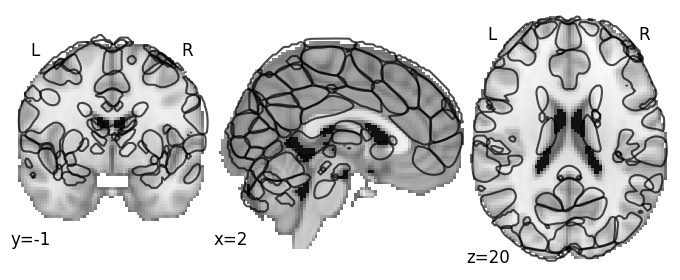 |

| Component 1: Middle frontal gyrus lateral, LH |
|:---:|
| [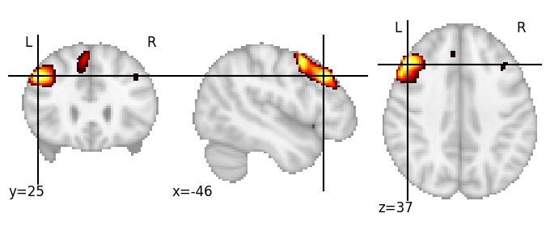](https://parietal-inria.github.io/MODL_atlas/128/html/1.html)|

| Component 2: Middle frontal gyrus anterior |
|:---:|
| [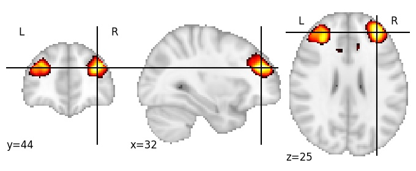](https://parietal-inria.github.io/MODL_atlas/128/html/2.html) |

| Component 3: Superior occipital gyrus |
|:---:|
| [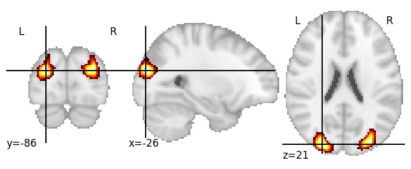](https://parietal-inria.github.io/MODL_atlas/128/html/3.html) |

| Component 4: Frontal pole lateral, RH |
|:---:|
| [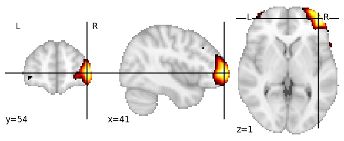](https://parietal-inria.github.io/MODL_atlas/128/html/4.html) |

| Component 5: Superior precentral and postcentral sulci |
|:---:|
| [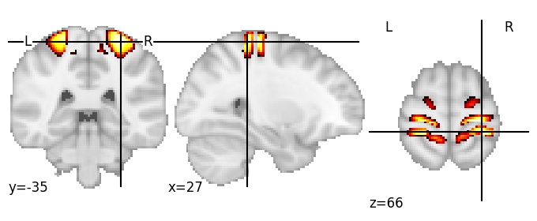](https://parietal-inria.github.io/MODL_atlas/128/html/5.html) |

| Component 6: Lower posterior cingulate cortex |
|:---:|
| [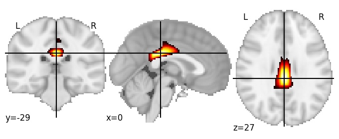](https://parietal-inria.github.io/MODL_atlas/128/html/6.html) |

| Component 7: Intraparietal sulcus posterior, LH |
|:---:|
| [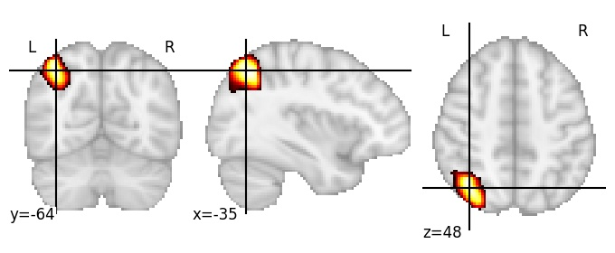](https://parietal-inria.github.io/MODL_atlas/128/html/7.html) |

| Component 8: Parieto-occipital sulcus central |
|:---:|
| [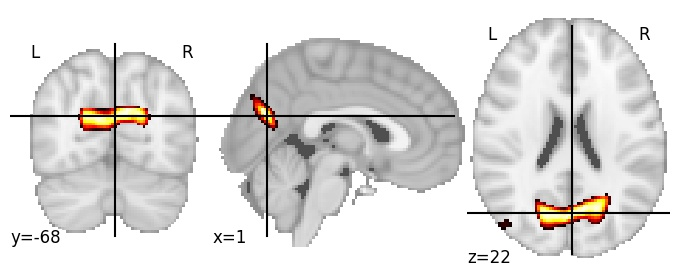](https://parietal-inria.github.io/MODL_atlas/128/html/8.html) |

| Component 9: Superior frontal sulcus |
|:---:|
|  |

| Component 10: Ventral medial prefrontal cortex |
|:---:|
| [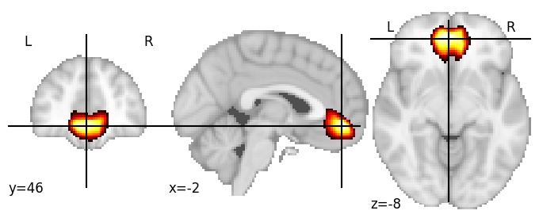](https://parietal-inria.github.io/MODL_atlas/128/html/10.html) |

| Component 11: Cerebellum Crus I posterior |
|:---:|
|  |

| Component 12: Lingual gyrus posterior | 
|:---:|
| [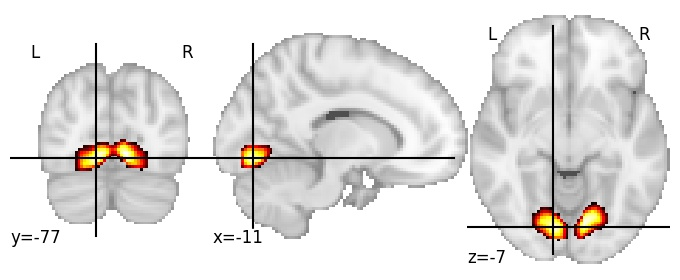](https://parietal-inria.github.io/MODL_atlas/128/html/12.html) |

| Component 13: Lateral occipital cortex, superior |
|:---:|
| [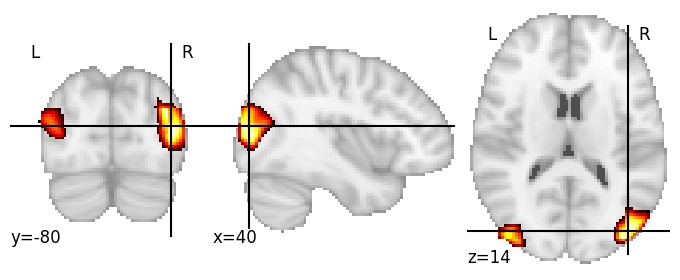](https://parietal-inria.github.io/MODL_atlas/128/html/13.html) |

| Component 14: Lateral frontal pole |
|:---:|
| [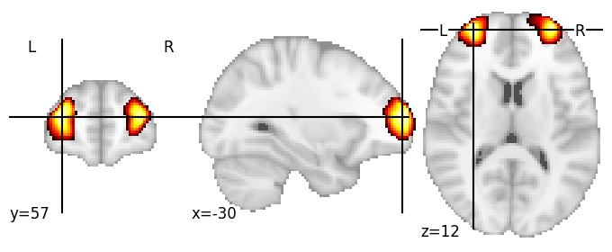](https://parietal-inria.github.io/MODL_atlas/128/html/14.html) |

| Component 15: Precentral gyrus inferior |
|:---:|
| [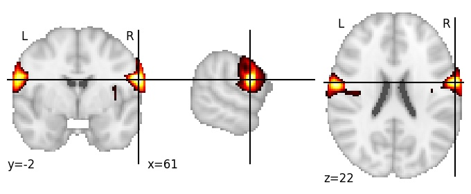](https://parietal-inria.github.io/MODL_atlas/128/html/15.html) |

| Component 16: Precuneus superior |
|:---:|
| [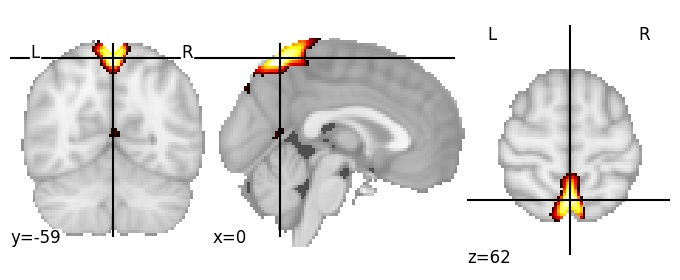](https://parietal-inria.github.io/MODL_atlas/128/html/16.html) |

| Component 17: Parieto-occipital sulcus postero-superior |
|:---:|
| [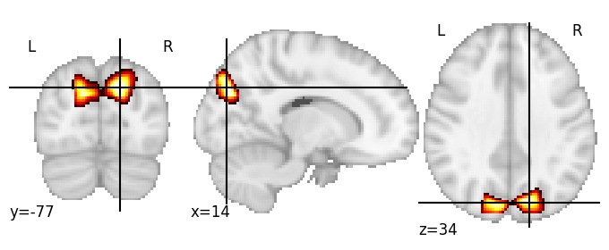](https://parietal-inria.github.io/MODL_atlas/128/html/17.html) |

| Component 18: Postcentral gyrus RH |
|:---:|
| [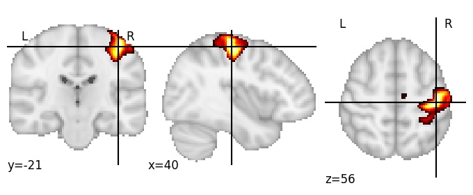](https://parietal-inria.github.io/MODL_atlas/128/html/18.html) |

| Component 19: Mid-anterior cingulate cortex |
|:---:|
| [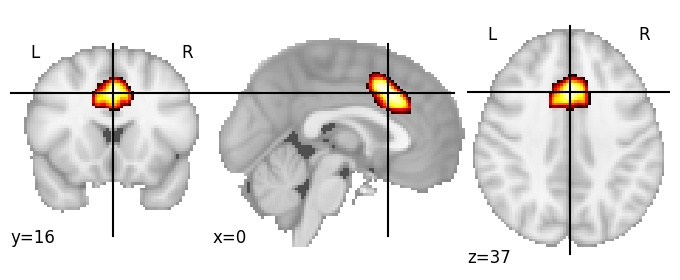](https://parietal-inria.github.io/MODL_atlas/128/html/19.html) |

| Component 20: Cerebrospinal fluid (superior of Central sulcus) |
|:---:|
| [)](https://parietal-inria.github.io/MODL_atlas/128/html/20.html) |

| Component 21: Angular gyrus superior, RH |
|:---:|
| [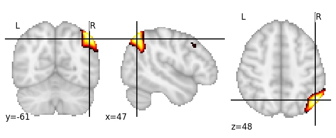](https://parietal-inria.github.io/MODL_atlas/128/html/21.html) |

| Component 22: Cerebellum Crus I anterior |
|:---:|
| [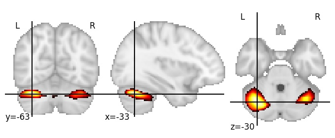](https://parietal-inria.github.io/MODL_atlas/128/html/22.html) |

| Component 23: Superior temporal gyrus, middle |
|:---:|
| [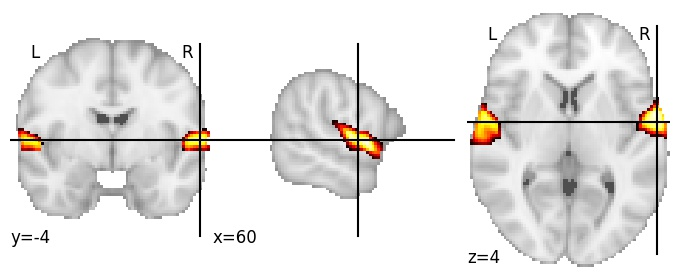](https://parietal-inria.github.io/MODL_atlas/128/html/23.html) |

| Component 24: Angular gyrus, posterior |
|:---:|
|  |

| Component 25: Lateral occipital cortex, inferior |
|:---:|
| [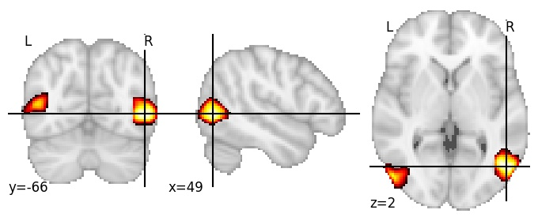](https://parietal-inria.github.io/MODL_atlas/128/html/25.html) |

| Component 26: Middle temporal gyrus RH |
|:---:|
| [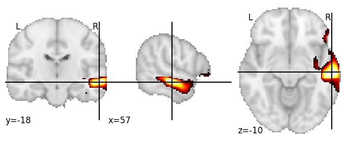](https://parietal-inria.github.io/MODL_atlas/128/html/26.html) |

| Component 27: Cerebellum VI anterior |
|:---:|
| [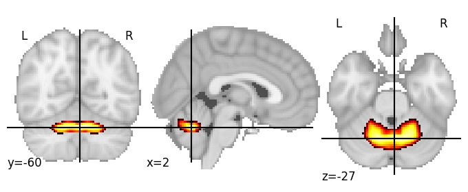](https://parietal-inria.github.io/MODL_atlas/128/html/27.html) |

| Component 28: Cerebellum VI superior |
|:---:|
| [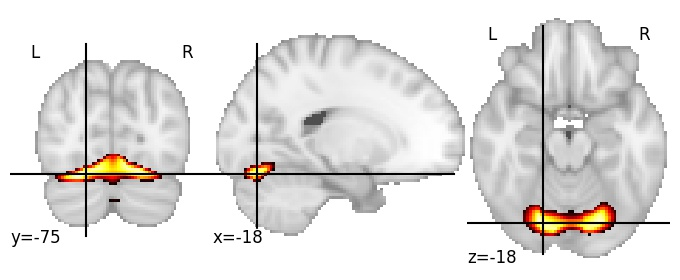](https://parietal-inria.github.io/MODL_atlas/128/html/28.html) |

| Component 29: Angular gyrus anterior, RH |
|:---:|
| [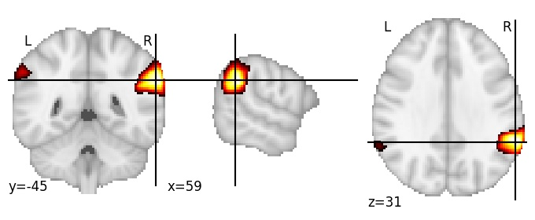](https://parietal-inria.github.io/MODL_atlas/128/html/29.html) |

| Component 30: Cerebrospinal fluid (between anterior part of superior frontal gyrus and skull) |
|:---:|
| [")](https://parietal-inria.github.io/MODL_atlas/128/html/30.html) |

| Component 31: Parahippocampal gyrus |
|:---:|
| [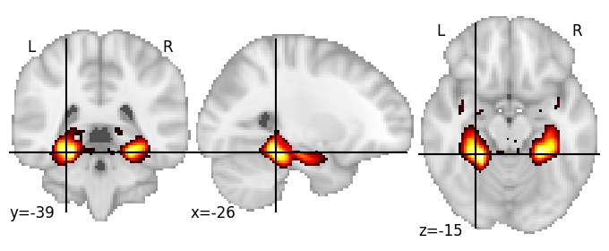](https://parietal-inria.github.io/MODL_atlas/128/html/31.html) |

| Component 32: Inferior frontal gyrus anterior, LH |
|:---:|
| [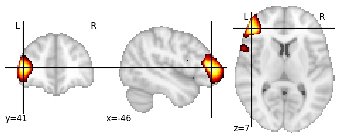](https://parietal-inria.github.io/MODL_atlas/128/html/32.html) |

| Component 33: Posterior cingulate cortex |
|:---:|
|  |

| Component 34: Inferior temporal gyrus, posterior |
|:---:|
| [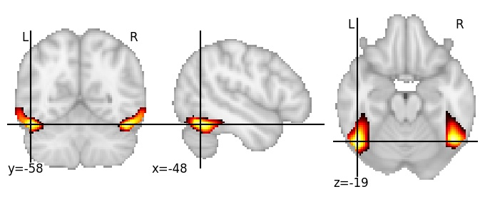](https://parietal-inria.github.io/MODL_atlas/128/html/34.html) |

| Component 35: Dorsomedial prefrontal cortex, anterocaudal |
|:---:|
|  |

| Component 36: Superior frontal gyrus, posterior |
|:---:|
| [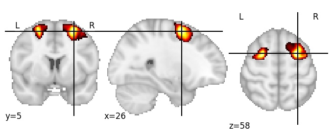](https://parietal-inria.github.io/MODL_atlas/128/html/36.html) |

| Component 37: Supramarginal gyrus, LH |
|:---:|
|  |

| Component 38: Superior precentral and postcentral gyri |
|:---:|
| [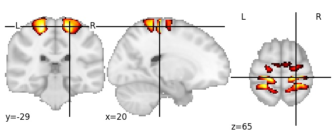](https://parietal-inria.github.io/MODL_atlas/128/html/38.html) |

| Component 39: Cerebrospinal fluid (between occipital pole and cerebellum) |
|:---:|
| [")](https://parietal-inria.github.io/MODL_atlas/128/html/39.html) |

| Component 40: Paracingulate gyrus, middle |
|:---:|
|  |

| Component 41: Anterior fusiform gyrus |
|:---:|
| [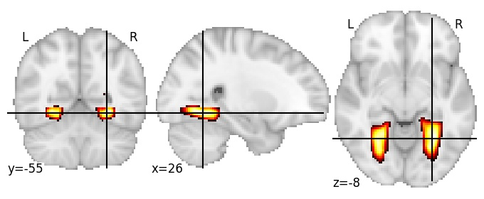](https://parietal-inria.github.io/MODL_atlas/128/html/41.html) |

| Component 42: Middle temporal gyrus, LH |
|:---:|
|  |

| Component 43: Postcentral gyrus superior, LH |
|:---:|
| [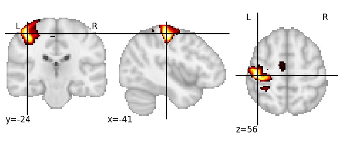](https://parietal-inria.github.io/MODL_atlas/128/html/43.html) |

| Component 44: Inferior parietal lobule, LH |
|:---:|
| [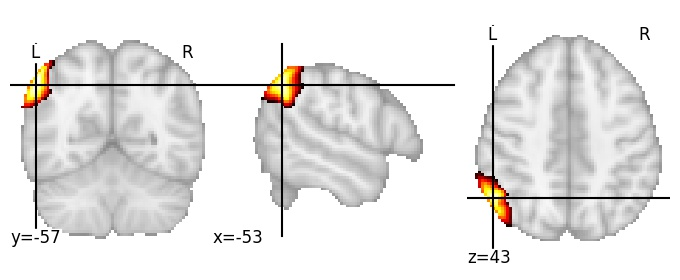](https://parietal-inria.github.io/MODL_atlas/128/html/44.html) |

| Component 45: Calcarine sulcus, anterior |
|:---:|
| [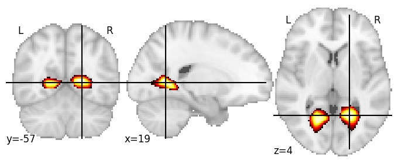](https://parietal-inria.github.io/MODL_atlas/128/html/45.html) |

| Component 46: Intraparietal sulcus, RH |
|:---:|
|  |

| Component 47: Inferior occipital sulcus |
|:---:|
| [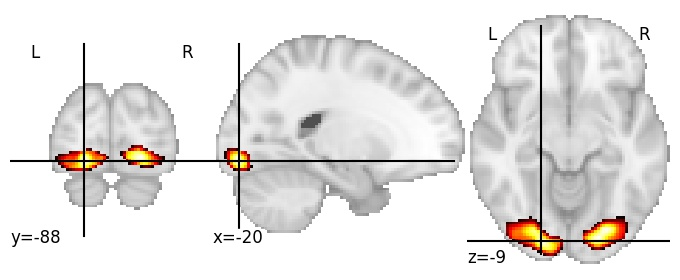](https://parietal-inria.github.io/MODL_atlas/128/html/47.html) |

| Component 48: Postcentral sulcus inferior, LH |
|:---:|
| [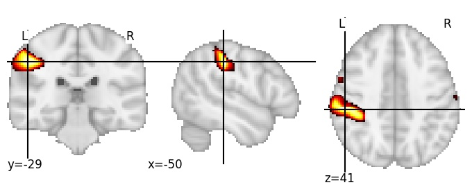](https://parietal-inria.github.io/MODL_atlas/128/html/48.html) |

| Component 49: Insula center, and lateral fissure |
|:---:|
| [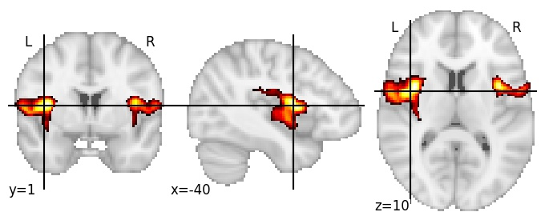](https://parietal-inria.github.io/MODL_atlas/128/html/49.html) |

| Component 50: Superior parietal lobule, posterior |
|:---:|
| [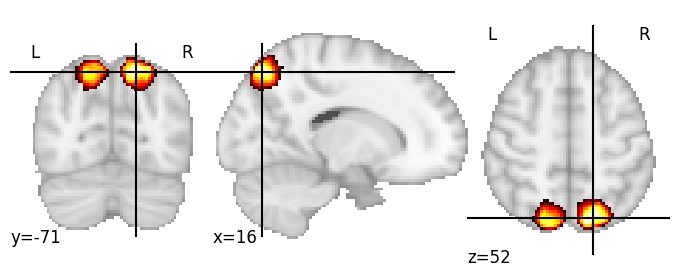](https://parietal-inria.github.io/MODL_atlas/128/html/50.html) |

| Component 51: Cerebrospinal fluid (between superior part of superior frontal gyrus and skull) |
|:---:|
| [")](https://parietal-inria.github.io/MODL_atlas/128/html/51.html) |

| Component 52: Inferior precuneus |
|:---:|
| [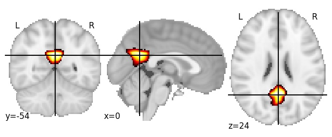](https://parietal-inria.github.io/MODL_atlas/128/html/52.html) |

| Component 53: Inferior frontal sulcus RH |
|:---:|
| [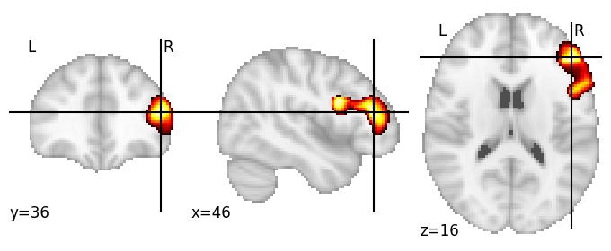](https://parietal-inria.github.io/MODL_atlas/128/html/53.html) |

| Component 54: Planum temporale LH |
|:---:|
| [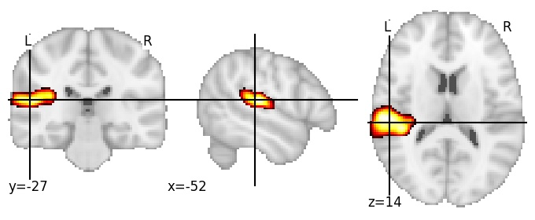](https://parietal-inria.github.io/MODL_atlas/128/html/54.html) |

| Component 55: Cerebellum superior posterior fissure |
|:---:|
| [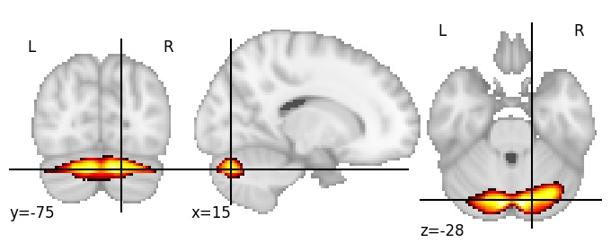](https://parietal-inria.github.io/MODL_atlas/128/html/55.html) |

| Component 56: Intraparietal sulcus anterior, LH |
|:---:|
| [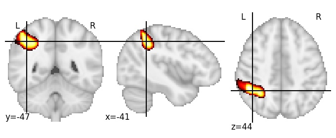](https://parietal-inria.github.io/MODL_atlas/128/html/56.html) |

| Component 57: Hippocampal fissure |
|:---:|
| [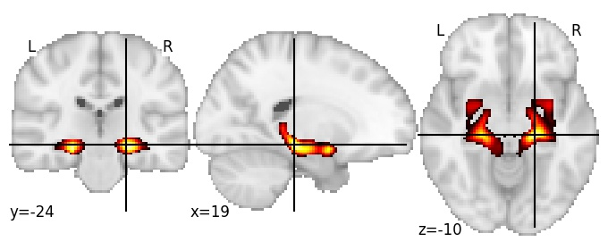](https://parietal-inria.github.io/MODL_atlas/128/html/57.html) |

| Component 58: Dorsomedial prefrontal cortex, anteromedial |
|:---:|
| [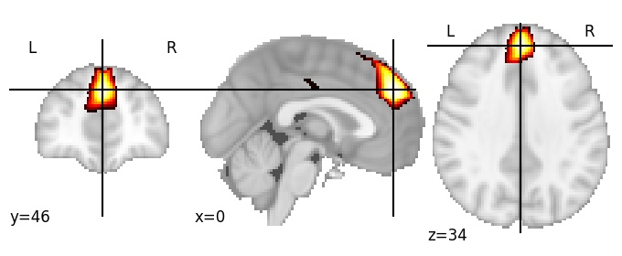](https://parietal-inria.github.io/MODL_atlas/128/html/58.html) |

| Component 59: Inferior callosomarginal sulcus |
|:---:|
| [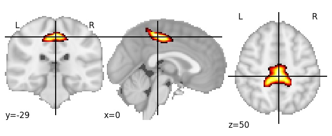](https://parietal-inria.github.io/MODL_atlas/128/html/59.html) |

| Component 60: Paracentral lobule |
|:---:|
| [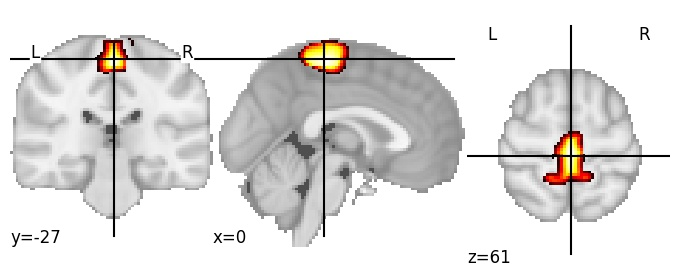](https://parietal-inria.github.io/MODL_atlas/128/html/60.html) |

| Component 61: Parieto-occipital sulcus anterior |
|:---:|
| [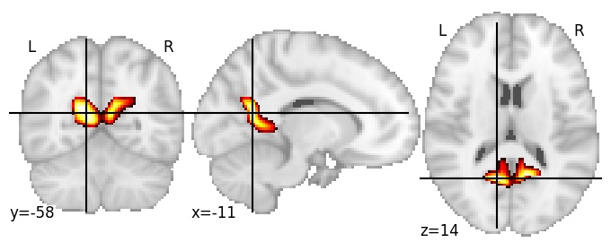](https://parietal-inria.github.io/MODL_atlas/128/html/61.html) |

| Component 62: Central sulcus |
|:---:|
| [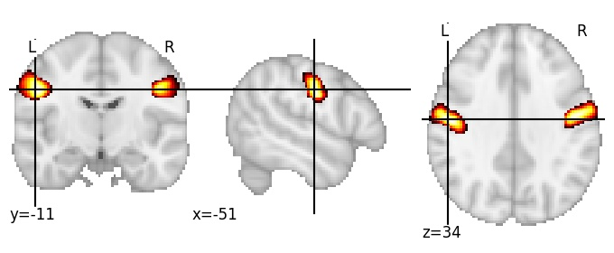](https://parietal-inria.github.io/MODL_atlas/128/html/62.html) |

| Component 63: Posterior cingulate cortex, superior |
|:---:|
|  |

| Component 64: Lateral fissure, anterior |
|:---:|
|  |
