| All 128 components |  
|:---:|  
| 

| Component 1: Middle frontal gyrus lateral LH |  
|:---:|  
| |

| Component 2: Middle frontal gyrus anterior |  
|:---:|  
| |

| Component 3: Superior occipital gyrus |  
|:---:|  
| |

| Component 4: Frontal pole lateral RH |  
|:---:|  
| |

| Component 5: Superior precentral and postcentral sulci anterior |  
|:---:|  
| |

| Component 6: Posterior cingulate cortex antero-inferior |  
|:---:|  
| |

| Component 7: Intraparietal sulcus posterior LH |  
|:---:|  
| |

| Component 8: Parieto-occipital sulcus central |  
|:---:|  
| |

| Component 9: Superior frontal sulcus |  
|:---:|  
| |

| Component 10: Ventromedial prefrontal cortex |  
|:---:|  
| |

| Component 11: Cerebellum Crus I posterior |  
|:---:|  
| |

| Component 12: Lingual gyrus posterior |  
|:---:|  
| |

| Component 13: Lateral occipital cortex superior |  
|:---:|  
| |

| Component 14: Lateral frontal pole |  
|:---:|  
| |

| Component 15: Precentral gyrus inferior |  
|:---:|  
| |

| Component 16: Precuneus superior |  
|:---:|  
| |

| Component 17: Parieto-occipital sulcus postero-superior |  
|:---:|  
| |

| Component 18: Postcentral gyrus RH |  
|:---:|  
| |

| Component 19: Cingulate cortex mid-anterior |  
|:---:|  
| |

| Component 20: Cerebrospinal fluid (superior of Central sulcus) |  
|:---:|  
| [")](128/html/20.html)|

| Component 21: Angular gyrus superior RH |  
|:---:|  
| |

| Component 22: Cerebellum Crus I anterior |  
|:---:|  
| |

| Component 23: Superior temporal gyrus middle |  
|:---:|  
| |

| Component 24: Angular gyrus posterior |  
|:---:|  
| |

| Component 25: Lateral occipital cortex inferior |  
|:---:|  
| |

| Component 26: Middle temporal gyrus RH |  
|:---:|  
| |

| Component 27: Cerebellum VI anterior |  
|:---:|  
| |

| Component 28: Cerebellum VI superior |  
|:---:|  
| |

| Component 29: Angular gyrus anterior RH |  
|:---:|  
| |

| Component 30: Cerebrospinal fluid (between anterior part of superior frontal gyrus and skull) |  
|:---:|  
| [")](128/html/30.html)|

| Component 31: Parahippocampal gyrus |  
|:---:|  
| |

| Component 32: Inferior frontal gyrus anterior, LH |  
|:---:|  
| |

| Component 33: Posterior cingulate cortex |  
|:---:|  
| |

| Component 34: Occipitotemporal gyrus posterior |  
|:---:|  
| |

| Component 35: Dorsomedial prefrontal cortex antero-superior |  
|:---:|  
| |

| Component 36: Superior frontal gyrus posterior |  
|:---:|  
| |

| Component 37: Supramarginal gyrus LH |  
|:---:|  
| |

| Component 38: Superior precentral and postcentral sulci posterior |  
|:---:|  
| |

| Component 39: Cerebrospinal fluid (between occipital pole and cerebellum) |  
|:---:|  
| [")](128/html/39.html)|

| Component 40: Paracingulate gyrus middle |  
|:---:|  
| |

| Component 41: Fusiform gyrus anterior |  
|:---:|  
| |

| Component 42: Middle temporal gyrus LH |  
|:---:|  
| |

| Component 43: Postcentral gyrus superior LH |  
|:---:|  
| |

| Component 44: Angular gyrus superior |  
|:---:|  
| |

| Component 45: Calcarine sulcus anterior |  
|:---:|  
| |

| Component 46: Intraparietal sulcus RH |  
|:---:|  
| |

| Component 47: Inferior occipital sulcus |  
|:---:|  
| |

| Component 48: Postcentral sulcus inferior LH |  
|:---:|  
| |

| Component 49: Insula center and lateral fissure |  
|:---:|  
| |

| Component 50: Superior parietal lobule posterior |  
|:---:|  
| |

| Component 51: Cerebrospinal fluid (between superior part of superior frontal gyrus and skull) |  
|:---:|  
| [")](128/html/51.html)|

| Component 52: Posterior cingulate cortex inferior |  
|:---:|  
| |

| Component 53: Inferior frontal sulcus RH |  
|:---:|  
| |

| Component 54: Planum temporale LH |  
|:---:|  
| |

| Component 55: Cerebellum superior posterior fissure |  
|:---:|  
| |

| Component 56: Intraparietal sulcus anterior LH |  
|:---:|  
| |

| Component 57: Hippocampal fissure |  
|:---:|  
| |

| Component 58: Dorsomedial prefrontal cortex anteromedial |  
|:---:|  
| |

| Component 59: Callosomarginal sulcus inferior |  
|:---:|  
| |

| Component 60: Paracentral lobule |  
|:---:|  
| |

| Component 61: Parieto-occipital sulcus anterior |  
|:---:|  
| |

| Component 62: Central sulcus |  
|:---:|  
| |

| Component 63: Posterior cingulate cortex superior |  
|:---:|  
| |

| Component 64: Lateral fissure anterior |  
|:---:|  
| |

| Component 65: Inferior temporal gyrus posterior |  
|:---:|  
| [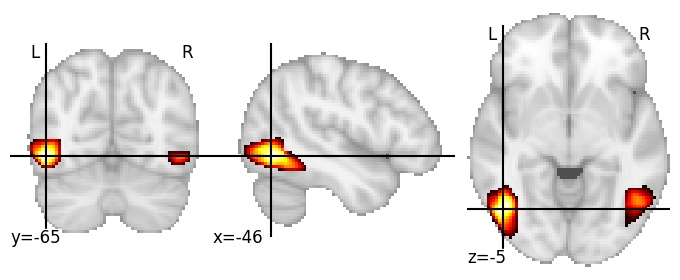](128/html/65.html)|

| Component 66: Cerebrospinal fluid (between Parieto-occipital sulcus and skull) |  
|:---:|  
| [")](128/html/66.html)|

| Component 67: Insula antero-superior |  
|:---:|  
| [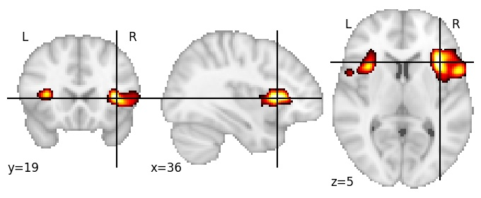](128/html/67.html)|

| Component 68: Planum temporale RH |  
|:---:|  
| |

| Component 69: Anterior cingulate cortex |  
|:---:|  
| [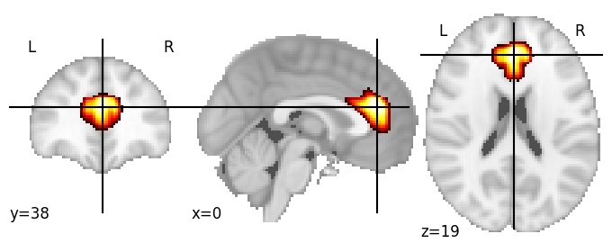](128/html/69.html)|

| Component 70: Cerebrospinal fluid (between central sulcus and skull) |  
|:---:|  
| [")](128/html/70.html)|

| Component 71: Thalamus |  
|:---:|  
| |

| Component 72: Calcarine cortex posterior |  
|:---:|  
| [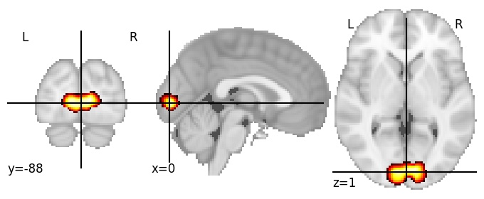](128/html/72.html)|

| Component 73: Superior occipital sulcus |  
|:---:|  
| [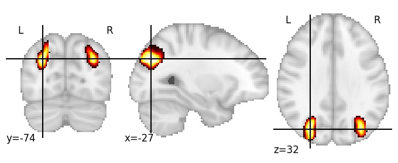](128/html/73.html)|

| Component 74: Postcentral sulcus superior |  
|:---:|  
| |

| Component 75: Cuneus |  
|:---:|  
| |

| Component 76: Precentral sulcus inferior, LH |  
|:---:|  
| |

| Component 77: Superior parietal sulcus |  
|:---:|  
| [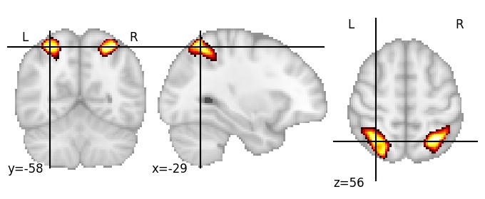](128/html/77.html)|

| Component 78: Cuneus superior |  
|:---:|  
| |

| Component 79: Pars triangularis |  
|:---:|  
| |

| Component 80: Superior temporal sulcus LH |  
|:---:|  
| [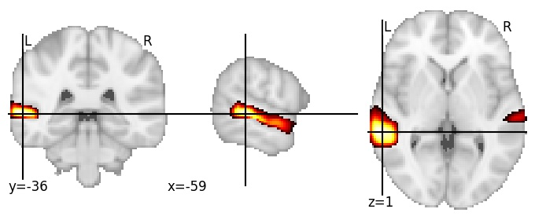](128/html/80.html)|

| Component 81: Intraparietal sulcus anterior RH |  
|:---:|  
| [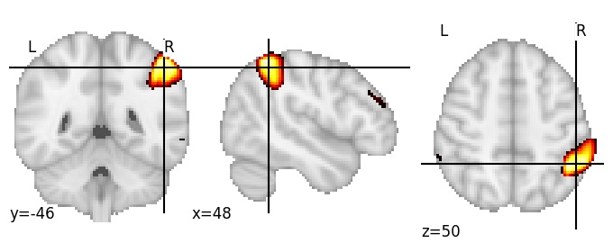](128/html/81.html)|

| Component 82: Cerebellum IV and V |  
|:---:|  
| |

| Component 83: Precentral sulcus superior |  
|:---:|  
| |

| Component 84: Precentral gyrus superior |  
|:---:|  
| [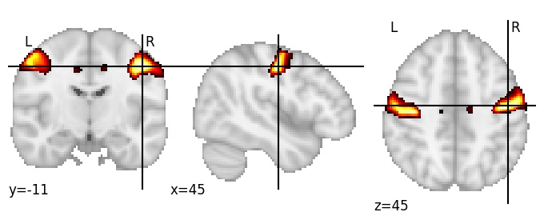](128/html/84.html)|

| Component 85: Calcarine cortex anterior |  
|:---:|  
| |

| Component 86: Cerebrospinal fluid (between parietal lobe and skull) |  
|:---:|  
| [")](128/html/86.html)|

| Component 87: Internal capsule |  
|:---:|  
| [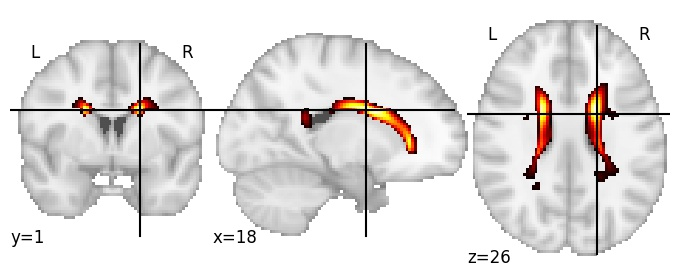](128/html/87.html)|

| Component 88: Lunate sulcus |  
|:---:|  
| [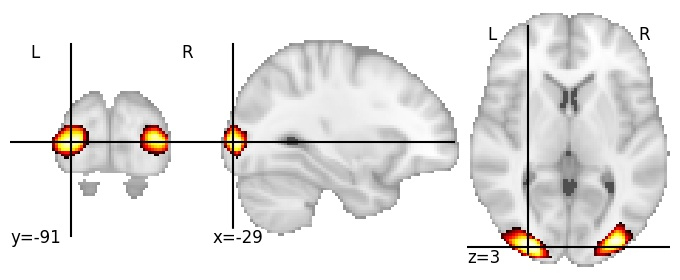](128/html/88.html)|

| Component 89: Superior parietal lobule anterior |  
|:---:|  
| |

| Component 90: Superior frontal sulcus anterior |  
|:---:|  
| |

| Component 91: Lingual gyrus |  
|:---:|  
| [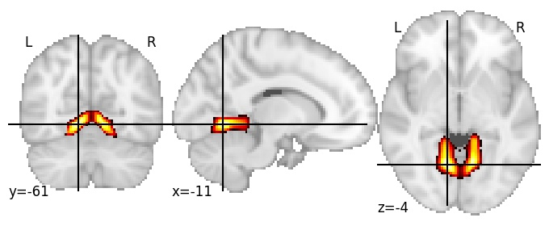](128/html/91.html)|

| Component 92: Precuneus anterior |  
|:---:|  
| |

| Component 93: Cerebrospinal fluid (between middle frontal gyrus and skull) |  
|:---:|  
| [")](128/html/93.html)|

| Component 94: Caudate |  
|:---:|  
| [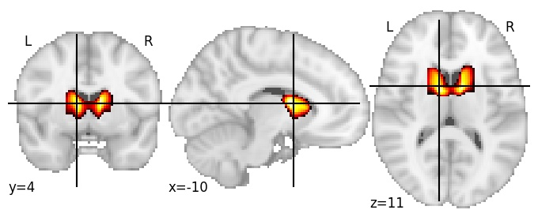](128/html/94.html)|

| Component 95: Retrosplenial cortex |  
|:---:|  
| [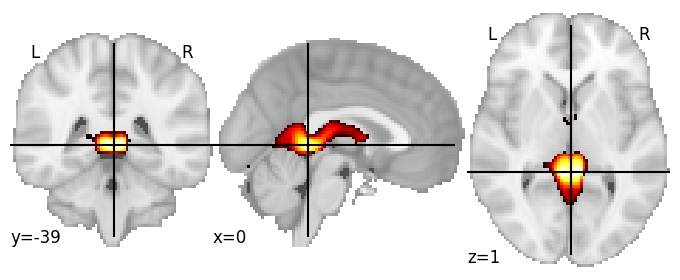](128/html/95.html)|

| Component 96: Cerebellum Crus II |  
|:---:|  
| [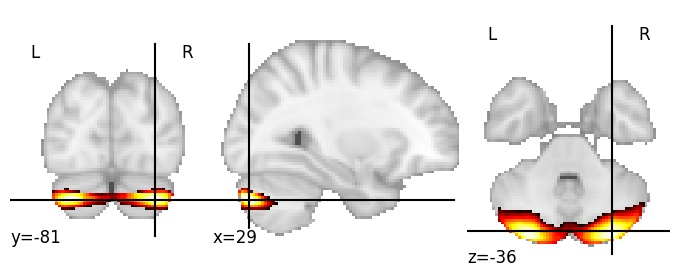](128/html/96.html)|

| Component 97: Thalamus and globus pallidus |  
|:---:|  
| [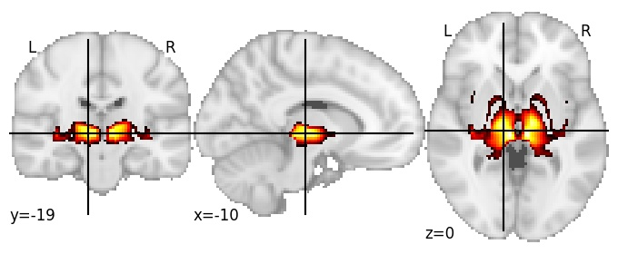](128/html/97.html)|

| Component 98: Putamen anterior |  
|:---:|  
| [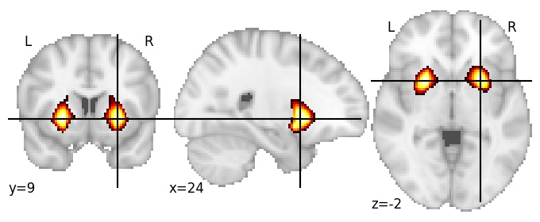](128/html/98.html)|

| Component 99: Planum porale |  
|:---:|  
| |

| Component 100: Subcallosal cortex |  
|:---:|  
| [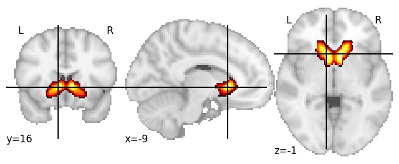](128/html/100.html)|

| Component 101: Superior frontal sulcus anterior, LH |  
|:---:|  
| |

| Component 102: Paracingulate gyrus postero-inferior |  
|:---:|  
| |

| Component 103: Occipital pole superior |  
|:---:|  
| [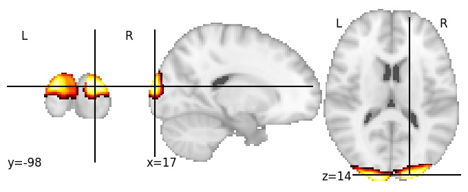](128/html/103.html)|

| Component 104: Inferior frontal sulcus posterior RH |  
|:---:|  
| [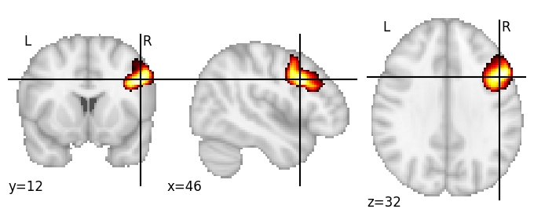](128/html/104.html)|

| Component 105: Cingulate sulcus posterior |  
|:---:|  
| [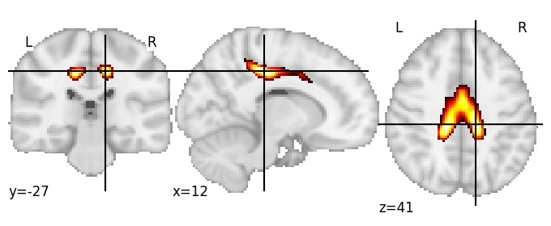](128/html/105.html)|

| Component 106: Middle frontal gyrus RH |  
|:---:|  
| [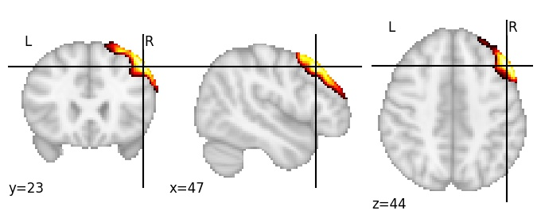](128/html/106.html)|

| Component 107: Insula anterior |  
|:---:|  
| [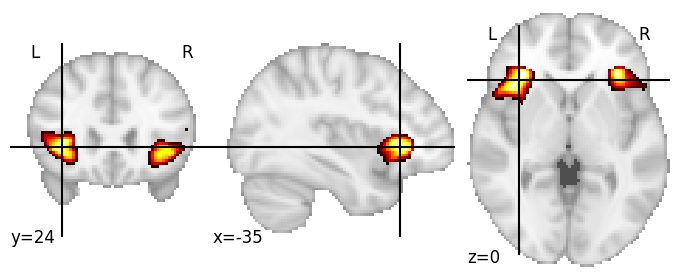](128/html/107.html)|

| Component 108: Inferior occipital gyrus |  
|:---:|  
| |

| Component 109: Central operculum cortex |  
|:---:|  
| [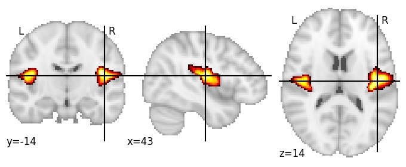](128/html/109.html)|

| Component 110: Angular gyrus inferior |  
|:---:|  
| |

| Component 111: Intracalcarine cortex |  
|:---:|  
| [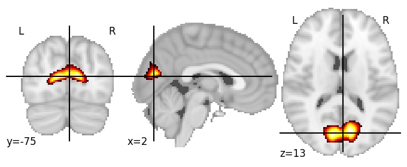](128/html/111.html)|

| Component 112: Postcentral sulcus RH |  
|:---:|  
| |

| Component 113: Cerebellum VI |  
|:---:|  
| [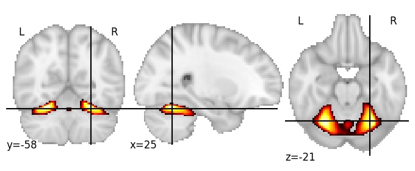](128/html/113.html)|

| Component 114: Supramarginal gyrus anterior RH |  
|:---:|  
| |

| Component 115: Cerebellum IV and middle cerebellar peduncle |  
|:---:|  
| |

| Component 116: Occipital pole inferior |  
|:---:|  
| |

| Component 117: Ventromedial prefrontal cortex anterior |  
|:---:|  
| [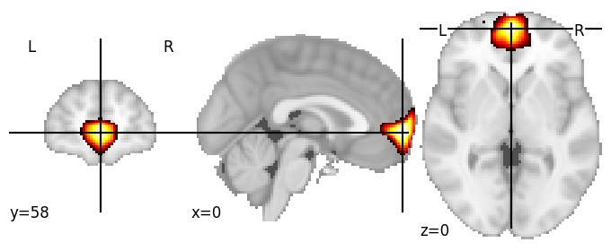](128/html/117.html)|

| Component 118: Parieto-occipital sulcus antero-superior |  
|:---:|  
| [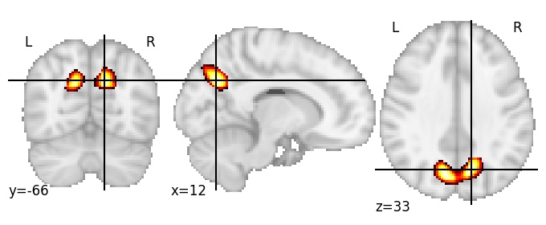](128/html/118.html)|

| Component 119: Paracingulate gyrus postero-superior |  
|:---:|  
| [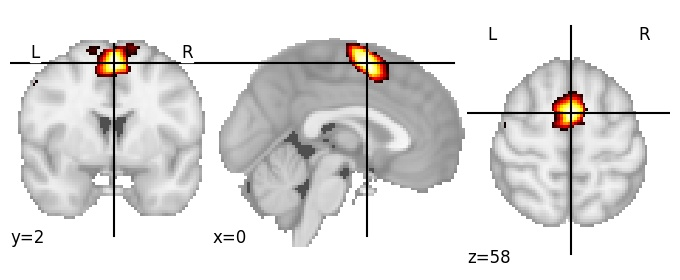](128/html/119.html)|

| Component 120: Fusiform gyrus |  
|:---:|  
| |

| Component 121: Precuneus posterior |  
|:---:|  
| [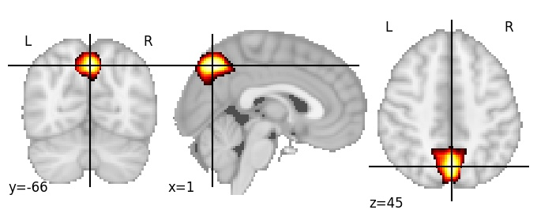](128/html/121.html)|

| Component 122: Angular gyrus LH |  
|:---:|  
| [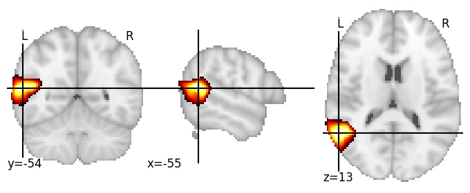](128/html/122.html)|

| Component 123: Inferior frontal sulcus LH |  
|:---:|  
| |

| Component 124: Putamen posterior |  
|:---:|  
| [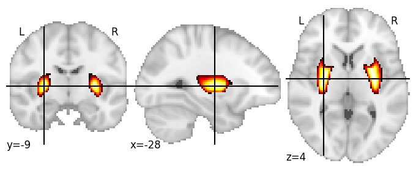](128/html/124.html)|

| Component 125: Postcentral gyrus middle |  
|:---:|  
| [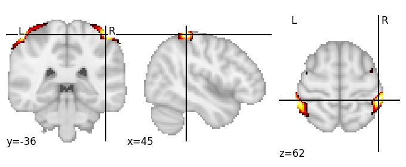](128/html/125.html)|

| Component 126: Superior temporal sulcus posterior RH |  
|:---:|  
| |

| Component 127: Lateral ventricles superior |  
|:---:|  
| [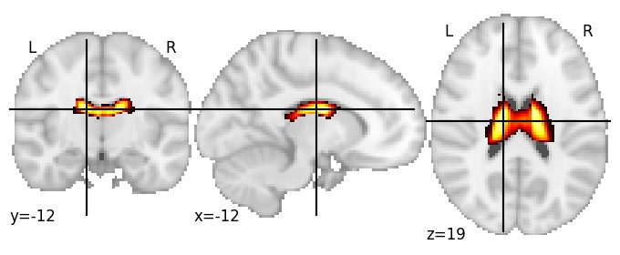](128/html/127.html)|

| Component 128: Angular gyrus RH |  
|:---:|  
| [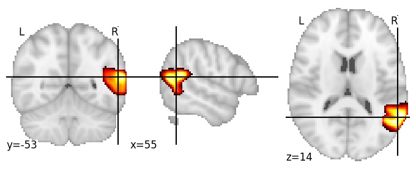](128/html/128.html)|