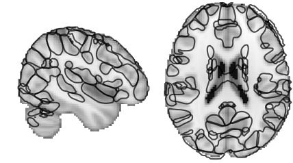

See names for each component: [1](https://parietal-inria.github.io/MODL_atlas/128/1 "Component 1")
[2](https://parietal-inria.github.io/MODL_atlas/128/2 "Component 2")
[3](https://parietal-inria.github.io/MODL_atlas/128/3 "Component 3")
[4](https://parietal-inria.github.io/MODL_atlas/128/4 "Component 4")
[5](https://parietal-inria.github.io/MODL_atlas/128/5 "Component 5")
[6](https://parietal-inria.github.io/MODL_atlas/128/6 "Component 6")
[7](https://parietal-inria.github.io/MODL_atlas/128/7 "Component 7")
[8](https://parietal-inria.github.io/MODL_atlas/128/8 "Component 8")
[9](https://parietal-inria.github.io/MODL_atlas/128/9 "Component 9")
[10](https://parietal-inria.github.io/MODL_atlas/128/10 "Component 10")
[11](https://parietal-inria.github.io/MODL_atlas/128/11 "Component 11")
[12](https://parietal-inria.github.io/MODL_atlas/128/12 "Component 12")
[13](https://parietal-inria.github.io/MODL_atlas/128/13 "Component 13")
[14](https://parietal-inria.github.io/MODL_atlas/128/14 "Component 14")
[15](https://parietal-inria.github.io/MODL_atlas/128/15 "Component 15")
[16](https://parietal-inria.github.io/MODL_atlas/128/16 "Component 16")
[17](https://parietal-inria.github.io/MODL_atlas/128/17 "Component 17")
[18](https://parietal-inria.github.io/MODL_atlas/128/18 "Component 18")
[19](https://parietal-inria.github.io/MODL_atlas/128/19 "Component 19")
[20](https://parietal-inria.github.io/MODL_atlas/128/20 "Component 20")
[21](https://parietal-inria.github.io/MODL_atlas/128/21 "Component 21")
[22](https://parietal-inria.github.io/MODL_atlas/128/22 "Component 22")
[23](https://parietal-inria.github.io/MODL_atlas/128/23 "Component 23")
[24](https://parietal-inria.github.io/MODL_atlas/128/24 "Component 24")
[25](https://parietal-inria.github.io/MODL_atlas/128/25 "Component 25")
[26](https://parietal-inria.github.io/MODL_atlas/128/26 "Component 26")
[27](https://parietal-inria.github.io/MODL_atlas/128/27 "Component 27")
[28](https://parietal-inria.github.io/MODL_atlas/128/28 "Component 28")
[29](https://parietal-inria.github.io/MODL_atlas/128/29 "Component 29")
[30](https://parietal-inria.github.io/MODL_atlas/128/30 "Component 30")
[31](https://parietal-inria.github.io/MODL_atlas/128/31 "Component 31")
[32](https://parietal-inria.github.io/MODL_atlas/128/32 "Component 32")
[33](https://parietal-inria.github.io/MODL_atlas/128/33 "Component 33")
[34](https://parietal-inria.github.io/MODL_atlas/128/34 "Component 34")
[35](https://parietal-inria.github.io/MODL_atlas/128/35 "Component 35")
[36](https://parietal-inria.github.io/MODL_atlas/128/36 "Component 36")
[37](https://parietal-inria.github.io/MODL_atlas/128/37 "Component 37")
[38](https://parietal-inria.github.io/MODL_atlas/128/38 "Component 38")
[39](https://parietal-inria.github.io/MODL_atlas/128/39 "Component 39")
[40](https://parietal-inria.github.io/MODL_atlas/128/40 "Component 40")
[41](https://parietal-inria.github.io/MODL_atlas/128/41 "Component 41")
[42](https://parietal-inria.github.io/MODL_atlas/128/42 "Component 42")
[43](https://parietal-inria.github.io/MODL_atlas/128/43 "Component 43")
[44](https://parietal-inria.github.io/MODL_atlas/128/44 "Component 44")
[45](https://parietal-inria.github.io/MODL_atlas/128/45 "Component 45")
[46](https://parietal-inria.github.io/MODL_atlas/128/46 "Component 46")
[47](https://parietal-inria.github.io/MODL_atlas/128/47 "Component 47")
[48](https://parietal-inria.github.io/MODL_atlas/128/48 "Component 48")
[49](https://parietal-inria.github.io/MODL_atlas/128/49 "Component 49")
[50](https://parietal-inria.github.io/MODL_atlas/128/50 "Component 50")
[51](https://parietal-inria.github.io/MODL_atlas/128/51 "Component 51")
[52](https://parietal-inria.github.io/MODL_atlas/128/52 "Component 52")
[53](https://parietal-inria.github.io/MODL_atlas/128/53 "Component 53")
[54](https://parietal-inria.github.io/MODL_atlas/128/54 "Component 54")
[55](https://parietal-inria.github.io/MODL_atlas/128/55 "Component 55")
[56](https://parietal-inria.github.io/MODL_atlas/128/56 "Component 56")
[57](https://parietal-inria.github.io/MODL_atlas/128/57 "Component 57")
[58](https://parietal-inria.github.io/MODL_atlas/128/58 "Component 58")
[59](https://parietal-inria.github.io/MODL_atlas/128/59 "Component 59")
[60](https://parietal-inria.github.io/MODL_atlas/128/60 "Component 60")
[61](https://parietal-inria.github.io/MODL_atlas/128/61 "Component 61")
[62](https://parietal-inria.github.io/MODL_atlas/128/62 "Component 62")
[63](https://parietal-inria.github.io/MODL_atlas/128/63 "Component 63")
[64](https://parietal-inria.github.io/MODL_atlas/128/64 "Component 64")
[65](https://parietal-inria.github.io/MODL_atlas/128/65 "Component 65")
[66](https://parietal-inria.github.io/MODL_atlas/128/66 "Component 66")
[67](https://parietal-inria.github.io/MODL_atlas/128/67 "Component 67")
[68](https://parietal-inria.github.io/MODL_atlas/128/68 "Component 68")
[69](https://parietal-inria.github.io/MODL_atlas/128/69 "Component 69")
[70](https://parietal-inria.github.io/MODL_atlas/128/70 "Component 70")
[71](https://parietal-inria.github.io/MODL_atlas/128/71 "Component 71")
[72](https://parietal-inria.github.io/MODL_atlas/128/72 "Component 72")
[73](https://parietal-inria.github.io/MODL_atlas/128/73 "Component 73")
[74](https://parietal-inria.github.io/MODL_atlas/128/74 "Component 74")
[75](https://parietal-inria.github.io/MODL_atlas/128/75 "Component 75")
[76](https://parietal-inria.github.io/MODL_atlas/128/76 "Component 76")
[77](https://parietal-inria.github.io/MODL_atlas/128/77 "Component 77")
[78](https://parietal-inria.github.io/MODL_atlas/128/78 "Component 78")
[79](https://parietal-inria.github.io/MODL_atlas/128/79 "Component 79")
[80](https://parietal-inria.github.io/MODL_atlas/128/80 "Component 80")
[81](https://parietal-inria.github.io/MODL_atlas/128/81 "Component 81")
[82](https://parietal-inria.github.io/MODL_atlas/128/82 "Component 82")
[83](https://parietal-inria.github.io/MODL_atlas/128/83 "Component 83")
[84](https://parietal-inria.github.io/MODL_atlas/128/84 "Component 84")
[85](https://parietal-inria.github.io/MODL_atlas/128/85 "Component 85")
[86](https://parietal-inria.github.io/MODL_atlas/128/86 "Component 86")
[87](https://parietal-inria.github.io/MODL_atlas/128/87 "Component 87")
[88](https://parietal-inria.github.io/MODL_atlas/128/88 "Component 88")
[89](https://parietal-inria.github.io/MODL_atlas/128/89 "Component 89")
[90](https://parietal-inria.github.io/MODL_atlas/128/90 "Component 90")
[91](https://parietal-inria.github.io/MODL_atlas/128/91 "Component 91")
[92](https://parietal-inria.github.io/MODL_atlas/128/92 "Component 92")
[93](https://parietal-inria.github.io/MODL_atlas/128/93 "Component 93")
[94](https://parietal-inria.github.io/MODL_atlas/128/94 "Component 94")
[95](https://parietal-inria.github.io/MODL_atlas/128/95 "Component 95")
[96](https://parietal-inria.github.io/MODL_atlas/128/96 "Component 96")
[97](https://parietal-inria.github.io/MODL_atlas/128/97 "Component 97")
[98](https://parietal-inria.github.io/MODL_atlas/128/98 "Component 98")
[99](https://parietal-inria.github.io/MODL_atlas/128/99 "Component 99")
[100](https://parietal-inria.github.io/MODL_atlas/128/100 "Component 100")
[101](https://parietal-inria.github.io/MODL_atlas/128/101 "Component 101")
[102](https://parietal-inria.github.io/MODL_atlas/128/102 "Component 102")
[103](https://parietal-inria.github.io/MODL_atlas/128/103 "Component 103")
[104](https://parietal-inria.github.io/MODL_atlas/128/104 "Component 104")
[105](https://parietal-inria.github.io/MODL_atlas/128/105 "Component 105")
[106](https://parietal-inria.github.io/MODL_atlas/128/106 "Component 106")
[107](https://parietal-inria.github.io/MODL_atlas/128/107 "Component 107")
[108](https://parietal-inria.github.io/MODL_atlas/128/108 "Component 108")
[109](https://parietal-inria.github.io/MODL_atlas/128/109 "Component 109")
[110](https://parietal-inria.github.io/MODL_atlas/128/110 "Component 110")
[111](https://parietal-inria.github.io/MODL_atlas/128/111 "Component 111")
[112](https://parietal-inria.github.io/MODL_atlas/128/112 "Component 112")
[113](https://parietal-inria.github.io/MODL_atlas/128/113 "Component 113")
[114](https://parietal-inria.github.io/MODL_atlas/128/114 "Component 114")
[115](https://parietal-inria.github.io/MODL_atlas/128/115 "Component 115")
[116](https://parietal-inria.github.io/MODL_atlas/128/116 "Component 116")
[117](https://parietal-inria.github.io/MODL_atlas/128/117 "Component 117")
[118](https://parietal-inria.github.io/MODL_atlas/128/118 "Component 118")
[119](https://parietal-inria.github.io/MODL_atlas/128/119 "Component 119")
[120](https://parietal-inria.github.io/MODL_atlas/128/120 "Component 120")
[121](https://parietal-inria.github.io/MODL_atlas/128/121 "Component 121")
[122](https://parietal-inria.github.io/MODL_atlas/128/122 "Component 122")
[123](https://parietal-inria.github.io/MODL_atlas/128/123 "Component 123")
[124](https://parietal-inria.github.io/MODL_atlas/128/124 "Component 124")
[125](https://parietal-inria.github.io/MODL_atlas/128/125 "Component 125")
[126](https://parietal-inria.github.io/MODL_atlas/128/126 "Component 126")
[127](https://parietal-inria.github.io/MODL_atlas/128/127 "Component 127")
[128](https://parietal-inria.github.io/MODL_atlas/128/128 "Component 128")
