| All 256 components |  
|:---:|  
| [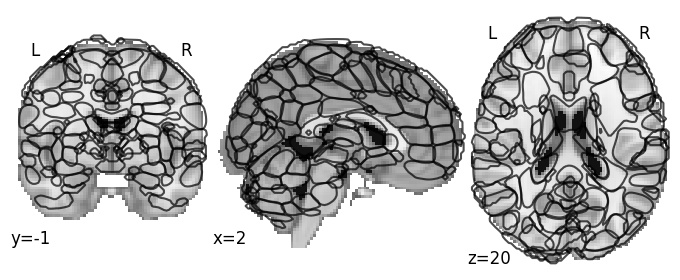](https://osf.io/tku4r/download)

| Component 1: Middle frontal gyrus anterior, LH |  
|:---:|  
| [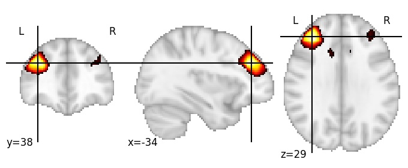](256/html/1.html)|

| Component 2: Middle frontal gyrus anterior, RH |  
|:---:|  
| [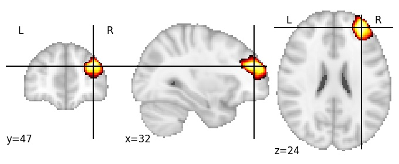](256/html/2.html)|

| Component 3: Cerebrospinal fluid (between superior parietal lobule and skull) |  
|:---:|  
| [")](256/html/3.html)|

| Component 4: Inferior frontal sulcus, RH |  
|:---:|  
| [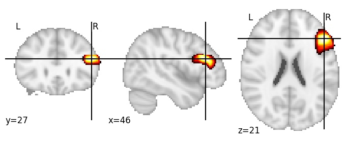](256/html/4.html)|

| Component 5: Caudate superior |  
|:---:|  
| [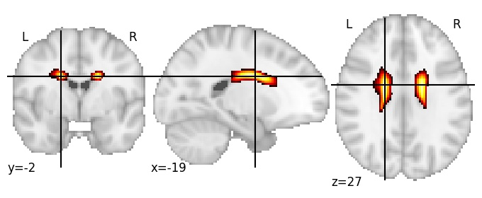](256/html/5.html)|

| Component 6: Cuneus, anterior |  
|:---:|  
| [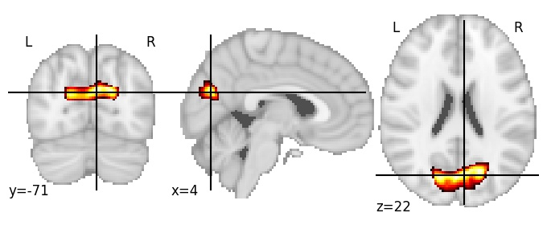](256/html/6.html)|

| Component 7: Lateral ventricles, anterior horns |  
|:---:|  
| [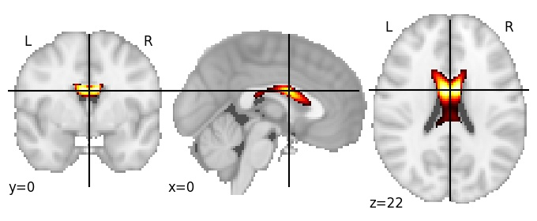](256/html/7.html)|

| Component 8: Lateral occipital cortex, LH |  
|:---:|  
| [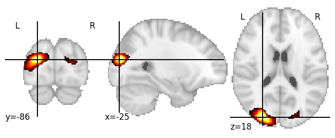](256/html/8.html)|

| Component 9: Occipital pole, superior |  
|:---:|  
| |

| Component 10: Collateral sulcus, anterior |  
|:---:|  
| [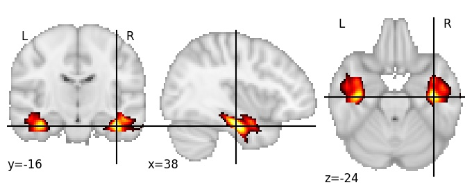](256/html/10.html)|

| Component 11: Cerebrospinal fluid (between intraparietal sulcus and skull) |  
|:---:|  
| [")](256/html/11.html)|

| Component 12: Superior frontal gyrus anterior |  
|:---:|  
| [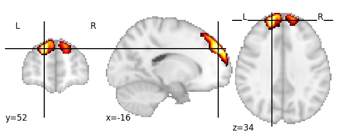](256/html/12.html)|

| Component 13: Mid-anterior cingulate cortex |  
|:---:|  
| [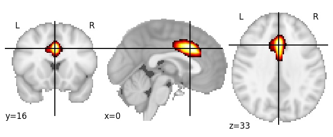](256/html/13.html)|

| Component 14: Mid-posterior cingulate cortex |  
|:---:|  
| [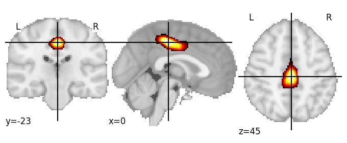](256/html/14.html)|

| Component 15: Posterior cingulate cortex |  
|:---:|  
| |

| Component 16: Pars opercularis, pars triangularis LH |  
|:---:|  
| [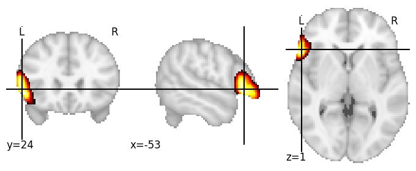](256/html/16.html)|

| Component 17: Medial frontal cortex, posterior |  
|:---:|  
| [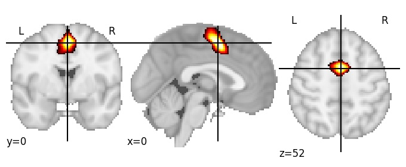](256/html/17.html)|

| Component 18: Cerebrospinal fluid (between precuneus and skull) |  
|:---:|  
| [")](256/html/18.html)|

| Component 19: Superior parietal lobule |  
|:---:|  
| [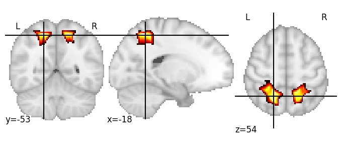](256/html/19.html)|

| Component 20: Frontal operculum LH |  
|:---:|  
| [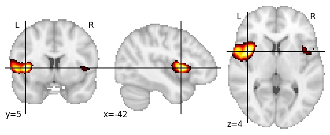](256/html/20.html)|

| Component 21: Amygdala |  
|:---:|  
| [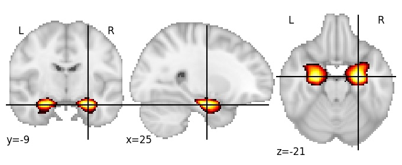](256/html/21.html)|

| Component 22: Supramarginal gyrus, LH |  
|:---:|  
| |

| Component 23: Postcentral gyrus LH |  
|:---:|  
| [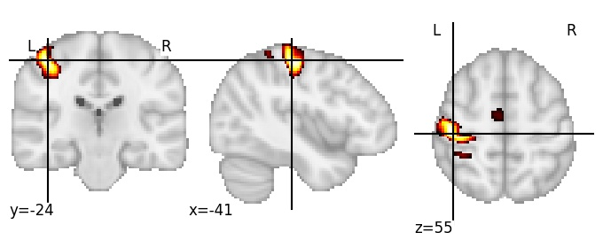](256/html/23.html)|

| Component 24: Parieto-occipital sulcus, superior |  
|:---:|  
| [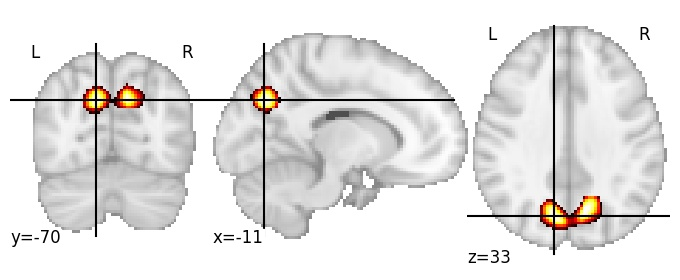](256/html/24.html)|

| Component 25: Occipital pole, inferior |  
|:---:|  
| [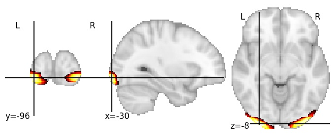](256/html/25.html)|

| Component 26: Superior temporal gyrus LH |  
|:---:|  
| [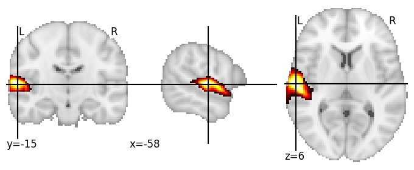](256/html/26.html)|

| Component 27: Intraparietal sulcus, anterior |  
|:---:|  
| [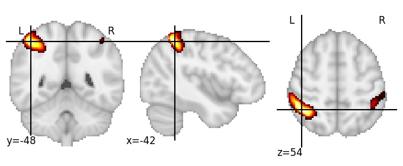](256/html/27.html)|

| Component 28: Inferior occipital gyrus |  
|:---:|  
| [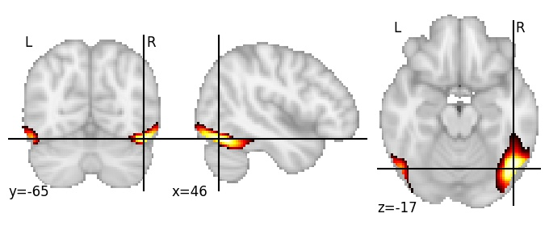](256/html/28.html)|

| Component 29: Angular gyrus superior, RH |  
|:---:|  
| |

| Component 30: Postcentral sulcus superior, LH |  
|:---:|  
| [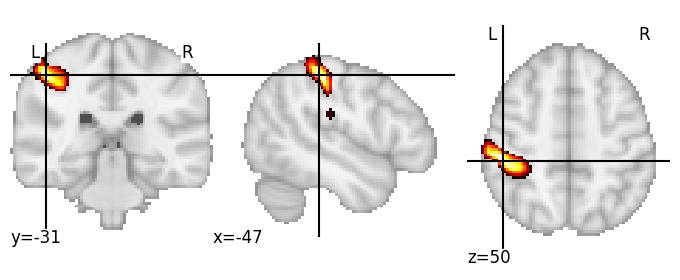](256/html/30.html)|

| Component 31: Superior occipital sulcus RH |  
|:---:|  
| [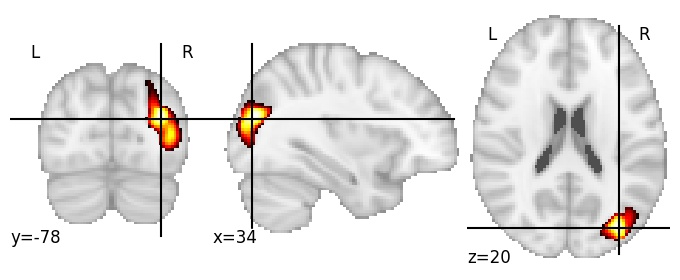](256/html/31.html)|

| Component 32: Anterior cingulate cortex |  
|:---:|  
| [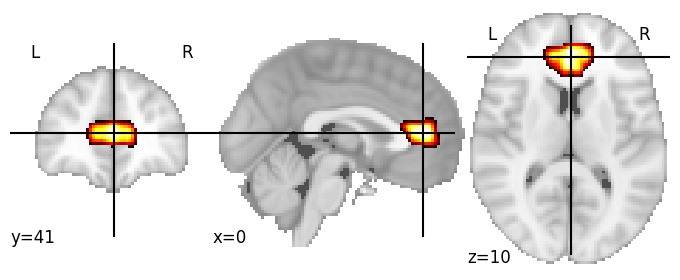](256/html/32.html)|

| Component 33: Cerebellum IX |  
|:---:|  
| [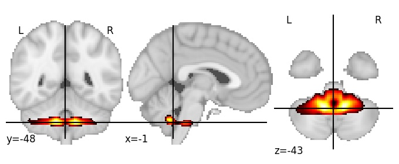](256/html/33.html)|

| Component 34: Corpus callosum forceps minor, LH |  
|:---:|  
| [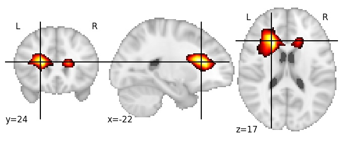](256/html/34.html)|

| Component 35: Occipitotemporal sulcus posterior, RH |  
|:---:|  
| [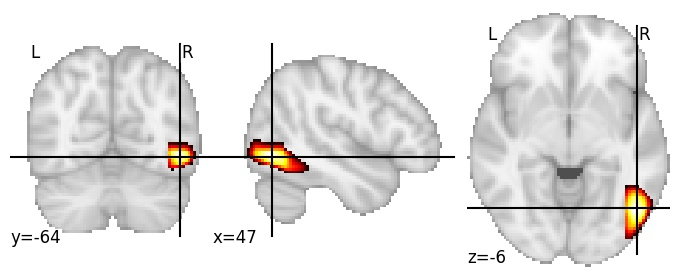](256/html/35.html)|

| Component 36: Cerebellum VIIb |  
|:---:|  
| [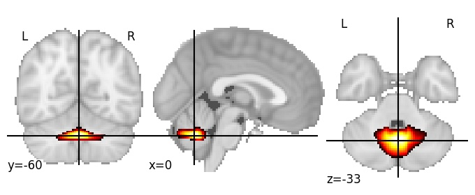](256/html/36.html)|

| Component 37: Caudate nucleus |  
|:---:|  
| [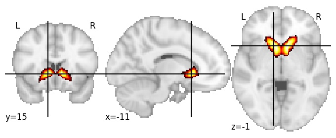](256/html/37.html)|

| Component 38: Supramarginal gyrus, RH |  
|:---:|  
| [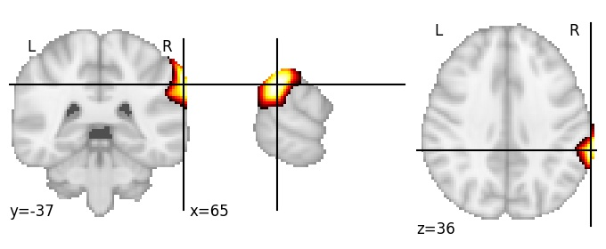](256/html/38.html)|

| Component 39: Paracingulate gyrus, anterior |  
|:---:|  
| [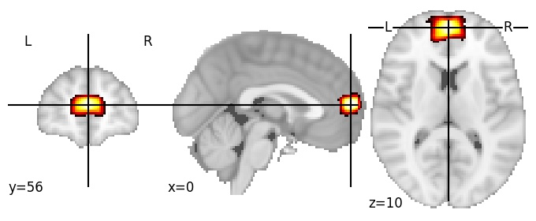](256/html/39.html)|

| Component 40: Paracingulate gyrus, posterior |  
|:---:|  
| [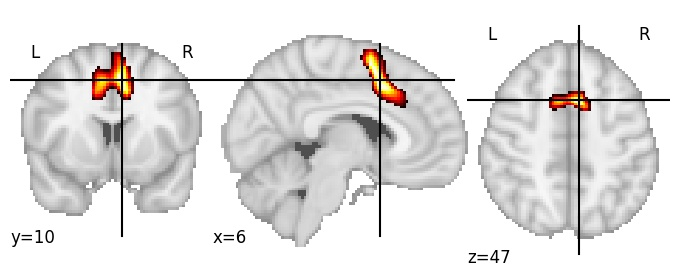](256/html/40.html)|

| Component 41: Thalamus |  
|:---:|  
| [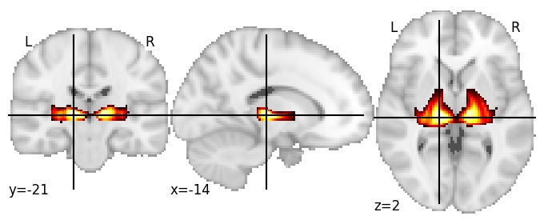](256/html/41.html)|

| Component 42: Postcentral sulcus, inferior |  
|:---:|  
| [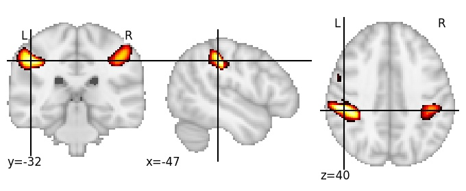](256/html/42.html)|

| Component 43: Ventromedial frontal cortex |  
|:---:|  
| [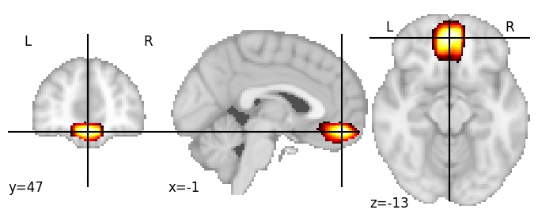](256/html/43.html)|

| Component 44: Precentral sulcus, medial |  
|:---:|  
| [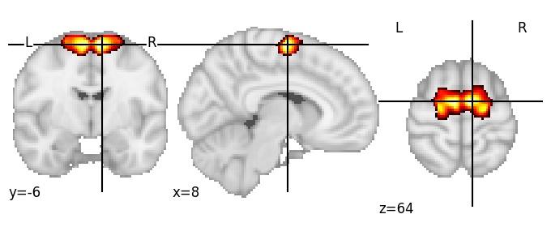](256/html/44.html)|

| Component 45: Superior frontal sulcus, LH |  
|:---:|  
| [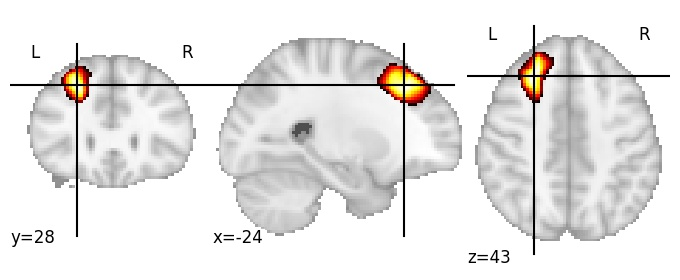](256/html/45.html)|

| Component 46: Postcentral sulcus superior, RH |  
|:---:|  
| [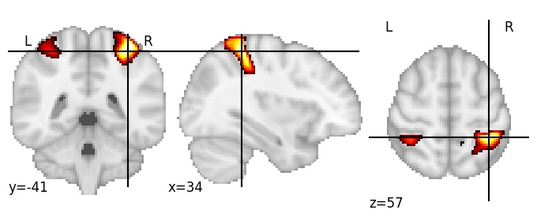](256/html/46.html)|

| Component 47: Supramarginal gyrus anterior, RH |  
|:---:|  
| [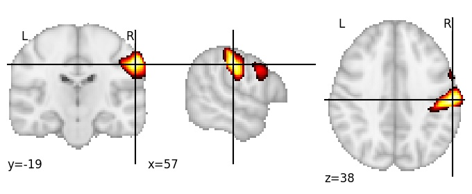](256/html/47.html)|

| Component 48: Frontal opercula RH |  
|:---:|  
| [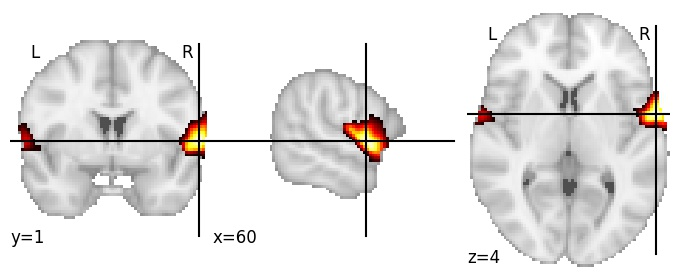](256/html/48.html)|

| Component 49: Lingual gyrus, anterior |  
|:---:|  
| [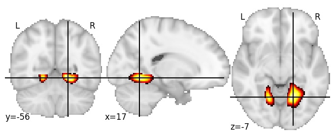](256/html/49.html)|

| Component 50: Cerebellum VIIIb posterior |  
|:---:|  
| [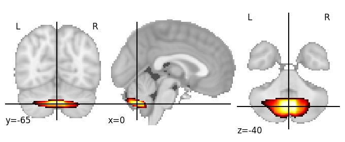](256/html/50.html)|

| Component 51: Central sulcus superior, RH |  
|:---:|  
| [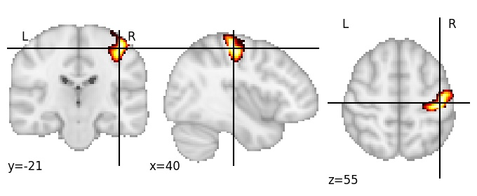](256/html/51.html)|

| Component 52: Cerebrospinal fluid (between parietal lobe and skull) |  
|:---:|  
| [")](256/html/52.html)|

| Component 53: Caudate |  
|:---:|  
| [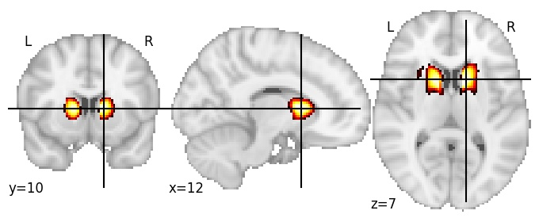](256/html/53.html)|

| Component 54: Superior frontal sulcus anterior, RH |  
|:---:|  
| [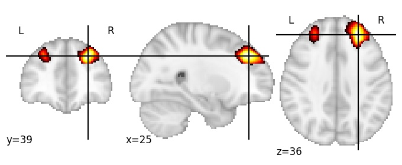](256/html/54.html)|

| Component 55: Anterior corona radiata |  
|:---:|  
| [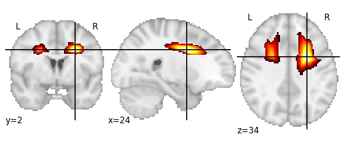](256/html/55.html)|

| Component 56: Suborbital cortex |  
|:---:|  
| [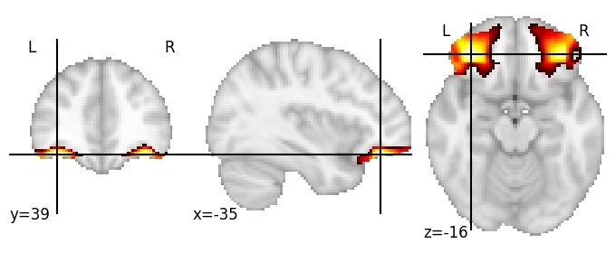](256/html/56.html)|

| Component 57: Inferior frontal gyrus LH |  
|:---:|  
| [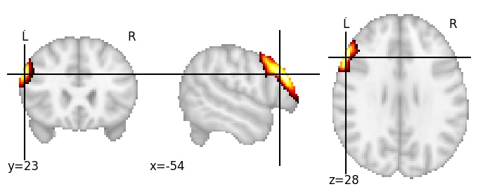](256/html/57.html)|

| Component 58: Caudate superior |  
|:---:|  
| |

| Component 59: Fusiform gyrus LH |  
|:---:|  
| |

| Component 60: Genu of callosal body |  
|:---:|  
| |

| Component 61: Frontal pole |  
|:---:|  
| |

| Component 62: Lingual gyrus, middle |  
|:---:|  
| |

| Component 63: Intraparietal sulcus dorsal, RH |  
|:---:|  
| |

| Component 64: Angular gyrus inferior, LH |  
|:---:|  
| |

| Component 65: Precuneus anterior |  
|:---:|  
| |

| Component 66: Caudate inferior |  
|:---:|  
| |

| Component 67: Middle frontal gyrus posterior RH |  
|:---:|  
| |

| Component 68: Superior frontal gyrus posterior, LH |  
|:---:|  
| |

| Component 69: Cerebellum VIIIb anterior |  
|:---:|  
| |

| Component 70: Parietal operculum |  
|:---:|  
| |

| Component 71: Isthmus of corpus callosum |  
|:---:|  
| |

| Component 72: Putamen |  
|:---:|  
| |

| Component 73: Supramarginal gyrus |  
|:---:|  
| |

| Component 74: Insula |  
|:---:|  
| |

| Component 75: Inferior frontal sulcus posterior, LH |  
|:---:|  
| |

| Component 76: Superior frontal gyrus posterior |  
|:---:|  
| |

| Component 77: Cuneus inferior |  
|:---:|  
| |

| Component 78: Mid-posterior lingual gyrus |  
|:---:|  
| |

| Component 79: Frontal pole lateral, RH |  
|:---:|  
| |

| Component 80: Inferior temporal gyrus, posterior, LH |  
|:---:|  
| |

| Component 81: Cerebellum Crus I RH |  
|:---:|  
| |

| Component 82: Cerebrospinal fluid (between superior frontal gyrus and skull) |  
|:---:|  
| [")](256/html/82.html)|

| Component 83: Central sulcus inferior |  
|:---:|  
| |

| Component 84: Superior occipital sulcus, inferior |  
|:---:|  
| |

| Component 85: Calcarine sulcus |  
|:---:|  
| |

| Component 86: Heschl’s gyrus |  
|:---:|  
| |

| Component 87: Superior parts of central and postcentral sulci |  
|:---:|  
| |

| Component 88: Cuneus inferior |  
|:---:|  
| |

| Component 89: Transverse occipital sulcus |  
|:---:|  
| |

| Component 90: Dorsal posterior cingulate cortex |  
|:---:|  
| |

| Component 91: Cerebellum Crus I superior |  
|:---:|  
| |

| Component 92: Frontomarginal gyrus |  
|:---:|  
| |

| Component 93: Optic radiation LH |  
|:---:|  
| |

| Component 94: Inferior frontal sulcus anterior, LH |  
|:---:|  
| |

| Component 95: Posterior hippocampus |  
|:---:|  
| |

| Component 96: Cerebellum IV |  
|:---:|  
| |

| Component 97: Superior occipital gyrus RH |  
|:---:|  
| |

| Component 98: Middle frontal gyrus medial RH |  
|:---:|  
| |

| Component 99: Precentral gyrus superior |  
|:---:|  
| |

| Component 100: Central sulcus middle |  
|:---:|  
| |

| Component 101: Internal capsule anterior horn RH |  
|:---:|  
| |

| Component 102: Ventral posterior cingulate cortex |  
|:---:|  
| |

| Component 103: Lateral ventricles, middle |  
|:---:|  
| |

| Component 104: Frontal pole |  
|:---:|  
| |

| Component 105: Putamen anterior |  
|:---:|  
| |

| Component 106: Intraparietal sulcus posterior, LH |  
|:---:|  
| |

| Component 107: Occipital pole |  
|:---:|  
| |

| Component 108: Middle temporal gyrus posterior |  
|:---:|  
| |

| Component 109: Angular gyrus RH |  
|:---:|  
| |

| Component 110: Insula anterior |  
|:---:|  
| |

| Component 111: Retrosplenial cortex |  
|:---:|  
| |

| Component 112: Fusiform gyrus posterior |  
|:---:|  
| |

| Component 113: Lateral occipital cortex anterior |  
|:---:|  
| |

| Component 114: Precentral gyrus medial superior |  
|:---:|  
| |

| Component 115: Superior parts of central and postcentral sulci LH |  
|:---:|  
| |

| Component 116: Mid-posterior medial frontal gyrus |  
|:---:|  
| |

| Component 117: Collateral sulcus, middle |  
|:---:|  
| |

| Component 118: Intraparietal sulcus ventral, RH |  
|:---:|  
| |

| Component 119: Calcarine sulcus posterior |  
|:---:|  
| |

| Component 120: Lateral occipital cortex superior |  
|:---:|  
| |

| Component 121: Dorsomedial prefrontal cortex |  
|:---:|  
| |

| Component 122: Occipital pole, superior |  
|:---:|  
| |

| Component 123: Callosomarginal sulcus |  
|:---:|  
| |

| Component 124: Intraparietal sulcus posterior, RH |  
|:---:|  
| |

| Component 125: Hippocampal fissure |  
|:---:|  
| |

| Component 126: Angular gyrus posterior, RH |  
|:---:|  
| |

| Component 127: Angular gyrus posterior, LH |  
|:---:|  
| |

| Component 128: Parieto-occipital sulcus, inferior |  
|:---:|  
| |

| Component 129: Precentral sulcus, RH |  
|:---:|  
| |

| Component 130: Pons, superior |  
|:---:|  
| |

| Component 131: Suborbital cortex medial |  
|:---:|  
| |

| Component 132: Insula, ventral anterior |  
|:---:|  
| |

| Component 133: Thalamus, medial |  
|:---:|  
| |

| Component 134: Middle temporal gyrus anterior RH |  
|:---:|  
| |

| Component 135: Superior corona radiata RH |  
|:---:|  
| |

| Component 136: Cerebrospinal fluid (between middle frontal gyrus and skull) |  
|:---:|  
| [")](256/html/136.html)|

| Component 137: Paracentral lobule posterior |  
|:---:|  
| |

| Component 138: Pons, inferior |  
|:---:|  
| |

| Component 139: Calcarine sulcus middle |  
|:---:|  
| |

| Component 140: Lateral ventricles, posterior horns |  
|:---:|  
| |

| Component 141: Inferior frontal gyrus anterior LH |  
|:---:|  
| |

| Component 142: Superior parts of central and postcentral sulci |  
|:---:|  
| |

| Component 143: Cerebellum Crus I posterior |  
|:---:|  
| |

| Component 144: Inferior frontal sulcus RH |  
|:---:|  
| |

| Component 145: Angular gyrus superior, LH |  
|:---:|  
| |

| Component 146: Intermediate primus of Jensen RH |  
|:---:|  
| |

| Component 147: Cerebellum Crus I lateral RH |  
|:---:|  
| |

| Component 148: Lateral fissure anterior |  
|:---:|  
| |

| Component 149: Rostral anterior cingulate cortex |  
|:---:|  
| |

| Component 150: Cerebrospinal fluid (between precentral gyrus and skull) |  
|:---:|  
| [")](256/html/150.html)|

| Component 151: Parieto-occipital sulcus, anterior |  
|:---:|  
| |

| Component 152: Precentral gyrus superior |  
|:---:|  
| |

| Component 153: Cerebrospinal fluid (between parieto-occipital sulcus and skull) |  
|:---:|  
| [")](256/html/153.html)|

| Component 154: Cerebellum V |  
|:---:|  
| |

| Component 155: Fusiform gyrus LH |  
|:---:|  
| |

| Component 156: Cerebellum Crus II |  
|:---:|  
| |

| Component 157: Anterior corona radiata RH |  
|:---:|  
| |

| Component 158: Thalamus lateral |  
|:---:|  
| |

| Component 159: Inferior occipital sulcus |  
|:---:|  
| |

| Component 160: Superior temporal sulcus posterior LH |  
|:---:|  
| |

| Component 161: Cerebellum VI superior LH |  
|:---:|  
| |

| Component 162: Angular gyrus inferior, RH |  
|:---:|  
| |

| Component 163: Superior temporal gyrus, medial |  
|:---:|  
| |

| Component 164: Middle temporal gyrus anterior LH |  
|:---:|  
| |

| Component 165: Fluid between cerebellum and pons |  
|:---:|  
| |

| Component 166: Angular gyrus superior |  
|:---:|  
| |

| Component 167: Planum temporale LH |  
|:---:|  
| |

| Component 168: Anterior hippocampus |  
|:---:|  
| |

| Component 169: Caudate nucleus |  
|:---:|  
| |

| Component 170: Temporal pole |  
|:---:|  
| |

| Component 171: Precentral sulcus, inferior, LH |  
|:---:|  
| |

| Component 172: Cerebellum Crus I anterior LH |  
|:---:|  
| |

| Component 173: Cerebellum VI anterior |  
|:---:|  
| |

| Component 174: Middle frontal gyrus posterior LH |  
|:---:|  
| |

| Component 175: Cerebrospinal fluid (between middle frontal gyrus and skull) |  
|:---:|  
| [")](256/html/175.html)|

| Component 176: Anterior cingulate cortex |  
|:---:|  
| |

| Component 177: Angular gyrus anterior LH |  
|:---:|  
| |

| Component 178: Posterior cingulate |  
|:---:|  
| |

| Component 179: Cerebellum Crus II |  
|:---:|  
| |

| Component 180: Cerebrospinal fluid (between precentral gyrus superior and skull) |  
|:---:|  
| [")](256/html/180.html)|

| Component 181: Cerebellum VI |  
|:---:|  
| |

| Component 182: Cerebrospinal fluid (between superior frontal gyrus and skull) |  
|:---:|  
| [")](256/html/182.html)|

| Component 183: Intraparietal sulcus LH |  
|:---:|  
| |

| Component 184: Cuneus superior |  
|:---:|  
| |

| Component 185: Frontal pole lateral LH |  
|:---:|  
| |

| Component 186: Superior temporal sulcus RH |  
|:---:|  
| |

| Component 187: Cerebellum VIIb |  
|:---:|  
| |

| Component 188: Posterior cingulate cortex |  
|:---:|  
| |

| Component 189: Superior parietal lobule anterior |  
|:---:|  
| |

| Component 190: Insula posterior inferior |  
|:---:|  
| |

| Component 191: Central opercular cortex |  
|:---:|  
| |

| Component 192: Middle frontal gyrus posterior RH |  
|:---:|  
| |

| Component 193: Lingual gyrus middle |  
|:---:|  
| |

| Component 194: Lateral occipital cortex |  
|:---:|  
| |

| Component 195: Lingual gyrus |  
|:---:|  
| |

| Component 196: Superior frontal gyrus posterior RH |  
|:---:|  
| |

| Component 197: Parieto-occipital sulcus, posterior |  
|:---:|  
| |

| Component 198: Cerebrospinal fluid (between paracentral lobule and skull) |  
|:---:|  
| [")](256/html/198.html)|

| Component 199: Putamen and globus pallidus |  
|:---:|  
| |

| Component 200: Cerebellum V |  
|:---:|  
| |

| Component 201: Cingulate sulcus posterior |  
|:---:|  
| |

| Component 202: Cerebrospinal fluid (between middle frontal gyrus and skull) |  
|:---:|  
| [")](256/html/202.html)|

| Component 203: Fusiform gyrus RH |  
|:---:|  
| |

| Component 204: Planum temporale RH |  
|:---:|  
| |

| Component 205: Pericallosal sulcus, middle |  
|:---:|  
| |

| Component 206: Thalamus ventral |  
|:---:|  
| |

| Component 207: Posterior middle frontal gyrus |  
|:---:|  
| |

| Component 208: Superior parietal lobule superior |  
|:---:|  
| |

| Component 209: Cerebellum Crus I posterior LH |  
|:---:|  
| |

| Component 210: Precentral sulcus inferior RH |  
|:---:|  
| |

| Component 211: Cerebellum VI RH |  
|:---:|  
| |

| Component 212: Inferior temporal sulcus posterior LH |  
|:---:|  
| |

| Component 213: Lingual gyrus anterior |  
|:---:|  
| |

| Component 214: Middle frontal gyrus anterior |  
|:---:|  
| |

| Component 215: Superior parietal lobule |  
|:---:|  
| |

| Component 216: Parieto-occipital sulcus superior |  
|:---:|  
| |

| Component 217: Superior temporal gyrus anterior |  
|:---:|  
| |

| Component 218: Precuneus inferior |  
|:---:|  
| |

| Component 219: Paracentral lobule |  
|:---:|  
| |

| Component 220: Occipital horn of lateral ventricles |  
|:---:|  
| |

| Component 221: Precentral sulcus superior LH |  
|:---:|  
| |

| Component 222: Calcarine sulcus anterior |  
|:---:|  
| |

| Component 223: Cerebellum VI superior |  
|:---:|  
| |

| Component 224: Putamen |  
|:---:|  
| |

| Component 225: Middle temporal gyrus middle RH |  
|:---:|  
| |

| Component 226: Anterior insula dorsal |  
|:---:|  
| |

| Component 227: Parietal operculum LH |  
|:---:|  
| |

| Component 228: Thalamus |  
|:---:|  
| |

| Component 229: Dorsomedial prefrontal cortex posterior |  
|:---:|  
| |

| Component 230: Superior temporal sulcus posterior RH |  
|:---:|  
| |

| Component 231: Posterior corona radiata LH |  
|:---:|  
| |

| Component 232: Pars opercularis |  
|:---:|  
| |

| Component 233: Cerebellum VI anterior |  
|:---:|  
| |

| Component 234: Superior occipital sulcus LH |  
|:---:|  
| |

| Component 235: Dorsomedial prefrontal cortex anterior |  
|:---:|  
| |

| Component 236: Pars orbitalis RH |  
|:---:|  
| |

| Component 237: Occipitotemporal gyrus anterior |  
|:---:|  
| |

| Component 238: Calcarine sulcus anterior |  
|:---:|  
| |

| Component 239: Precentral gyrus middle |  
|:---:|  
| |

| Component 240: Lateral occipital cortex inferior |  
|:---:|  
| |

| Component 241: Precuneus posterior |  
|:---:|  
| |

| Component 242: Anterior horizontal ramus lateral fissure RH |  
|:---:|  
| |

| Component 243: Postcentral sulcus middle RH |  
|:---:|  
| |

| Component 244: Ventromedial prefrontal cortex anterior |  
|:---:|  
| |

| Component 245: Cerebrospinal fluid (between middle frontal gyrus RH and skull) |  
|:---:|  
| [")](256/html/245.html)|

| Component 246: Cerebrospinal fluid (between precentral and postcentral gyri LH and skull) |  
|:---:|  
| [")](256/html/246.html)|

| Component 247: Superior longitudinal fasciculus I posterior, RH |  
|:---:|  
| |

| Component 248: Superior frontal sulcus RH |  
|:---:|  
| |

| Component 249: Forceps major RH |  
|:---:|  
| |

| Component 250: Superior longitudinal fasciculus II LH |  
|:---:|  
| |

| Component 251: Supramarginal gyrus anterior, LH |  
|:---:|  
| |

| Component 252: Callosomarginal sulcus inferior |  
|:---:|  
| |

| Component 253: Superior temporal sulcus posterior RH |  
|:---:|  
| |

| Component 254: Superior longitudinal fasciculus I LH |  
|:---:|  
| |

| Component 255: Parietal operculum RH |  
|:---:|  
| |

| Component 256: Precuneus superior |  
|:---:|  
| |