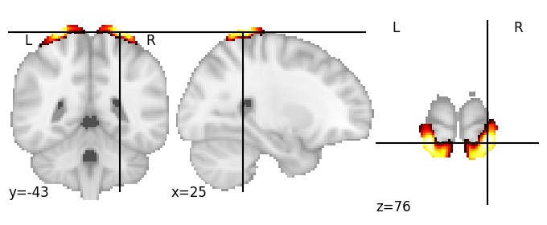
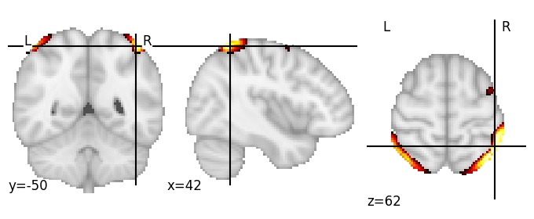
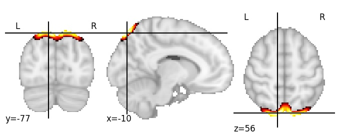
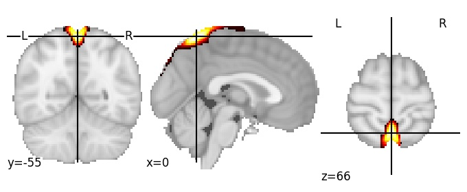
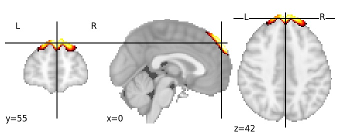

| All 256 components |
|:---:|
|  |

| Component 1: Middle frontal gyrus anterior, LH |
|:---:|
| |

| Component 2: Middle frontal gyrus anterior, RH |
|:---:|
|  |

| Component 3: Cerebrospinal fluid (between superior parietal lobule and skull) |
|:---:|
|  |

| Component 4: Inferior frontal sulcus, RH |
|:---:|
|  |

| Component 5: Caudate superior |
|:---:|
|  |

| Component 6: Lower posterior cingulate cortex |
|:---:|
|  |

| Component 7: Intraparietal sulcus posterior, LH |
|:---:|
|  |

| Component 8: Parieto-occipital sulcus central |
|:---:|
|  |

| Component 9: Superior frontal sulcus |
|:---:|
|  |

| Component 10: Ventral medial prefrontal cortex |
|:---:|
|  |

| Component 11: Cerebellum Crus I posterior |
|:---:|
|  |

| Component 12: Lingual gyrus posterior | 
|:---:|
|  |

| Component 13: Lateral occipital cortex, superior |
|:---:|
|  |

| Component 14: Lateral frontal pole |
|:---:|
|  |

| Component 15: Precentral gyrus inferior |
|:---:|
|  |

| Component 16: Precuneus superior |
|:---:|
|  |

| Component 17: Parieto-occipital sulcus postero-superior |
|:---:|
|  |

| Component 18: Postcentral gyrus RH |
|:---:|
|  |

| Component 19: Mid-anterior cingulate cortex |
|:---:|
|  |

| Component 20: Cerebrospinal fluid (superior of Central sulcus) |
|:---:|
| [")](https://parietal-inria.github.io/MODL_atlas/256/html/20.html) |

| Component 21: Angular gyrus superior, RH |
|:---:|
|  |

| Component 22: Cerebellum Crus I anterior |
|:---:|
|  |

| Component 23: Superior temporal gyrus, middle |
|:---:|
|  |

| Component 24: Angular gyrus, posterior |
|:---:|
|  |

| Component 25: Lateral occipital cortex, inferior |
|:---:|
|  |

| Component 26: Middle temporal gyrus RH |
|:---:|
|  |

| Component 27: Cerebellum VI anterior |
|:---:|
|  |

| Component 28: Cerebellum VI superior |
|:---:|
|  |

| Component 29: Angular gyrus anterior, RH |
|:---:|
|  |

| Component 30: Cerebrospinal fluid (between anterior part of superior frontal gyrus and skull) |
|:---:|
| [")](https://parietal-inria.github.io/MODL_atlas/256/html/30.html) |

| Component 31: Parahippocampal gyrus |
|:---:|
|  |

| Component 32: Inferior frontal gyrus anterior, LH |
|:---:|
|  |

| Component 33: Posterior cingulate cortex |
|:---:|
|  |

| Component 34: Inferior temporal gyrus, posterior |
|:---:|
|  |

| Component 35: Dorsomedial prefrontal cortex, anterocaudal |
|:---:|
|  |

| Component 36: Superior frontal gyrus, posterior |
|:---:|
|  |

| Component 37: Supramarginal gyrus, LH |
|:---:|
|  |

| Component 38: Superior precentral and postcentral gyri |
|:---:|
|  |

| Component 39: Cerebrospinal fluid (between occipital pole and cerebellum) |
|:---:|
| [")](https://parietal-inria.github.io/MODL_atlas/256/html/39.html) |

| Component 40: Paracingulate gyrus, middle |
|:---:|
|  |

| Component 41: Anterior fusiform gyrus |
|:---:|
|  |

| Component 42: Middle temporal gyrus, LH |
|:---:|
|  |

| Component 43: Postcentral gyrus superior, LH |
|:---:|
|  |

| Component 44: Inferior parietal lobule, LH |
|:---:|
|  |

| Component 45: Calcarine sulcus, anterior |
|:---:|
|  |

| Component 46: Intraparietal sulcus, RH |
|:---:|
|  |

| Component 47: Inferior occipital sulcus |
|:---:|
|  |

| Component 48: Postcentral sulcus inferior, LH |
|:---:|
|  |

| Component 49: Insula center, and lateral fissure |
|:---:|
|  |

| Component 50: Superior parietal lobule, posterior |
|:---:|
|  |

| Component 51: Cerebrospinal fluid (between superior part of superior frontal gyrus and skull) |
|:---:|
| [")](https://parietal-inria.github.io/MODL_atlas/256/html/51.html) |

| Component 52: Inferior precuneus |
|:---:|
|  |

| Component 53: Inferior frontal sulcus RH |
|:---:|
|  |

| Component 54: Planum temporale LH |
|:---:|
|  |

| Component 55: Cerebellum superior posterior fissure |
|:---:|
|  |

| Component 56: Intraparietal sulcus anterior, LH |
|:---:|
|  |

| Component 57: Hippocampal fissure |
|:---:|
|  |

| Component 58: Dorsomedial prefrontal cortex, anteromedial |
|:---:|
|  |

| Component 59: Inferior callosomarginal sulcus |
|:---:|
|  |

| Component 60: Paracentral lobule |
|:---:|
|  |

| Component 61: Parieto-occipital sulcus anterior |
|:---:|
|  |

| Component 62: Central sulcus |
|:---:|
|  |

| Component 63: Posterior cingulate cortex, superior |
|:---:|
|  |

| Component 64: Lateral fissure, anterior |
|:---:|
|  |

| Component 65: Ventrolateral fusiform gyrus |
|:---:|
|  |

| Component 66: Cerebrospinal fluid (between Parieto-occipital sulcus and skull) |
|:---:|
| [")](https://parietal-inria.github.io/MODL_atlas/256/html/66.html) |

| Component 67: Anterior insula, RH-dominated |
|:---:|
|  |

| Component 68: Planum temporale RH |
|:---:|
|  |

| Component 69: Anterior cingulate cortex |
|:---:|
|  |

| Component 70: Cerebrospinal fluid (between central sulcus and skull) |
|:---:|
| [")](https://parietal-inria.github.io/MODL_atlas/256/html/70.html) |

| Component 71: Thalamus |
|:---:|
|  |

| Component 72: Calcarine cortex, posterior |
|:---:|
|  |

| Component 73: Superior occipital sulcus |
|:---:|
|  |

| Component 74: Postcentral sulcus, superior |
|:---:|
|  |

| Component 75: Cuneus |
|:---:|
|  |

| Component 76: Precentral sulcus inferior, LH |
|:---:|
|  |

| Component 77: Superior parietal sulcus |
|:---:|
|  |

| Component 78: Cuneus superior |
|:---:|
|  |

| Component 79: Pars triangularis |
|:---:|
|  |

| Component 80: Superior temporal sulcus LH |
|:---:|
|  |

| Component 81: Intraparietal sulcus anterior, RH |
|:---:|
|  |

| Component 82: Cerebellum IV and V |
|:---:|
|  |

| Component 83: Precentral sulcus, superior |
|:---:|
|  |

| Component 84: Precentral gyrus superior |
|:---:|
|  |

| Component 85: Calcarine cortex, anterior |
|:---:|
|  |

| Component 86: Cerebrospinal fluid (between parietal lobe and skull) |
|:---:|
| [")](https://parietal-inria.github.io/MODL_atlas/256/html/86.html) |

| Component 87: Internal capsule |
|:---:|
|  |

| Component 88: Lunate sulcus |
|:---:|
|  |

| Component 89: Superior parietal lobule, anterior |
|:---:|
|  |

| Component 90: Superior frontal sulcus, anterior |
|:---:|
|  |

| Component 91: Lingual gyrus |
|:---:|
|  |

| Component 92: Precuneus anterior |
|:---:|
|  |

| Component 93: Cerebrospinal fluid (between middle frontal gyrus and skull) |
|:---:|
| [")](https://parietal-inria.github.io/MODL_atlas/256/html/93.html) |

| Component 94: Caudate |
|:---:|
|  |

| Component 95: Retrosplenial cortex |
|:---:|
|  |

| Component 96: Cerebellum Crus II |
|:---:|
|  |

| Component 97: Thalamus and globus pallidus |
|:---:|
|  |

| Component 98: Putamen, anterior |
|:---:|
|  |

| Component 99: Posterior insula ventral |
|:---:|
|  |

| Component 100: Caudate ventral |
|:---:|
|  |

| Component 101: Superior frontal sulcus anterior, LH |
|:---:|
|  |

| Component 102: Paracingulate gyrus postero-inferior |
|:---:|
|  |

| Component 103: Occipital pole, superior |
|:---:|
|  |

| Component 104: Inferior frontal sulcus posterior RH |
|:---:|
|  |

| Component 105: Cingulate sulcus, posterior |
|:---:|
|  |

| Component 106: Middle frontal gyrus, RH |
|:---:|
|  |

| Component 107: Anterior insula |
|:---:|
|  |

| Component 108: Inferior occipital gyrus |
|:---:|
|  |

| Component 109: Central operculum cortex |
|:---:|
|  |

| Component 110: Inferior parietal lobule, LH |
|:---:|
|  |

| Component 111: Intracalcarine cortex |
|:---:|
|  |

| Component 112: Postcentral sulcus RH |
|:---:|
|  |

| Component 113: Cerebellum VI |
|:---:|
|  |

| Component 114: Supramarginal gyrus anterior, RH |
|:---:|
|  |

| Component 115: Cerebellum IV and middle cerebellar peduncle |
|:---:|
|  |

| Component 116: Occipital pole, inferior |
|:---:|
|  |

| Component 117: Ventromedial prefrontal cortex, anterior |
|:---:|
|  |

| Component 118: Parieto-occipital sulcus antero-superior |
|:---:|
|  |

| Component 119: Paracingulate gyrus, postero-superior |
|:---:|
|  |

| Component 120: Fusiform gyrus |
|:---:|
|  |

| Component 121: Precuneus, posterior |
|:---:|
|  |

| Component 122: Angular gyrus, LH |
|:---:|
|  |

| Component 123: Inferior frontal sulcus, LH |
|:---:|
|  |

| Component 124: Putamen, posterior |
|:---:|
|  |

| Component 125: Postcentral gyrus, middle |
|:---:|
|  |

| Component 126: Superior temporal sulcus posterior, RH |
|:---:|
|  |

| Component 127: Lateral ventricles, superior |
|:---:|
|  |

| Component 256: Angular gyrus, RH |
|:---:|
|  |
