| All 512 components |  
|:---:|  
| 

| Component 1: Superior occipital sulcus inferior LH |  
|:---:|  
| [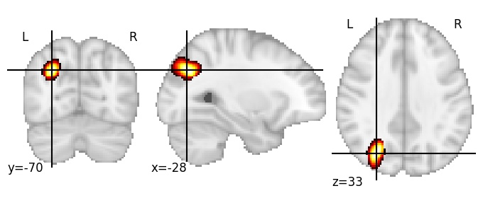](512/html/1.html)|

| Component 2: Superior occipital gyrus  |  
|:---:|  
| |

| Component 3: Anterior insula, ventral |  
|:---:|  
| [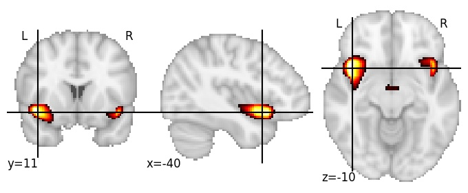](512/html/3.html)|

| Component 4: Middle frontal gyrus middle RH |  
|:---:|  
| [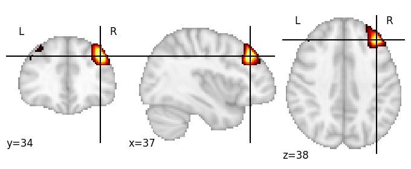](512/html/4.html)|

| Component 5: Calcarine cortex posterior LH |  
|:---:|  
| [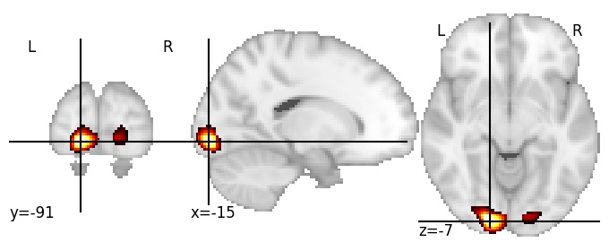](512/html/5.html)|

| Component 6: Lateral fissure posterior ramus RH |  
|:---:|  
| [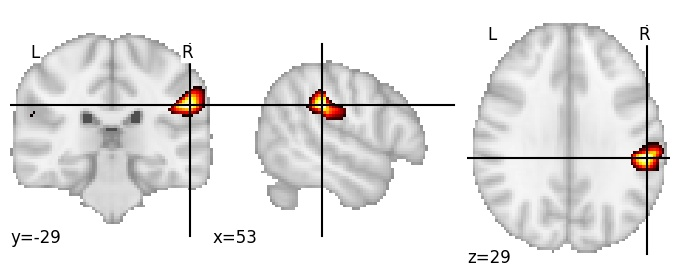](512/html/6.html)|

| Component 7: Superior occipital gyrus superior LH |  
|:---:|  
| [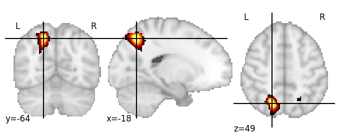](512/html/7.html)|

| Component 8: Angular gyrus inferior LH |  
|:---:|  
| [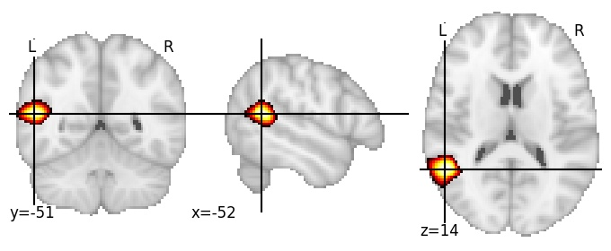](512/html/8.html)|

| Component 9: Calcarine sulcus anterior, LH |  
|:---:|  
| [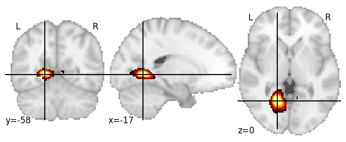](512/html/9.html)|

| Component 10: Frontal pole lateral, RH |  
|:---:|  
| [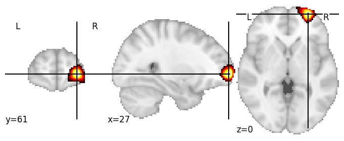](512/html/10.html)|

| Component 11: Midbrain superior |  
|:---:|  
| |

| Component 12: Occipitotemporal gyrus mid-posterior RH |  
|:---:|  
| |

| Component 13: Posterior insula dorsal medial |  
|:---:|  
| [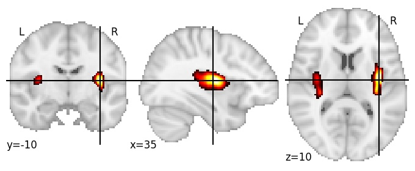](512/html/13.html)|

| Component 14: Cerebellum VI RH |  
|:---:|  
| |

| Component 15: Fusiform gyrus anterior LH |  
|:---:|  
| [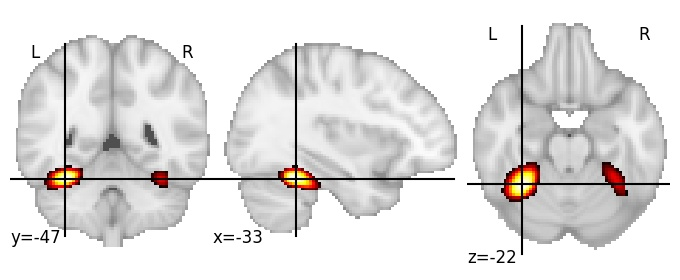](512/html/15.html)|

| Component 16: Cerebellum Crus I anterior RH |  
|:---:|  
| [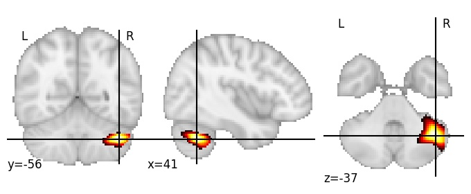](512/html/16.html)|

| Component 17: Supramarginal gyrus antero-superior LH |  
|:---:|  
| [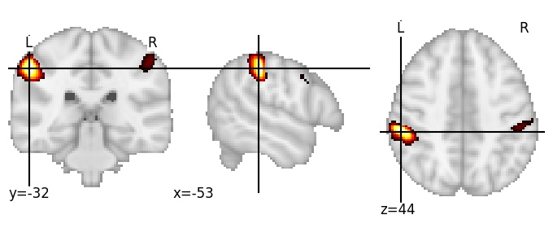](512/html/17.html)|

| Component 18: Angular sulcus superior LH |  
|:---:|  
| [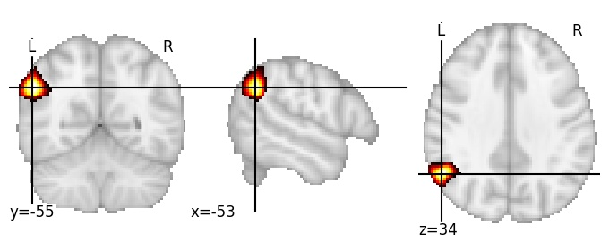](512/html/18.html)|

| Component 19: Paracingulate sulcus LH |  
|:---:|  
| [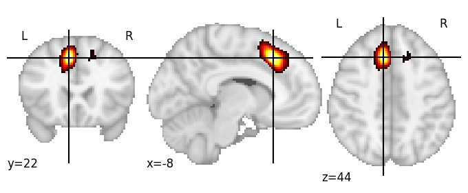](512/html/19.html)|

| Component 20: Superior frontal gyrus superior |  
|:---:|  
| [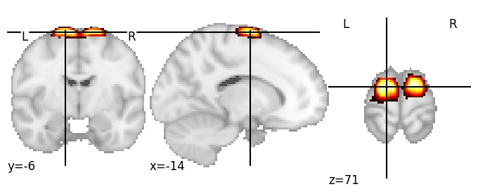](512/html/20.html)|

| Component 21: Pars triangularis LH |  
|:---:|  
| [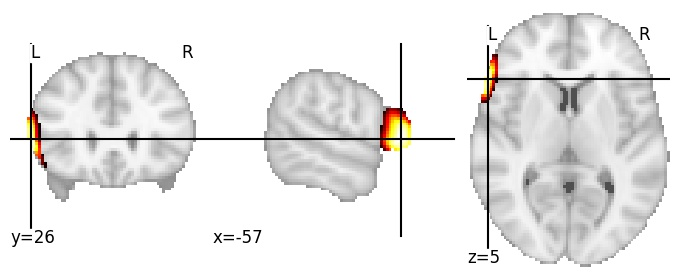](512/html/21.html)|

| Component 22: Superior longitudinal fasciculus II LH |  
|:---:|  
| [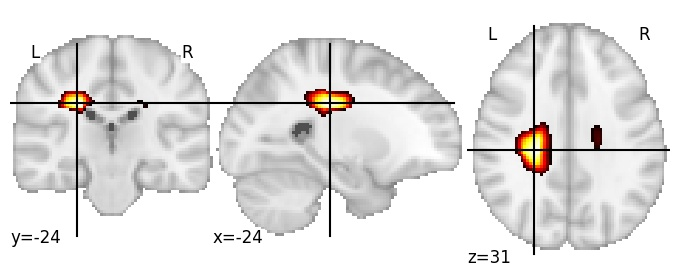](512/html/22.html)|

| Component 23: Superior corona radiata anterior |  
|:---:|  
| [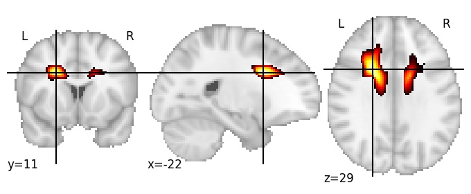](512/html/23.html)|

| Component 24: Dorsomedial prefrontal cortex anterocaudal LH |  
|:---:|  
| [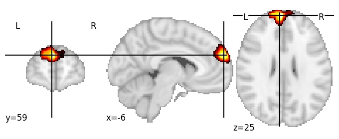](512/html/24.html)|

| Component 25: Superior longitudinal fasciculus III anterior LH |  
|:---:|  
| [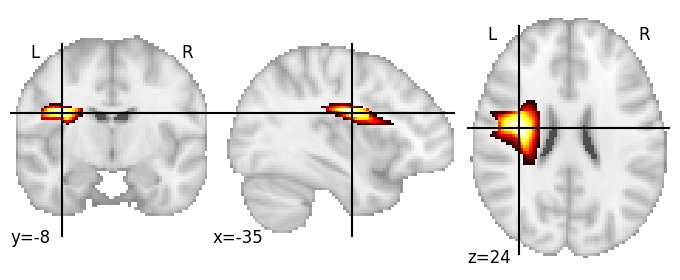](512/html/25.html)|

| Component 26: Cuneus antero-inferior |  
|:---:|  
| [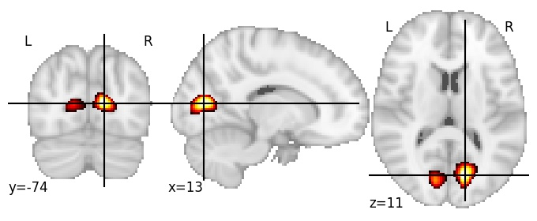](512/html/26.html)|

| Component 27: Anterior vertical ramus of the lateral fissure LH |  
|:---:|  
| [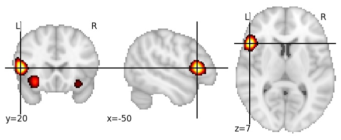](512/html/27.html)|

| Component 28: Corpus callosum isthmus anterior |  
|:---:|  
| [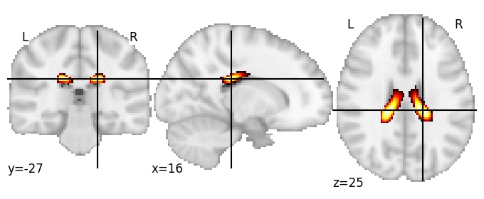](512/html/28.html)|

| Component 29: Posterior limb of the internal capsule RH |  
|:---:|  
| [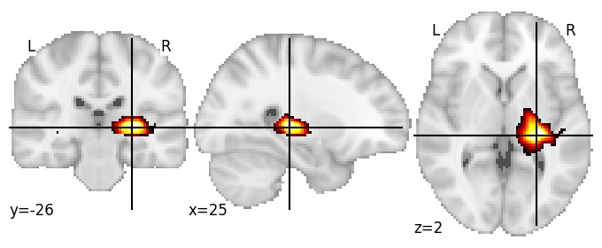](512/html/29.html)|

| Component 30: Cingulate gyrus middle inferior |  
|:---:|  
| [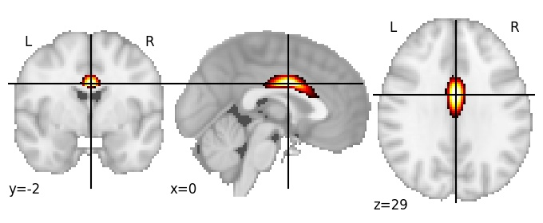](512/html/30.html)|

| Component 31: Caudate RH |  
|:---:|  
| [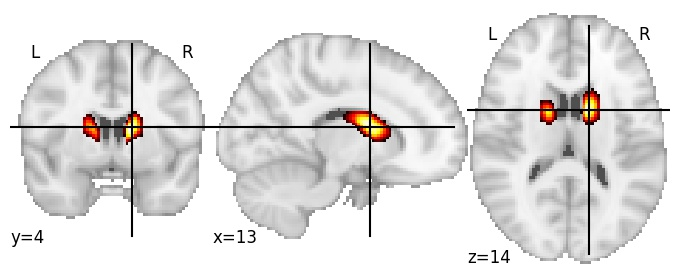](512/html/31.html)|

| Component 32: Superior frontal sulcus anterior RH |  
|:---:|  
| |

| Component 33: Pars orbitalis RH |  
|:---:|  
| [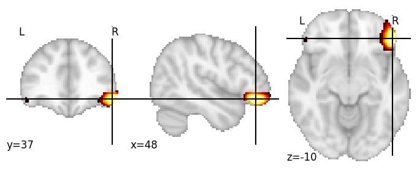](512/html/33.html)|

| Component 34: Cerebellum VIIb |  
|:---:|  
| [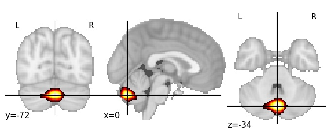](512/html/34.html)|

| Component 35: Intraparietal sulcus anterior LH |  
|:---:|  
| |

| Component 36: Superior longitudinal fasciculus I posterior RH |  
|:---:|  
| [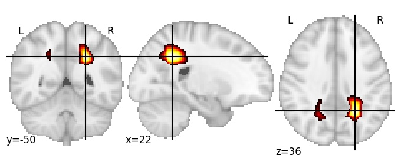](512/html/36.html)|

| Component 37: Superior longitudinal fasciculus II middle RH |  
|:---:|  
| [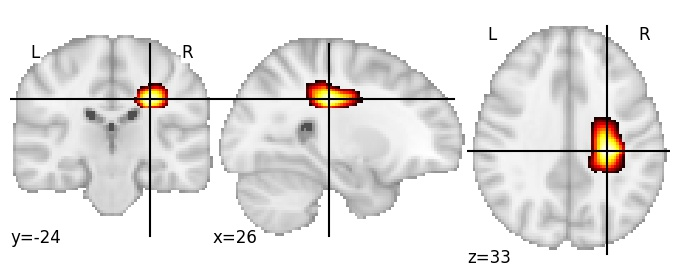](512/html/37.html)|

| Component 38: Angular gyrus postero-inferior RH |  
|:---:|  
| [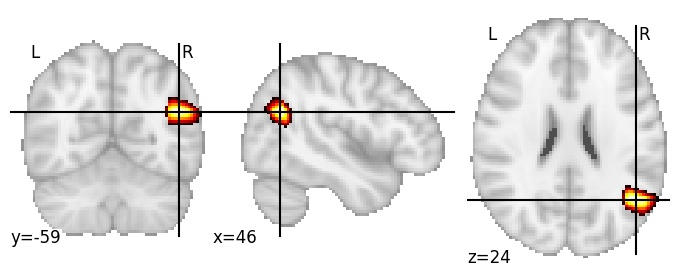](512/html/38.html)|

| Component 39: Cerebrospinal fluid (between middle frontal gyrus and skull) |  
|:---:|  
| [")](512/html/39.html)|

| Component 40: Cerebellum III anterior |  
|:---:|  
| [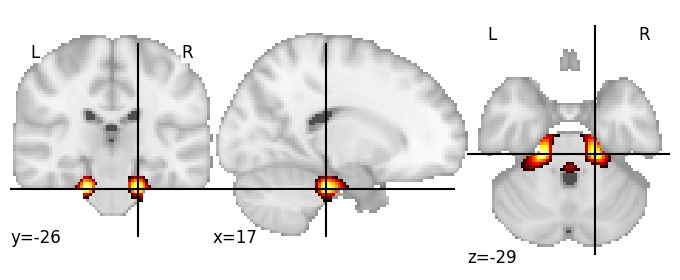](512/html/40.html)|

| Component 41: Central sulcus middle RH |  
|:---:|  
| |

| Component 42: Cerebrospinal fluid (between interhemispheric fissure and superior frontal gyrus superio ) |  
|:---:|  
| [")](512/html/42.html)|

| Component 43: Superior frontal gyrus superior RH |  
|:---:|  
| [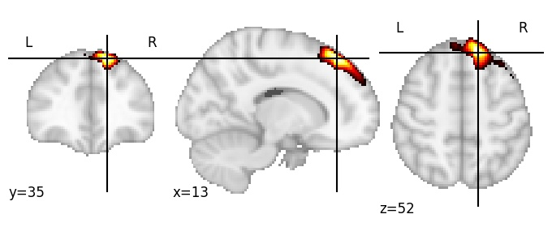](512/html/43.html)|

| Component 44: Frontal pole superior RH |  
|:---:|  
| |

| Component 45: Postcentral sulcus LH |  
|:---:|  
| |

| Component 46: Frontal pole |  
|:---:|  
| [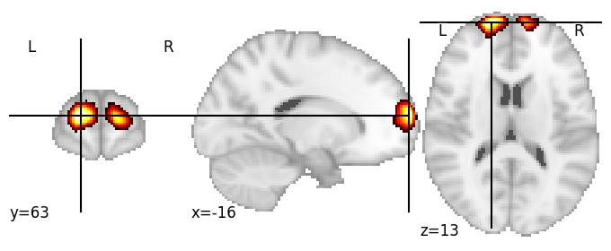](512/html/46.html)|

| Component 47: Paracingulate sulcus posterior RH |  
|:---:|  
| [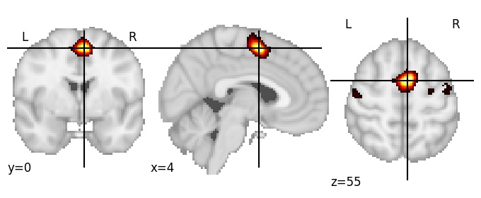](512/html/47.html)|

| Component 48: Middle frontal gyrus mid-anterior LH |  
|:---:|  
| [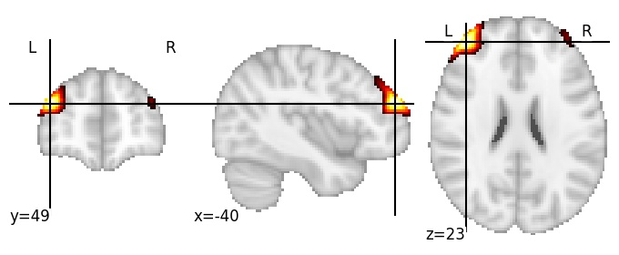](512/html/48.html)|

| Component 49: Middle frontal gyrus posterior lateral RH |  
|:---:|  
| [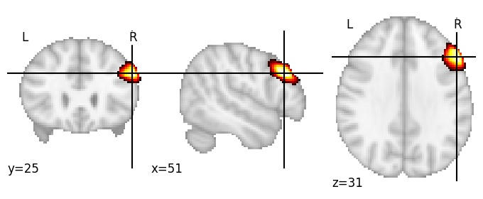](512/html/49.html)|

| Component 50: Intraparietal sulcus superior LH |  
|:---:|  
| [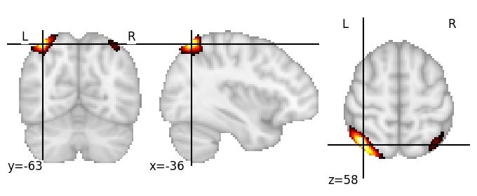](512/html/50.html)|

| Component 51: Ventromedial prefrontal cortex |  
|:---:|  
| |

| Component 52: Lingual gyrus posterior |  
|:---:|  
| |

| Component 53: Anterior insula dorsal RH |  
|:---:|  
| [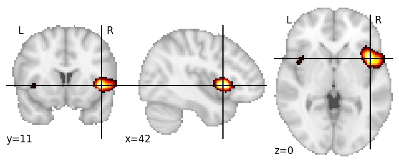](512/html/53.html)|

| Component 54: Caudate dorsal |  
|:---:|  
| [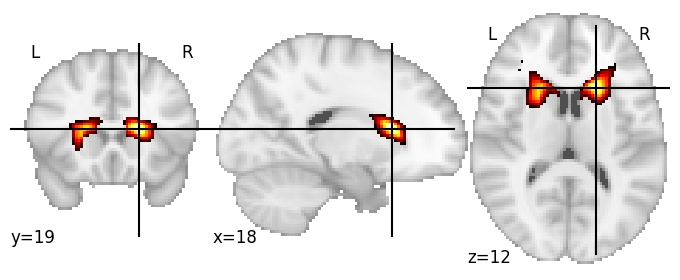](512/html/54.html)|

| Component 55: Parieto-occipital sulcus mid-posterior |  
|:---:|  
| |

| Component 56: Globus pallidus anterior |  
|:---:|  
| |

| Component 57: Superior longitudinal fasciculus I anterior LH |  
|:---:|  
| [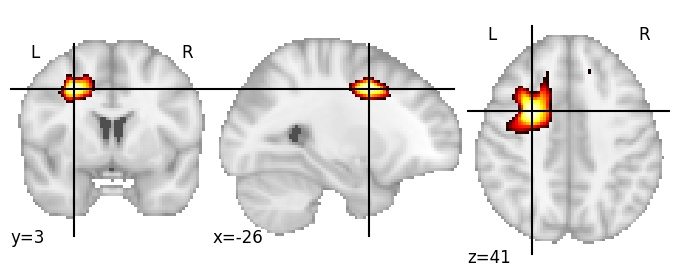](512/html/57.html)|

| Component 58: Superior longitudinal fasciculus I anterior RH |  
|:---:|  
| [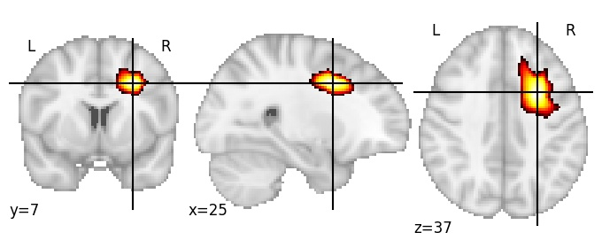](512/html/58.html)|

| Component 59: Precentral sulcus mid-inferior LH |  
|:---:|  
| [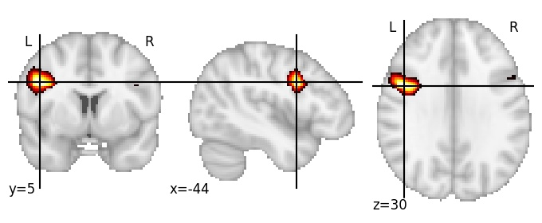](512/html/59.html)|

| Component 60: Cerebellum VI superior medial |  
|:---:|  
| [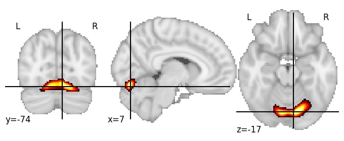](512/html/60.html)|

| Component 61: Postcentral sulcus inferior RH |  
|:---:|  
| [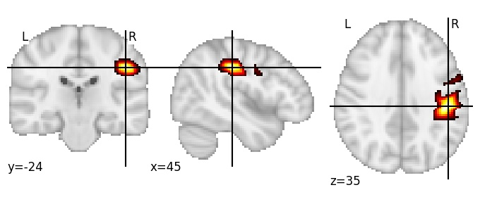](512/html/61.html)|

| Component 62: Cuneus middle posterior RH |  
|:---:|  
| [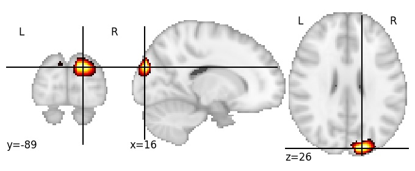](512/html/62.html)|

| Component 63: Cerebrospinal fluid (between middle frontal gyrus and skull LH) |  
|:---:|  
| [")](512/html/63.html)|

| Component 64: Paracingulate gyrus posterior LH |  
|:---:|  
| [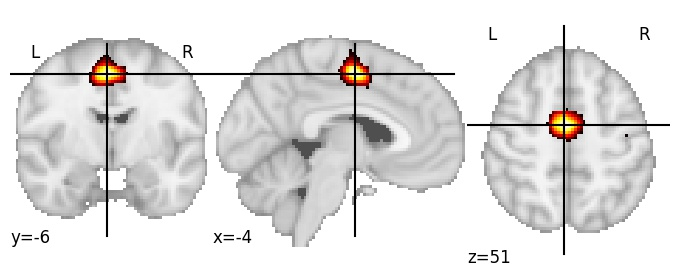](512/html/64.html)|

| Component 65: Precentral gyrus mid-superior  |  
|:---:|  
| |

| Component 66: Superior temporal gyrus mid-anterior LH |  
|:---:|  
| [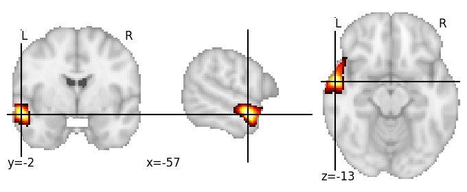](512/html/66.html)|

| Component 67: Fusiform gyrus anterior |  
|:---:|  
| [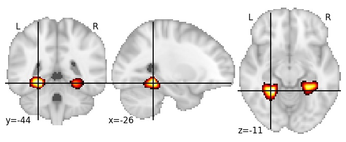](512/html/67.html)|

| Component 68: Superior frontal gyrus medial anterior |  
|:---:|  
| |

| Component 69: Superior frontal gyrus mid-posterior  |  
|:---:|  
| |

| Component 70: Cerebellum IX |  
|:---:|  
| |

| Component 71: Thalamus posterior |  
|:---:|  
| |

| Component 72: Globus pallidus RH |  
|:---:|  
| |

| Component 73: Postcentral sulcus RH |  
|:---:|  
| |

| Component 74: Thalamus superior |  
|:---:|  
| |

| Component 75: Superior occipital sulcus superior LH |  
|:---:|  
| |

| Component 76: Supramarginal gyrus posterior LH |  
|:---:|  
| |

| Component 77: Gyrus rectus |  
|:---:|  
| |

| Component 78: Anterior occipital sulcus RH |  
|:---:|  
| |

| Component 79: Lateral fissure anterior |  
|:---:|  
| |

| Component 80: Posterior corona radiata LH |  
|:---:|  
| |

| Component 81: Cerebellum V anterior |  
|:---:|  
| |

| Component 82: Parieto-occipital sulcus mid-anterior |  
|:---:|  
| |

| Component 83: Hippocampus anterior |  
|:---:|  
| |

| Component 84: Superior frontal gyrus mid-anterior LH |  
|:---:|  
| |

| Component 85: Cerebellum Crus II anterior LH |  
|:---:|  
| |

| Component 86: Intraparietal sulcus middle RH |  
|:---:|  
| |

| Component 87: Parieto-occipital sulcus posterior lateral |  
|:---:|  
| |

| Component 88: Occipital pole LH |  
|:---:|  
| |

| Component 89: Corticospinal tract superior |  
|:---:|  
| |

| Component 90: Cingulate gyrus middle superior |  
|:---:|  
| |

| Component 91: Parieto-occipital sulcus anterior |  
|:---:|  
| |

| Component 92: Cererbrospinal fluid (between callosomarginal sulcus and skull LH) |  
|:---:|  
| [")](512/html/92.html)|

| Component 93: Occipitotemporal gyrus posterior RH |  
|:---:|  
| |

| Component 94: Posterior insula dorsal lateral LH |  
|:---:|  
| |

| Component 95: Superior frontal gyrus posterior LH |  
|:---:|  
| |

| Component 96: Inferior frontal sulcus middle RH |  
|:---:|  
| |

| Component 97: Postcentral gyrus middle LH |  
|:---:|  
| |

| Component 98: Arcuate fasciculus postero-inferior LH |  
|:---:|  
| |

| Component 99: Angular gyrus anterior RH |  
|:---:|  
| |

| Component 100: Angular sulcus inferior RH |  
|:---:|  
| |

| Component 101: Temporal pole LH |  
|:---:|  
| |

| Component 102: Paracentral lobule inferior LH |  
|:---:|  
| |

| Component 103: Precentral sulcus medial |  
|:---:|  
| |

| Component 104: Dorsomedial prefrontal cortex LH |  
|:---:|  
| |

| Component 105: Amygdala inferior |  
|:---:|  
| |

| Component 106: Perirhinal cortex |  
|:---:|  
| |

| Component 107: Cuneus middle |  
|:---:|  
| |

| Component 108: Callosomarginal sulcus middle |  
|:---:|  
| |

| Component 109: Lunate sulcus RH |  
|:---:|  
| |

| Component 110: Putamen superior |  
|:---:|  
| |

| Component 111: Putamen LH |  
|:---:|  
| |

| Component 112: Frontal pole |  
|:---:|  
| |

| Component 113: Forceps minor |  
|:---:|  
| |

| Component 114: Superior temporal gyrus medial anterior |  
|:---:|  
| |

| Component 115: Middle frontal gyrus anterior RH |  
|:---:|  
| |

| Component 116: Planum polare superior |  
|:---:|  
| |

| Component 117: Dorsomedial prefrontal cortex posterior |  
|:---:|  
| |

| Component 118: Superior frontal gyrus postero-superior LH |  
|:---:|  
| |

| Component 119: Supramarginal gyrus postero-superior RH |  
|:---:|  
| |

| Component 120: Amygdala |  
|:---:|  
| |

| Component 121: Cerebellum VI medial RH |  
|:---:|  
| |

| Component 122: Lingual gyrus medial |  
|:---:|  
| |

| Component 123: Cuneus anterior RH |  
|:---:|  
| |

| Component 124: Superior frontal sulcus middle LH |  
|:---:|  
| |

| Component 125: Cerebellum IX inferior |  
|:---:|  
| |

| Component 126: Cingulum anterior |  
|:---:|  
| |

| Component 127: Inferior temporal sulcus posterior RH |  
|:---:|  
| |

| Component 128: Cerebellum VI superior LH |  
|:---:|  
| |

| Component 129: Optic radiation LH |  
|:---:|  
| |

| Component 130: Corpus callosum genu inferior |  
|:---:|  
| |

| Component 131: Precuneus mid-superior LH |  
|:---:|  
| |

| Component 132: Postcentral gyrus mid-inferior |  
|:---:|  
| |

| Component 133: Inferior frontal sulcus posterior LH |  
|:---:|  
| |

| Component 134: Lateral occipital cortex posterior LH |  
|:---:|  
| |

| Component 135: Angular gyrus mid-posterior RH |  
|:---:|  
| |

| Component 136: Temporal pole |  
|:---:|  
| |

| Component 137: Cerebellum Crus II posterior LH |  
|:---:|  
| |

| Component 138: Superior temporal sulcus posterior LH |  
|:---:|  
| |

| Component 139: Cerebrospinal fluid (between superior precentral gyrus and skull) |  
|:---:|  
| [")](512/html/139.html)|

| Component 140: Lunate sulcus LH |  
|:---:|  
| |

| Component 141: Cerebellum Crus I medial RH |  
|:---:|  
| |

| Component 142: Posterior cingulate cortex LH |  
|:---:|  
| |

| Component 143: Precuneus anterior |  
|:---:|  
| |

| Component 144: Intraparietal sulcus middle LH |  
|:---:|  
| |

| Component 145: Lingual gyrus middle |  
|:---:|  
| |

| Component 146: Superior temporal gyrus posterior RH |  
|:---:|  
| |

| Component 147: Lateral orbital cortex |  
|:---:|  
| |

| Component 148: Pons antero-superior |  
|:---:|  
| |

| Component 149: Middle frontal sulcus anterior |  
|:---:|  
| |

| Component 150: Occipital pole superior LH |  
|:---:|  
| |

| Component 151: Lingual gyrus mid-posterior LH |  
|:---:|  
| |

| Component 152: Posterior cingulate cortex superior |  
|:---:|  
| |

| Component 153: Inferior frontal sulcus posterior RH |  
|:---:|  
| |

| Component 154: Cerebrospinal fluid (between angular gyrus and skull LH) |  
|:---:|  
| [")](512/html/154.html)|

| Component 155: Intraparietal sulcus mid-anterior LH |  
|:---:|  
| |

| Component 156: Arcuate fasciculus postero-inferior RH |  
|:---:|  
| |

| Component 157: Frontal pole lateral RH |  
|:---:|  
| |

| Component 158: Cerebellum VIIIb inferior  |  
|:---:|  
| |

| Component 159: Parieto-occipital sulcus middle superior LH |  
|:---:|  
| |

| Component 160: Anterior rami of the lateral fissure RH |  
|:---:|  
| |

| Component 161: Cingulate gyrus mid-posterior  |  
|:---:|  
| |

| Component 162: Superior frontal sulcus posterior LH |  
|:---:|  
| |

| Component 163: Superior longitudinal fasciculus I posterior LH |  
|:---:|  
| |

| Component 164: Cerebellum IV inferior |  
|:---:|  
| |

| Component 165: Superior corona radiata |  
|:---:|  
| |

| Component 166: Posterior insula dorsal lateral |  
|:---:|  
| |

| Component 167: Middle frontal gyrus posterior LH |  
|:---:|  
| |

| Component 168: Third ventricle |  
|:---:|  
| |

| Component 169: Precentral gyrus middle LH |  
|:---:|  
| |

| Component 170: Callosal sulcus posterior |  
|:---:|  
| |

| Component 171: Angular gyrus superior LH |  
|:---:|  
| |

| Component 172: Superior occipital gyrus LH |  
|:---:|  
| |

| Component 173: Superior longitudinal fasciculus II posterior RH |  
|:---:|  
| |

| Component 174: Superior frontal gyrus anterior |  
|:---:|  
| |

| Component 175: Cuneus posterior RH |  
|:---:|  
| |

| Component 176: Superior parts of central and postcentral sulci  |  
|:---:|  
| |

| Component 177: Calcarine sulcus mid-anterior |  
|:---:|  
| |

| Component 178: Middle temporal gyrus medial LH |  
|:---:|  
| |

| Component 179: Occipital pole lateral LH |  
|:---:|  
| |

| Component 180: Fusiform gyrus anterior RH |  
|:---:|  
| |

| Component 181: Cerebrospinal fluid (between superior parietal lobule and skull RH) |  
|:---:|  
| [")](512/html/181.html)|

| Component 182: Cerebrospinal fluid (between superior frontal gyrus and skull) |  
|:---:|  
| [")](512/html/182.html)|

| Component 183: Planum temporale |  
|:---:|  
| |

| Component 184: Subcentral gyrus RH |  
|:---:|  
| |

| Component 185: Superior frontal sulcus anterior LH |  
|:---:|  
| |

| Component 186: Anterior cingulate cortex |  
|:---:|  
| |

| Component 187: Inferior occipital gyrus |  
|:---:|  
| |

| Component 188: Cerebrospinal fluid (between superior frontal gyrus lateral RH and skull) |  
|:---:|  
| [")](512/html/188.html)|

| Component 189: Arcuate fasciculus postero-superior |  
|:---:|  
| |

| Component 190: Superior frontal sulcus anterior LH |  
|:---:|  
| |

| Component 191: Cingulum middle |  
|:---:|  
| |

| Component 192: Frontal pole medial |  
|:---:|  
| |

| Component 193: Supramarginal gyrus inferior LH |  
|:---:|  
| |

| Component 194: Cerebrospinal fluid (between superior cerebellum and limbic lobe) |  
|:---:|  
| [")](512/html/194.html)|

| Component 195: Occipital pole |  
|:---:|  
| |

| Component 196: Angular gyrus anterior LH |  
|:---:|  
| |

| Component 197: Corpus callosum genu |  
|:---:|  
| |

| Component 198: Cerebellum VI antero-inferior LH |  
|:---:|  
| |

| Component 199: Precentral gyrus superior RH |  
|:---:|  
| |

| Component 200: Occipital pole superior |  
|:---:|  
| |

| Component 201: Precentral sulcus mid-superior LH |  
|:---:|  
| |

| Component 202: Superior occipito-frontal fasciculus middle |  
|:---:|  
| |

| Component 203: Middle frontal gyrus mid-posterior RH |  
|:---:|  
| |

| Component 204: Pons |  
|:---:|  
| |

| Component 205: Middle frontal gyrus anterior lateral RH |  
|:---:|  
| |

| Component 206: Postcentral sulcus superior RH |  
|:---:|  
| |

| Component 207: Superior temporal sulcus posterior RH |  
|:---:|  
| |

| Component 208: Corpus callosum genu superior |  
|:---:|  
| |

| Component 209: Fourth ventricle |  
|:---:|  
| |

| Component 210: Calcarine sulcus middle |  
|:---:|  
| |

| Component 211: Postcentral sulcus superior LH |  
|:---:|  
| |

| Component 212: Precentral gyrus superior LH |  
|:---:|  
| |

| Component 213: Precentral sulcus mid-superior RH |  
|:---:|  
| |

| Component 214: Intraparietal sulcus anterior RH |  
|:---:|  
| |

| Component 215: Superior temporal gyrus medial anterior RH |  
|:---:|  
| |

| Component 216: Precuneus postero-inferior RH |  
|:---:|  
| |

| Component 217: Parieto-occipital sulcus postero-superior  |  
|:---:|  
| |

| Component 218: Cerebellum III inferior |  
|:---:|  
| |

| Component 219: Superior parietal lobule medial RH |  
|:---:|  
| |

| Component 220: Anterior cingulate cortex superior |  
|:---:|  
| |

| Component 221: Inferior frontal sulcus posterior LH |  
|:---:|  
| |

| Component 222: Inferior longitudinal fasciculus |  
|:---:|  
| |

| Component 223: Cingulate sulcus middle |  
|:---:|  
| |

| Component 224: Subthalamic nuclei |  
|:---:|  
| |

| Component 225: Caudate ventral |  
|:---:|  
| |

| Component 226: Parietal operculum posterior RH |  
|:---:|  
| |

| Component 227: Collateral sulcus posterior RH |  
|:---:|  
| |

| Component 228: Cuneus postero-superior |  
|:---:|  
| |

| Component 229: Paracentral sulcus |  
|:---:|  
| |

| Component 230: Middle temporal gyrus middle LH |  
|:---:|  
| |

| Component 231: Inferior temporal sulcus posterior LH |  
|:---:|  
| |

| Component 232: Occipital pole lateral RH |  
|:---:|  
| |

| Component 233: Medulla oblongata |  
|:---:|  
| |

| Component 234: Cerebellum Crus II posterior |  
|:---:|  
| |

| Component 235: Superior temporal sulcus middle-superior RH |  
|:---:|  
| |

| Component 236: Anterior limb of internal capsule |  
|:---:|  
| |

| Component 237: Middle temporal gyrus mid-posterior RH |  
|:---:|  
| |

| Component 238: Lateral occipital cortex superior LH |  
|:---:|  
| |

| Component 239: Pars triangularis RH |  
|:---:|  
| |

| Component 240: Cuneus superior  |  
|:---:|  
| |

| Component 241: Superior parietal lobule postero-inferior posterior |  
|:---:|  
| |

| Component 242: Superior parietal sulcus LH |  
|:---:|  
| |

| Component 243: Middle temporal gyrus posterior LH |  
|:---:|  
| |

| Component 244: Precuneus antero-inferior |  
|:---:|  
| |

| Component 245: Cerebrospinal fluid (between middle frontal gyrus and skull RH) |  
|:---:|  
| [")](512/html/245.html)|

| Component 246: Superior occipital sulcus middle RH |  
|:---:|  
| |

| Component 247: Supramarginal gyrus anterior RH |  
|:---:|  
| |

| Component 248: Posterior cingulate cortex inferior |  
|:---:|  
| |

| Component 249: Lateral fissure anterior LH |  
|:---:|  
| |

| Component 250: Retrosplenial cortex superior |  
|:---:|  
| |

| Component 251: Middle frontal gyrus mid-posterior LH |  
|:---:|  
| |

| Component 252: Superior temporal gyrus superior RH |  
|:---:|  
| |

| Component 253: Precuneus middle |  
|:---:|  
| |

| Component 254: Subsplenial area |  
|:---:|  
| |

| Component 255: Middle temporal gyrus posterior RH |  
|:---:|  
| |

| Component 256: Cingulum mid-anterior |  
|:---:|  
| |

| Component 257: Cerebellum VI antero-superior LH |  
|:---:|  
| |

| Component 258: Superior parietal lobule LH |  
|:---:|  
| |

| Component 259: Cerebellum III superior |  
|:---:|  
| |

| Component 260: Cerebellum VI posterior |  
|:---:|  
| |

| Component 261: Caudate |  
|:---:|  
| |

| Component 262: Parahippocampal gyrus anterior |  
|:---:|  
| |

| Component 263: Central operculum posterior RH |  
|:---:|  
| |

| Component 264: Middle temporal gyrus mid-anterior LH |  
|:---:|  
| |

| Component 265: Fusiform gyrus posterior RH |  
|:---:|  
| |

| Component 266: Frontal operculum RH |  
|:---:|  
| |

| Component 267: Superior frontal gyrus middle LH |  
|:---:|  
| |

| Component 268: Middle temporal gyrus posterior RH |  
|:---:|  
| |

| Component 269: Precentral gyrus inferior LH |  
|:---:|  
| |

| Component 270: Hippocampus |  
|:---:|  
| |

| Component 271: Paracingulate gyrus mid-anterior LH |  
|:---:|  
| |

| Component 272: Cerebellum VIIIb medial |  
|:---:|  
| |

| Component 273: Central sulcus mid-superior RH |  
|:---:|  
| |

| Component 274: Cerebellum VIIIb anterior |  
|:---:|  
| |

| Component 275: Cerebrospinal fluid (between superior frontal gyrus superior and skull) |  
|:---:|  
| [")](512/html/275.html)|

| Component 276: Superior parietal lobule postero-superior LH |  
|:---:|  
| |

| Component 277: Superior frontal sulcus mid-posterior RH |  
|:---:|  
| |

| Component 278: Middle occipital sulcus LH |  
|:---:|  
| |

| Component 279: Internal capsule posterior RH |  
|:---:|  
| |

| Component 280: Occipitotemporal gyrus posterior LH |  
|:---:|  
| |

| Component 281: Inferior occipital sulcus |  
|:---:|  
| |

| Component 282: Middle frontal gyrus anterior LH |  
|:---:|  
| |

| Component 283: Lateral occipital cortex antero-superior RH |  
|:---:|  
| |

| Component 284: Cerebellum VI superior lateral |  
|:---:|  
| |

| Component 285: Cerebral peduncles |  
|:---:|  
| |

| Component 286: Occipital pole inferior |  
|:---:|  
| |

| Component 287: Ventromedial prefrontal cortex LH |  
|:---:|  
| |

| Component 288: Calcarine sulcus anterior |  
|:---:|  
| |

| Component 289: Cerebellum Crus I posterior RH |  
|:---:|  
| |

| Component 290: Precentral sulcus mid-inferior RH |  
|:---:|  
| |

| Component 291: Dorsomedial prefrontal cortex anterior |  
|:---:|  
| |

| Component 292: Inferior temporal sulcus middle RH |  
|:---:|  
| |

| Component 293: Heschl’s gyrus LH |  
|:---:|  
| |

| Component 294: Middle frontal gyrus posterior RH |  
|:---:|  
| |

| Component 295: Parietal operculum LH |  
|:---:|  
| |

| Component 296: Calcarine cortex mid-posterior LH |  
|:---:|  
| |

| Component 297: Postcentral sulcus superior |  
|:---:|  
| |

| Component 298: Thalamus middle  |  
|:---:|  
| |

| Component 299: Superior frontal gyrus medial middle |  
|:---:|  
| |

| Component 300: Inferior frontal gyrus posterior LH |  
|:---:|  
| |

| Component 301: Parieto-occipital sulcus middle inferior LH |  
|:---:|  
| |

| Component 302: Subparietal sulcus LH |  
|:---:|  
| |

| Component 303: Anterior limb of internal capsule RH |  
|:---:|  
| |

| Component 304: Precuneus mid-posterior |  
|:---:|  
| |

| Component 305: Angular gyrus superior RH |  
|:---:|  
| |

| Component 306: Central sulcus middle LH |  
|:---:|  
| |

| Component 307: Superior frontal sulcus middle |  
|:---:|  
| |

| Component 308: Globus pallidus |  
|:---:|  
| |

| Component 309: Central sulcus inferior RH |  
|:---:|  
| |

| Component 310: Middle frontal gyrus middle |  
|:---:|  
| |

| Component 311: Cerebrospinal fluid (between supramarginal gyrus and skull LH) |  
|:---:|  
| [")](512/html/311.html)|

| Component 312: Superior frontal gyrus middle RH |  
|:---:|  
| |

| Component 313: Corticospinal tract middle RH |  
|:---:|  
| |

| Component 314: Cingulate sulcus posterior RH |  
|:---:|  
| |

| Component 315: Lateral occipital cortex superior RH |  
|:---:|  
| |

| Component 316: Putamen postero-inferior |  
|:---:|  
| |

| Component 317: Cerebellum horizontal fissure medial |  
|:---:|  
| |

| Component 318: Superior parietal sulcus RH |  
|:---:|  
| |

| Component 319: Calcarine cortex anterior  |  
|:---:|  
| |

| Component 320: Precentral sulcus superior |  
|:---:|  
| |

| Component 321: Cuneus posterior |  
|:---:|  
| |

| Component 322: Precentral sulcus inferior LH |  
|:---:|  
| |

| Component 323: Superior longitudinal fasciculus II posterior LH |  
|:---:|  
| |

| Component 324: Superior parietal lobule postero-superior RH |  
|:---:|  
| |

| Component 325: Anterior horizontal ramus of the lateral fissure LH |  
|:---:|  
| |

| Component 326: Parieto-occipital sulcus mid-anterior RH |  
|:---:|  
| |

| Component 327: Cingulate sulcus mid-anterior RH |  
|:---:|  
| |

| Component 328: Caudate LH |  
|:---:|  
| |

| Component 329: Orbital H-shaped sulcus |  
|:---:|  
| |

| Component 330: Central operculum LH |  
|:---:|  
| |

| Component 331: Parieto-occipital sulcus middle |  
|:---:|  
| |

| Component 332: Putamen anterior  |  
|:---:|  
| |

| Component 333: Cerebrospinal fluid (between middle frontal gyrus and skull LH) |  
|:---:|  
| [")](512/html/333.html)|

| Component 334: Precentral gyrus mid-superior LH |  
|:---:|  
| |

| Component 335: Thalamus anterior  |  
|:---:|  
| |

| Component 336: Posterior cingulate cortex anterior |  
|:---:|  
| |

| Component 337: Superior temporal gyrus posterior LH |  
|:---:|  
| |

| Component 338: Central sulcus middle |  
|:---:|  
| |

| Component 339: Cerebellum IX and cerebellar peduncle  |  
|:---:|  
| |

| Component 340: Calcarine sulcus anterior RH |  
|:---:|  
| |

| Component 341: Cerebellum VI medial |  
|:---:|  
| |

| Component 342: Cerebellum V superior |  
|:---:|  
| |

| Component 343: Collateral sulcus anterior  |  
|:---:|  
| |

| Component 344: Cerebellar peduncles |  
|:---:|  
| |

| Component 345: Cerebrospinal fluid (between middle frontal gyrus and skull RH) |  
|:---:|  
| [")](512/html/345.html)|

| Component 346: Cerebellum secondary fissure |  
|:---:|  
| |

| Component 347: Superior occipital gyrus inferior RH |  
|:---:|  
| |

| Component 348: Central sulcus superior  |  
|:---:|  
| |

| Component 349: Inferior occipital gyrus anterior LH |  
|:---:|  
| |

| Component 350: Superior parietal lobule posterior |  
|:---:|  
| |

| Component 351: Superior temporal sulcus mid-posterior LH |  
|:---:|  
| |

| Component 352: Lateral occipital cortex anterior LH |  
|:---:|  
| |

| Component 353: Planum polare inferior |  
|:---:|  
| |

| Component 354: Paracingulate gyrus anterior LH |  
|:---:|  
| |

| Component 355: Paracingulate sulcus posterior |  
|:---:|  
| |

| Component 356: Inferior frontal gyrus anterior LH |  
|:---:|  
| |

| Component 357: Angular sulcus superior LH |  
|:---:|  
| |

| Component 358: Subparietal sulcus RH |  
|:---:|  
| |

| Component 359: Circular sulcus of the insula anterior |  
|:---:|  
| |

| Component 360: Middle temporal gyrus mid-anterior RH |  
|:---:|  
| |

| Component 361: Cerebrospinal fluid (between intraparietal sulcus and skull LH) |  
|:---:|  
| [")](512/html/361.html)|

| Component 362: Precuneus posterior  |  
|:---:|  
| |

| Component 363: Inferior occipital gyrus posterior LH |  
|:---:|  
| |

| Component 364: Lingual gyrus inferior |  
|:---:|  
| |

| Component 365: Angular gyrus postero-inferior LH |  
|:---:|  
| |

| Component 366: Inferior frontal gyrus anterior RH |  
|:---:|  
| |

| Component 367: Paracingulate sulcus mid-posterior |  
|:---:|  
| |

| Component 368: Frontomarginal gyrus LH |  
|:---:|  
| |

| Component 369: Middle occipital sulcus RH |  
|:---:|  
| |

| Component 370: Inferior occipital gyrus RH |  
|:---:|  
| |

| Component 371: Inferior frontal sulcus anterior RH |  
|:---:|  
| |

| Component 372: Postcentral sulcus inferior LH |  
|:---:|  
| |

| Component 373: Middle temporal gyrus postero-inferior LH |  
|:---:|  
| |

| Component 374: Superior parietal sulcus superior  |  
|:---:|  
| |

| Component 375: Cerebellum VI lateral RH |  
|:---:|  
| |

| Component 376: Cerebellum V RH |  
|:---:|  
| |

| Component 377: Internal capsule middle LH |  
|:---:|  
| |

| Component 378: Cingulate sulcus antero-inferior  |  
|:---:|  
| |

| Component 379: Middle temporal gyrus mid-anterior LH |  
|:---:|  
| |

| Component 380: Cerebrospinal fluid (between central sulcus and skull LH) |  
|:---:|  
| [")](512/html/380.html)|

| Component 381: Cerebellum VI |  
|:---:|  
| |

| Component 382: Cerebrospinal fluid (between central sulcus and skull RH) |  
|:---:|  
| [")](512/html/382.html)|

| Component 383: Anterior corona radiata LH |  
|:---:|  
| |

| Component 384: Superior occipital sulcus superior RH |  
|:---:|  
| |

| Component 385: Intermediate primus of Jensen LH |  
|:---:|  
| |

| Component 386: Lateral occipital cortex antero-superior LH |  
|:---:|  
| |

| Component 387: Supramarginal gyrus inferior RH |  
|:---:|  
| |

| Component 388: Anterior insula dorsal LH |  
|:---:|  
| |

| Component 389: Callosomarginal sulcus mid-inferior |  
|:---:|  
| |

| Component 390: Posterior insula ventral  |  
|:---:|  
| |

| Component 391: Middle temporal gyrus middle RH |  
|:---:|  
| |

| Component 392: Retrosplenial cortex inferior |  
|:---:|  
| |

| Component 393: Suborbital sulcus |  
|:---:|  
| |

| Component 394: Cingulate sulcus anterior RH |  
|:---:|  
| |

| Component 395: Precuneus postero-superior  |  
|:---:|  
| |

| Component 396: Superior longitudinal fasciculus I posterior |  
|:---:|  
| |

| Component 397: Frontal pole lateral LH |  
|:---:|  
| |

| Component 398: Cerebrospinal fluid (between callosomarginal sulcus and skull RH) |  
|:---:|  
| [")](512/html/398.html)|

| Component 399: Angular sulcus superior RH |  
|:---:|  
| |

| Component 400: Collateral sulcus middle |  
|:---:|  
| |

| Component 401: Pars opercularis LH |  
|:---:|  
| |

| Component 402: Superior temporal gyrus middle LH |  
|:---:|  
| |

| Component 403: Occipitotemporal sulcus posterior LH |  
|:---:|  
| |

| Component 404: Cerebellum Crus I posterior |  
|:---:|  
| |

| Component 405: Lateral fissure posterior limb RH |  
|:---:|  
| |

| Component 406: Caudate nucleus  |  
|:---:|  
| |

| Component 407: Posterior horn of lateral ventricles  |  
|:---:|  
| |

| Component 408: Callosal sulcus mid-posterior |  
|:---:|  
| |

| Component 409: Supramarginal gyrus antero-inferior LH |  
|:---:|  
| |

| Component 410: Callosomarginal sulcus superior |  
|:---:|  
| |

| Component 411: Angular gyrus antero-inferior LH |  
|:---:|  
| |

| Component 412: Superior parts of central and postcentral sulci LH |  
|:---:|  
| |

| Component 413: Precuneus RH |  
|:---:|  
| |

| Component 414: Superior parts of central and postcentral sulci RH |  
|:---:|  
| |

| Component 415: Thalamus LH |  
|:---:|  
| |

| Component 416: Angular gyrus postero-superior LH |  
|:---:|  
| |

| Component 417: Paracentral lobule superior |  
|:---:|  
| |

| Component 418: Angular gyrus posterior RH |  
|:---:|  
| |

| Component 419: Calcarine sulcus posterior medial |  
|:---:|  
| |

| Component 420: Paracingulate sulcus posterior LH |  
|:---:|  
| |

| Component 421: Thalamus medial |  
|:---:|  
| |

| Component 422: Fusiform gyrus anterior RH |  
|:---:|  
| |

| Component 423: Caudate nucleus tail |  
|:---:|  
| |

| Component 424: Parieto-occipital sulcus postero-inferior RH |  
|:---:|  
| |

| Component 425: Cerebellum Crus I superior |  
|:---:|  
| |

| Component 426: Temporal pole RH |  
|:---:|  
| |

| Component 427: Lingual gyrus anterior |  
|:---:|  
| |

| Component 428: Cerebrospinal fluid (between postcentral gyrus and skull) |  
|:---:|  
| [")](512/html/428.html)|

| Component 429: Cerebellum Crus II RH |  
|:---:|  
| |

| Component 430: Corpus callosum anterior body |  
|:---:|  
| |

| Component 431: Superior occipital gyrus RH |  
|:---:|  
| |

| Component 432: Subparietal sulcus inferior LH |  
|:---:|  
| |

| Component 433: Intraparietal sulcus middle RH |  
|:---:|  
| |

| Component 434: Hippocampus posterior |  
|:---:|  
| |

| Component 435: Cuneus anterior |  
|:---:|  
| |

| Component 436: Precuneus antero-superior |  
|:---:|  
| |

| Component 437: Central sulcus inferior |  
|:---:|  
| |

| Component 438: Central sulcus mid-inferior RH |  
|:---:|  
| |

| Component 439: Precentral sulcus inferior RH |  
|:---:|  
| |

| Component 440: Superior longitudinal fasciculus I |  
|:---:|  
| |

| Component 441: Middle frontal gyrus anterior medial RH |  
|:---:|  
| |

| Component 442: Cerebellum Crus I posterior LH |  
|:---:|  
| |

| Component 443: Superior temporal sulcus middle LH |  
|:---:|  
| |

| Component 444: Cerebrospinal fluid (between intraparietal sulcus and skull RH) |  
|:---:|  
| [")](512/html/444.html)|

| Component 445: Forceps minor RH |  
|:---:|  
| |

| Component 446: Forceps major |  
|:---:|  
| |

| Component 447: Superior temporal sulcus middle-inferior RH |  
|:---:|  
| |

| Component 448: Lingual gyrus mid-anterior LH |  
|:---:|  
| |

| Component 449: Middle frontal gyrus mid-posterior lateral LH |  
|:---:|  
| |

| Component 450: Cerebellum superior posterior fissure LH |  
|:---:|  
| |

| Component 451: Fusiform gyrus posterior RH |  
|:---:|  
| |

| Component 452: Medulla oblongata superior |  
|:---:|  
| |

| Component 453: Superior occipital gyrus superior RH |  
|:---:|  
| |

| Component 454: Superior longitudinal fasciculus III posterior RH |  
|:---:|  
| |

| Component 455: Frontomarginal sulcus |  
|:---:|  
| |

| Component 456: Superior longitudinal fasciculus III middle RH |  
|:---:|  
| |

| Component 457: Inferior frontal sulcus mid-anterior LH |  
|:---:|  
| |

| Component 458: Cerebrospinal fluid (between superior frontal gyrus superior and skull) |  
|:---:|  
| [")](512/html/458.html)|

| Component 459: Central sulcus LH |  
|:---:|  
| |

| Component 460: Intraparietal sulcus posterior RH |  
|:---:|  
| |

| Component 461: Precuneus inferior  |  
|:---:|  
| |

| Component 462: Heschl’s gyrus RH |  
|:---:|  
| |

| Component 463: Intraparietal sulcus posterior LH |  
|:---:|  
| |

| Component 464: Anterior horn of lateral ventricles |  
|:---:|  
| |

| Component 465: Cerebrospinal fluid (between postcentral sulcus and skull RH) |  
|:---:|  
| [")](512/html/465.html)|

| Component 466: Central sulcus superior LH |  
|:---:|  
| |

| Component 467: External capsule middle LH |  
|:---:|  
| |

| Component 468: Putamen RH |  
|:---:|  
| |

| Component 469: Cerebrospinal fluid (between superior parietal lobule and skull RH) |  
|:---:|  
| [")](512/html/469.html)|

| Component 470: Middle insula dorsal |  
|:---:|  
| |

| Component 471: Heschl’s gyrus posterior RH |  
|:---:|  
| |

| Component 472: Optic radiation RH |  
|:---:|  
| |

| Component 473: Anterior parts of occipitotemporal and collateral sulci LH |  
|:---:|  
| |

| Component 474: Cingulate sulcus mid-posterior  |  
|:---:|  
| |

| Component 475: Middle frontal sulcus mid-anterior LH |  
|:---:|  
| |

| Component 476: Ventromedial prefrontal cortex posterior |  
|:---:|  
| |

| Component 477: Cerebrospinal fluid (between superior parietal lobule and skull LH) |  
|:---:|  
| [")](512/html/477.html)|

| Component 478: Cerebellum VI posterior LH |  
|:---:|  
| |

| Component 479: Frontal pole medial |  
|:---:|  
| |

| Component 480: Putamen postero-superior |  
|:---:|  
| |

| Component 481: Cerebellum VI  LH |  
|:---:|  
| |

| Component 482: Cerebellum Crus I superior RH |  
|:---:|  
| |

| Component 483: Superior longitudinal fasciculus III anterior RH |  
|:---:|  
| |

| Component 484: Midbrain inferior |  
|:---:|  
| |

| Component 485: Postcentral gyrus middle RH |  
|:---:|  
| |

| Component 486: Paracingulate sulcus mid-posterior RH |  
|:---:|  
| |

| Component 487: Fusiform gyrus posterior LH |  
|:---:|  
| |

| Component 488: Hippocampus middle |  
|:---:|  
| |

| Component 489: Corpus callosum rostrum |  
|:---:|  
| |

| Component 490: Orbitofrontal cortex |  
|:---:|  
| |

| Component 491: Cerebellum Crus II medial RH |  
|:---:|  
| |

| Component 492: Cerebellum IV superior |  
|:---:|  
| |

| Component 493: Cingulate sulcus posterior LH |  
|:---:|  
| |

| Component 494: Superior parietal lobule superior |  
|:---:|  
| |

| Component 495: Lingual gyrus middle RH |  
|:---:|  
| |

| Component 496: Corpus callosum isthmus posterior |  
|:---:|  
| |

| Component 497: Precuneus superior |  
|:---:|  
| |

| Component 498: Inferior occipital gyrus posterior RH |  
|:---:|  
| |

| Component 499: Callosomarginal sulcus inferior |  
|:---:|  
| |

| Component 500: Superior frontal sulcus posterior RH |  
|:---:|  
| |

| Component 501: Inferior fronto-occipital fasciculus posterior LH |  
|:---:|  
| |

| Component 502: Central sulcus mid-superior  |  
|:---:|  
| |

| Component 503: Cerebrospinal fluid (between inferior frontal sulcus and skull LH) |  
|:---:|  
| [")](512/html/503.html)|

| Component 504: Cerebellum Crus I anterior LH |  
|:---:|  
| |

| Component 505: Central operculum anterior RH |  
|:---:|  
| |

| Component 506: Corpus callosum splenium |  
|:---:|  
| |

| Component 507: Superior occipital sulcus RH |  
|:---:|  
| |

| Component 508: Superior temporal gyrus superior LH |  
|:---:|  
| |

| Component 509: Middle temporal gyrus mid-posterior LH |  
|:---:|  
| |

| Component 510: Posterior insula ventral RH |  
|:---:|  
| |

| Component 511: Parieto-occipital sulcus middle LH |  
|:---:|  
| |

| Component 512: Precentral sulcus superior RH |  
|:---:|  
| |