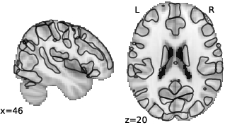

See names for each component: [1](https://parietal-inria.github.io/MODL_atlas/64/1 "Component 1")
[2](https://parietal-inria.github.io/MODL_atlas/64/2 "Component 2")
[3](https://parietal-inria.github.io/MODL_atlas/64/3 "Component 3")
[4](https://parietal-inria.github.io/MODL_atlas/64/4 "Component 4")
[5](https://parietal-inria.github.io/MODL_atlas/64/5 "Component 5")
[6](https://parietal-inria.github.io/MODL_atlas/64/6 "Component 6")
[7](https://parietal-inria.github.io/MODL_atlas/64/7 "Component 7")
[8](https://parietal-inria.github.io/MODL_atlas/64/8 "Component 8")
[9](https://parietal-inria.github.io/MODL_atlas/64/9 "Component 9")
[10](https://parietal-inria.github.io/MODL_atlas/64/10 "Component 10")
[11](https://parietal-inria.github.io/MODL_atlas/64/11 "Component 11")
[12](https://parietal-inria.github.io/MODL_atlas/64/12 "Component 12")
[13](https://parietal-inria.github.io/MODL_atlas/64/13 "Component 13")
[14](https://parietal-inria.github.io/MODL_atlas/64/14 "Component 14")
[15](https://parietal-inria.github.io/MODL_atlas/64/15 "Component 15")
[16](https://parietal-inria.github.io/MODL_atlas/64/16 "Component 16")
[17](https://parietal-inria.github.io/MODL_atlas/64/17 "Component 17")
[18](https://parietal-inria.github.io/MODL_atlas/64/18 "Component 18")
[19](https://parietal-inria.github.io/MODL_atlas/64/19 "Component 19")
[20](https://parietal-inria.github.io/MODL_atlas/64/20 "Component 20")
[21](https://parietal-inria.github.io/MODL_atlas/64/21 "Component 21")
[22](https://parietal-inria.github.io/MODL_atlas/64/22 "Component 22")
[23](https://parietal-inria.github.io/MODL_atlas/64/23 "Component 23")
[24](https://parietal-inria.github.io/MODL_atlas/64/24 "Component 24")
[25](https://parietal-inria.github.io/MODL_atlas/64/25 "Component 25")
[26](https://parietal-inria.github.io/MODL_atlas/64/26 "Component 26")
[27](https://parietal-inria.github.io/MODL_atlas/64/27 "Component 27")
[28](https://parietal-inria.github.io/MODL_atlas/64/28 "Component 28")
[29](https://parietal-inria.github.io/MODL_atlas/64/29 "Component 29")
[30](https://parietal-inria.github.io/MODL_atlas/64/30 "Component 30")
[31](https://parietal-inria.github.io/MODL_atlas/64/31 "Component 31")
[32](https://parietal-inria.github.io/MODL_atlas/64/32 "Component 32")
[33](https://parietal-inria.github.io/MODL_atlas/64/33 "Component 33")
[34](https://parietal-inria.github.io/MODL_atlas/64/34 "Component 34")
[35](https://parietal-inria.github.io/MODL_atlas/64/35 "Component 35")
[36](https://parietal-inria.github.io/MODL_atlas/64/36 "Component 36")
[37](https://parietal-inria.github.io/MODL_atlas/64/37 "Component 37")
[38](https://parietal-inria.github.io/MODL_atlas/64/38 "Component 38")
[39](https://parietal-inria.github.io/MODL_atlas/64/39 "Component 39")
[40](https://parietal-inria.github.io/MODL_atlas/64/40 "Component 40")
