# MODL Atlas

# Region names for 64 components

| Region from 64 components | Region naming according to| Region naming according to |
| --- | ----------- | ------ |
| Each component | Harvard Oxford atlas | Destrieux atlas |
| 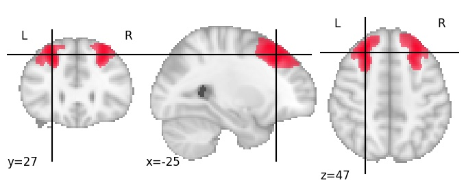 | Middle Frontal Gyrus 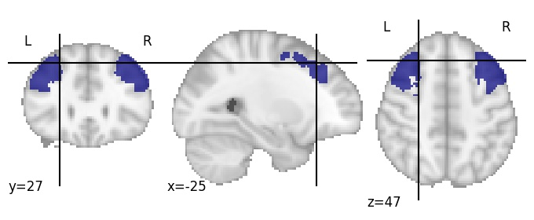 | R S_front_sup  |
| 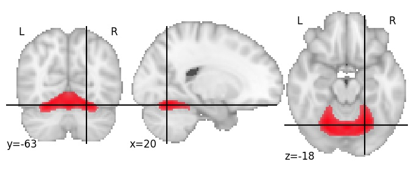 | Temporal Occipital Fusiform Cortex 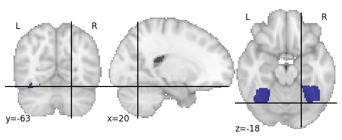 | L G_oc-temp_lat-fusiform  |
| 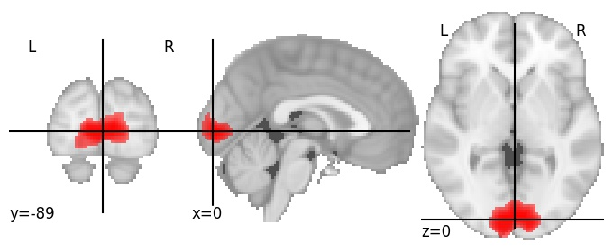 | Intracalcarine Cortex  | R Pole_occipital  |
| 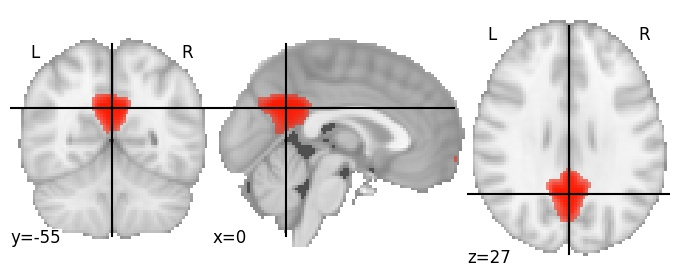 | Cingulate Gyrus, posterior division  | L G_cingul-Post-dorsal 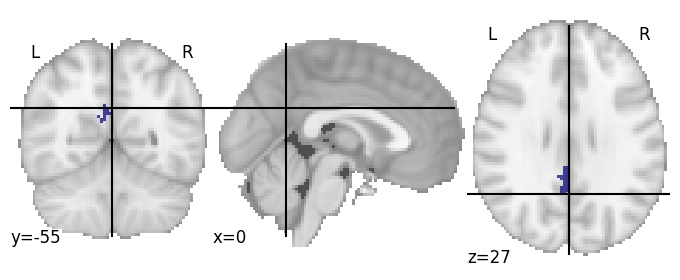 |
| 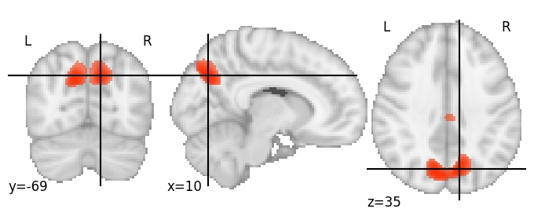 | Precuneous Cortex  | L S_parieto_occipital 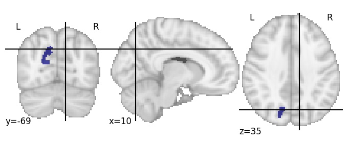 |
| 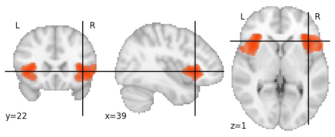 | Frontal Operculum Cortex 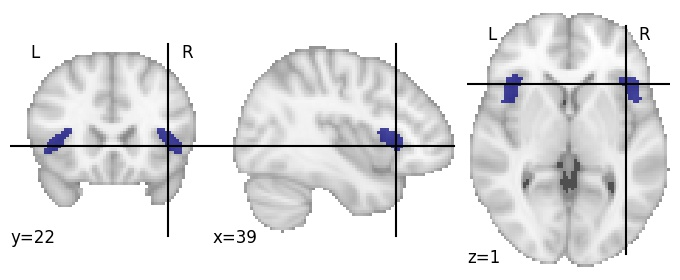| R Lat_Fis-ant-Horizont 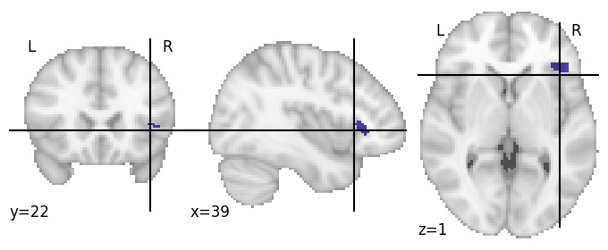 |
| 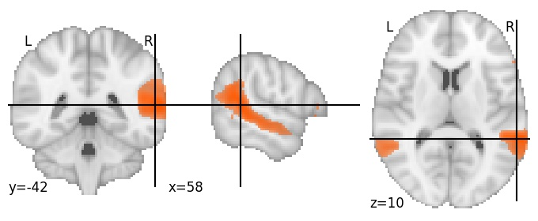 | Angular Gyrus 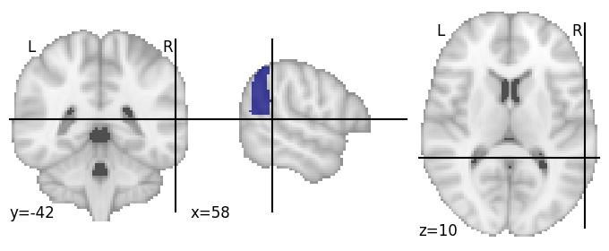| R S_temporal_sup 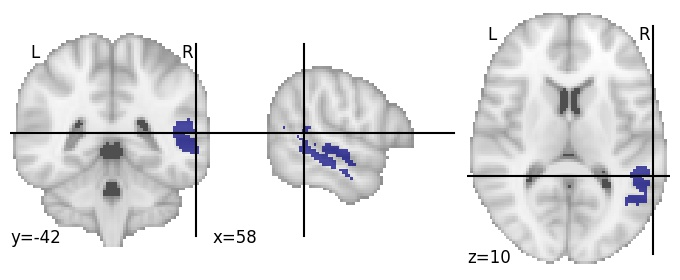 |
| 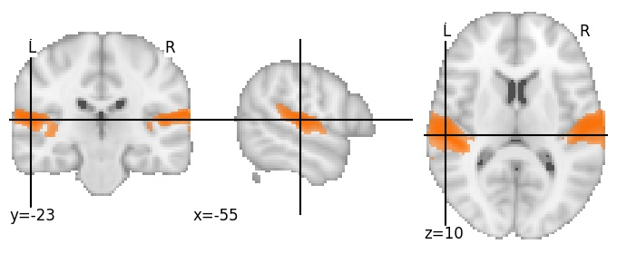 | Planum Temporale 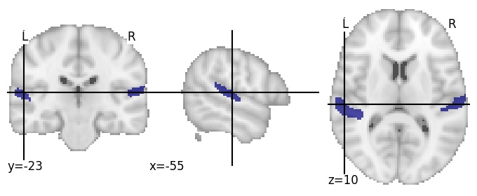| R G_temp_sup-G_T_transv 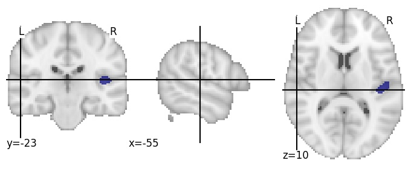 |
| 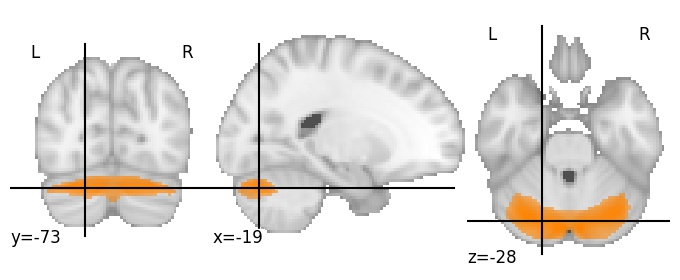 | Background | Background  |
| 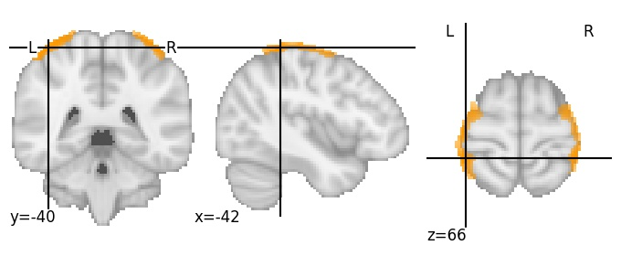 | Postcentral Gyrus 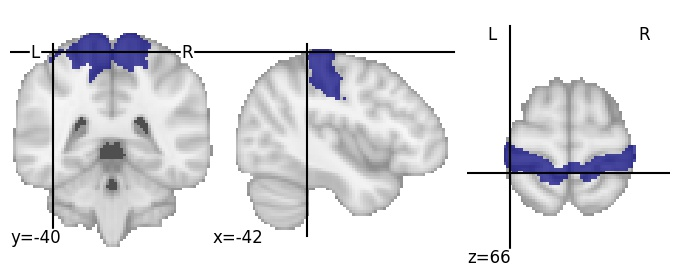| R G_postcentral 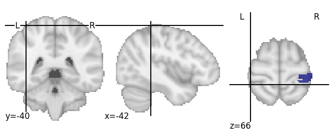 |
|  | Occipital Fusiform Gyrus | L G_oc-temp_lat-fusiform  |
| 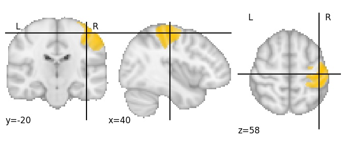 | Postcentral Gyrus | R G_postcentral  |
| 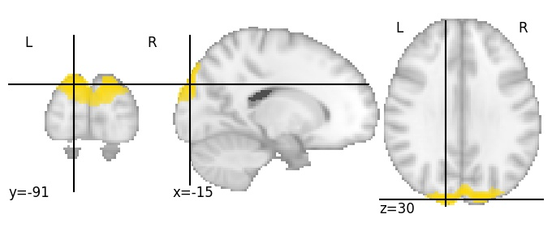 | Occipital pole 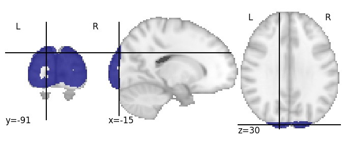| L G_occipital_sup 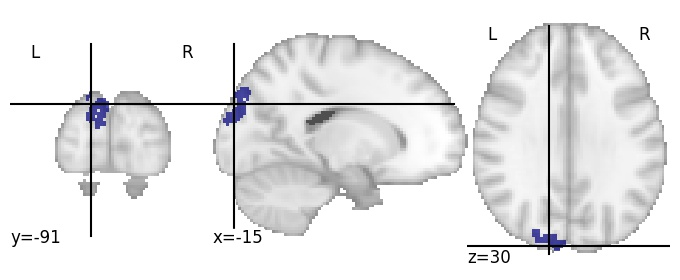 |
| 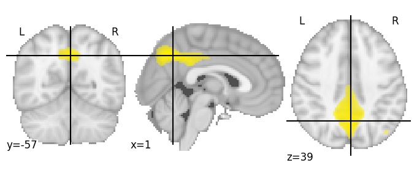 | Cingulate Gyrus, posterior division 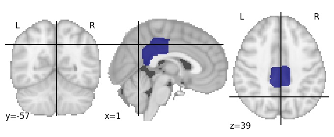| R S_subparietal  |
| 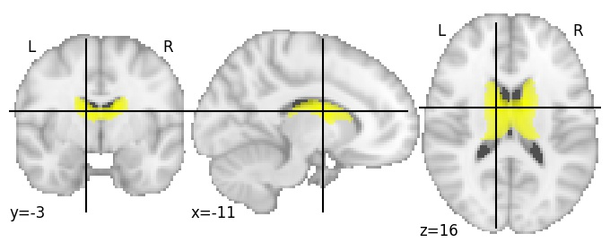 | Background, posterior division | Background 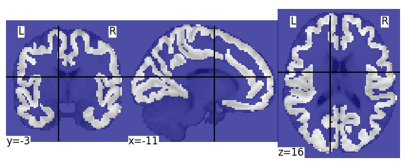 |
|  | Temporal Occipital Fusiform Cortex 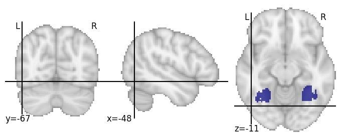| R S_oc-temp_lat  |
| 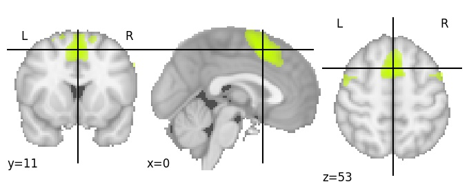 | Juxtapositional Lobule Cortex (formerly Supplementary Motor Cortex) | L G_front_sup 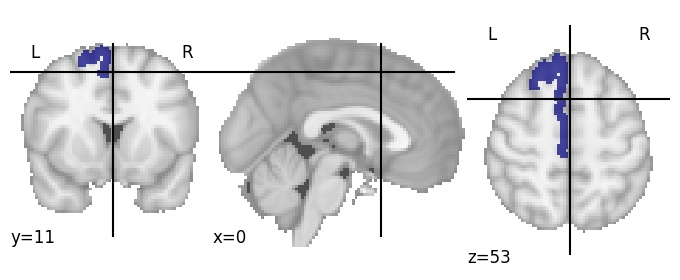 |
| 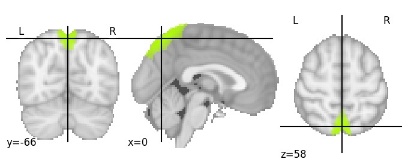 | Precuneous Cortex 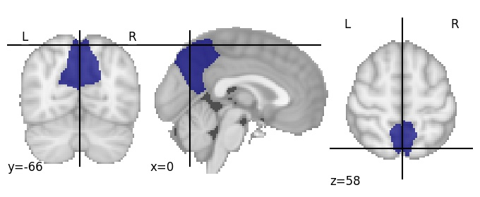| R G_precuneus 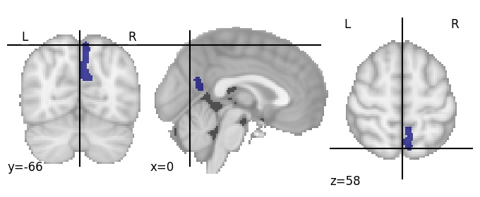 |
|  | Planum Polare | R G_font_inf-Opercular  |
| 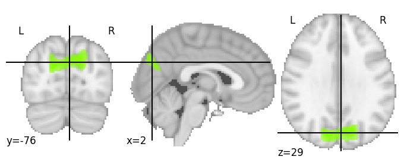 | Cuneal Cortex 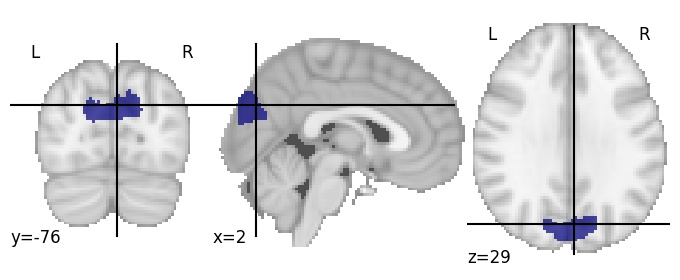| R S_parieto_occipital  |
| 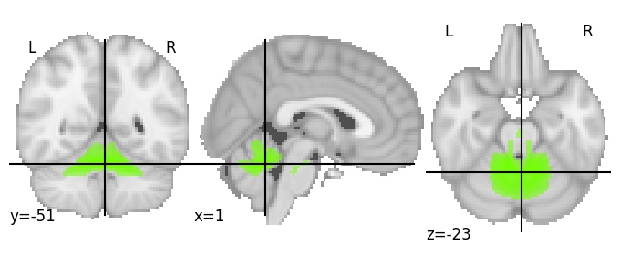 | Background | Background 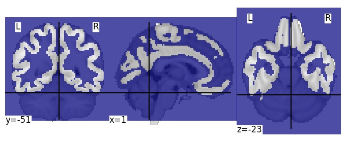 |
| 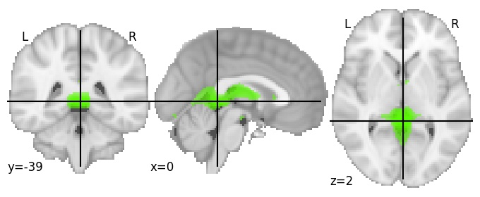 | Cingulate Gyrus, posterior division 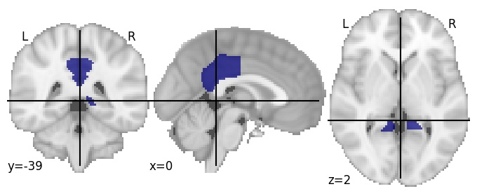| L G_cingul-Post-ventral 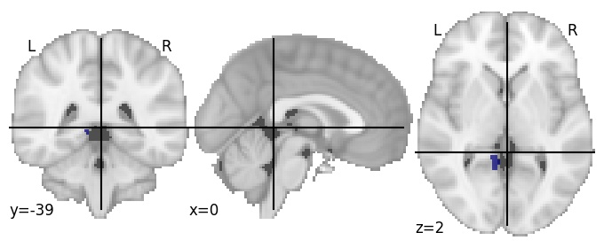 |
| 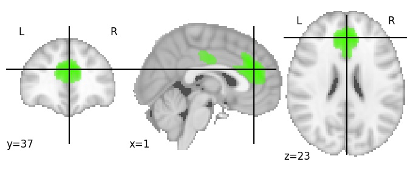 | Paracingulate Gyrus, posterior division 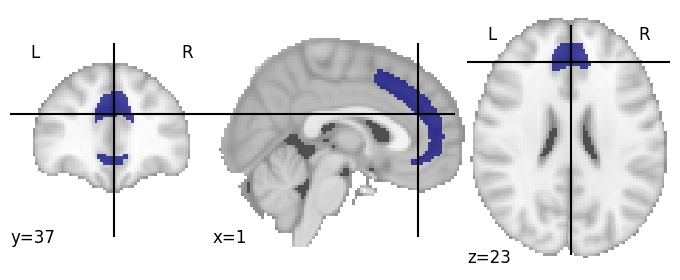| L G_and_S_cingul-Ant  |
| 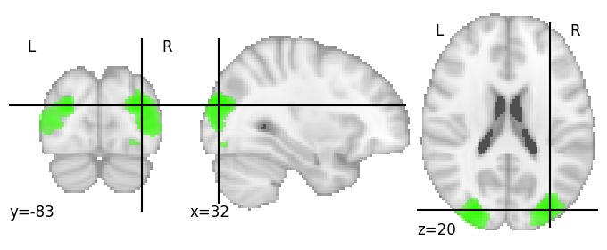 | Lateral Occipital Cortex, superior division 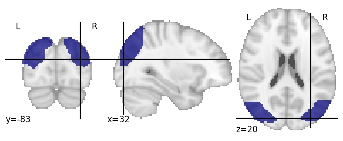| R S_oc_middle_and_Lunatus 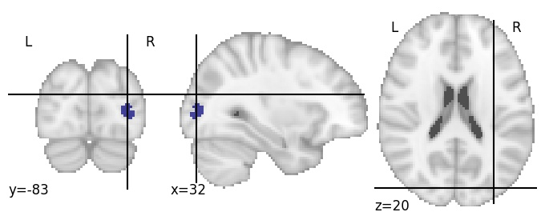 |
| 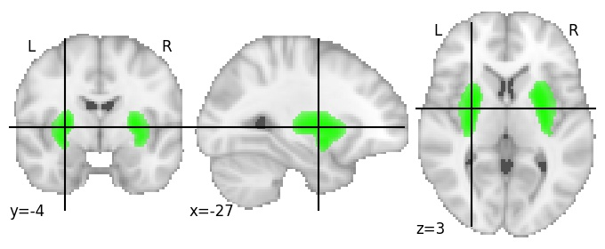 | Insular Cortex | L S_circular_insula_inf  |
| 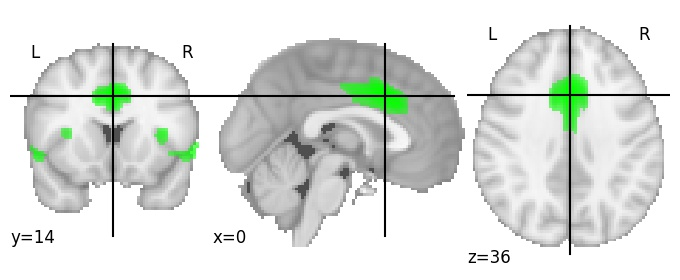 | Cingulate Gyrus, anterior division | L G_and_S_cingul-Mid-Ant  |
|  | Lateral Occipital Cortex, superior division | R S_intrapariet_and_P_trans  |
|  | Postcentral Gyrus | R G_and_S_paracentral  |
|  | Occipital Fusiform Gyrus | L G_and_S_occipital_inf  |
|  | Paracingulate Gyrus | L S_suborbital  |
|  | Intracalcarine Cortex | L S_calcarine  |
|  | Lateral Occipital Cortex, superior division | L G_pariet_inf-Angular  |
|  | Superior Parietal Lobule | R G_parietal_sup  |
|  | Juxtapositional Lobule Cortex (formerly Supplementary Motor Cortex) | L G_and_S_cingul-Mid-Post  |
|  | Lingual Gyrus | R G_cingul_-Post-ventral  |
|  | Angular Gyrus | R G_pariet_inf-Angular  |
|  | Supramarginal Gyrus, anterior division | R G_pariet_inf-Supramar  |
|  | Supramarginal Gyrus, posterior division | L S_precentral-inf-part  |
|  | Paracingulate Gyrus | L G_front_sup  |
|  | Superior Frontal Gyrus | L S_precentral-sup-part  |
|  | Postcentral Gyrus | R S_central  |
|  | Lateral Occipital Cortex, inferior division | R S_occipital_ant  |
|  | Cingulate Gyrus, posterior division | L S_cingul-Marginalis  |
|  | Juxtapositional Lobule Cortex (formerly Supplementary Motor Cortex) | R G_and_S_paracentral  |
|  | Parietal Operculum Cortex | L Lat_Fis-post  |
|  | Occipital Pole | L Pole_occipital  |
|  | Background | Background  |
|  | Supramarginal Gyrus, posterior division | R S_interm_prim-Jensen  |
|  | Inferior Frontal Gyrus, pars opercularis | R S_precentral-inf-part  |
|  | Postcentral Gyrus | L G_postcentral  |
|  | Middle Frontal Gyrus | R G_front_middle  |
|  | Inferior Frontal Gyrus, pars triangularis | L S_front_inf  |
|  | Precuneous Cortex | R G_cingul-Post-ventral  |
|  | Precuneous Cortex | R G_precuneus  |
|  | Occipital Fusiform Gyrus | L S_collat_transv_post  |
|  | Lateral Occipital Cortex, superior division | L S_oc_sup_and_transversal  |
|  | Lateral Occipital Cortex, superior division | L G_parietal_sup  |
|  | Frontal Pole | R S_front_middle  |
|  | Angular Gyrus | L G_pariet_inf-Angular  |
|  | Supracalcarine Cortex | R G_cuneus  |
|  | Middle Temporal Gyrus, posterior division | L G_front_inf-Orbital  |
|  | Superior Frontal Gyrus | L G_front_sup  |
|  | Postcentral Gyrus | L S_central  |
|  | Background | L S_circular_insula_ant  |
