| All 64 components |
|:---:|
| 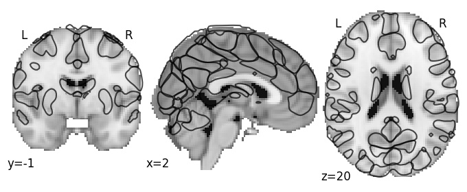 |

| Component 1: Superior frontal sulcus |
|:---:|
| |

| Component 2: Fusiform gyrus |
|:---:|
| [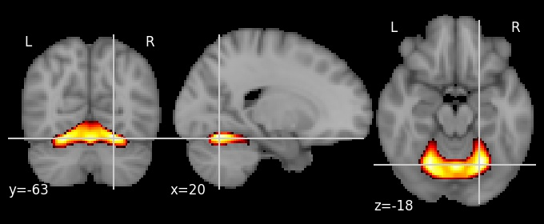](https://parietal-inria.github.io/MODL_atlas/64/html/2.html) |

| Component 3: Calcarine cortex posterior |
|:---:|
| [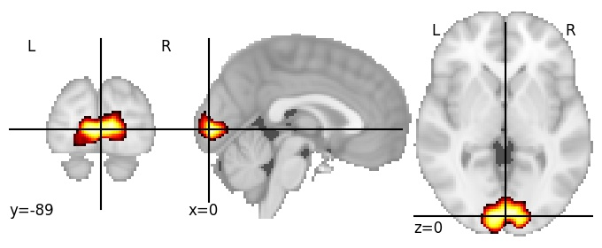](https://parietal-inria.github.io/MODL_atlas/64/html/3.html) |

| Component 4: Posterior Cingulate cortex |
|:---:|
| [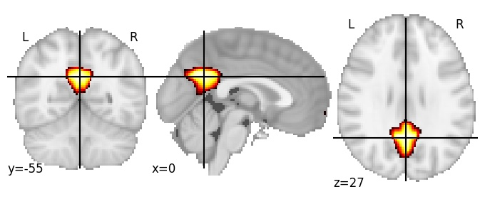](https://parietal-inria.github.io/MODL_atlas/64/html/4.html) |

| Component 5: Dorsal Parieto-occipital sulcus |
|:---:|
| [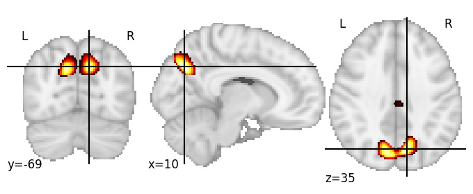](https://parietal-inria.github.io/MODL_atlas/64/html/5.html) |

| Component 6: Antero-superior insula |
|:---:|
| [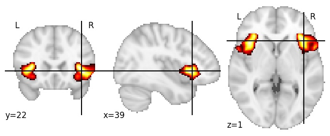](https://parietal-inria.github.io/MODL_atlas/64/html/6.html) |

| Component 7: Superior temporal sulcus with angular gyrus |
|:---:|
| [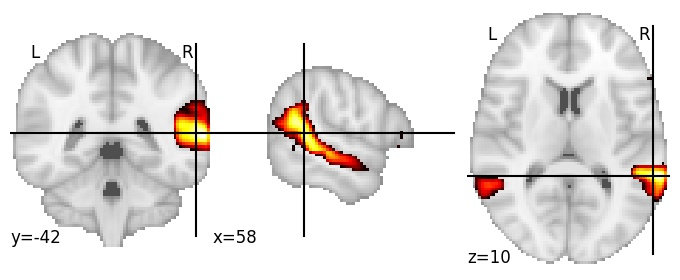](https://parietal-inria.github.io/MODL_atlas/64/html/7.html) |

| Component 8: Planum temporale |
|:---:|
| [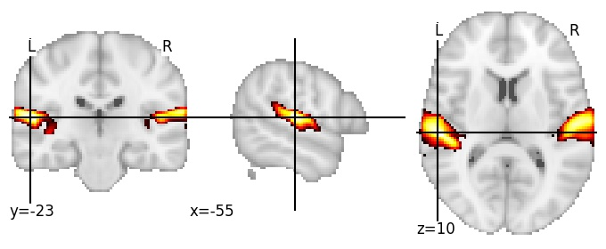](https://parietal-inria.github.io/MODL_atlas/64/html/8.html) |

| Component 9: Cerebellum Crus II |
|:---:|
| [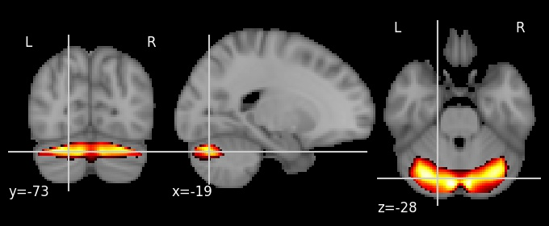](https://parietal-inria.github.io/MODL_atlas/64/html/9.html) |

| Component 10: Superior parts of Postcentral and Precentral gyri |
|:---:|
| [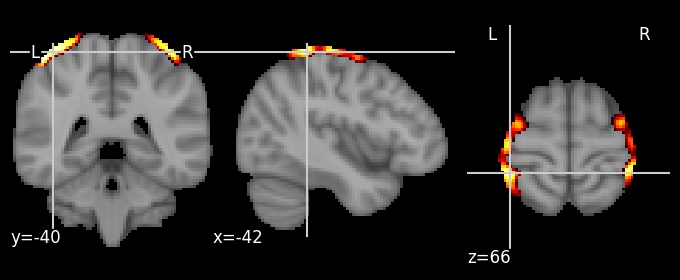](https://parietal-inria.github.io/MODL_atlas/64/html/10.html) |

| Component 11: Cerebrospinal fluid |
|:---:|
| [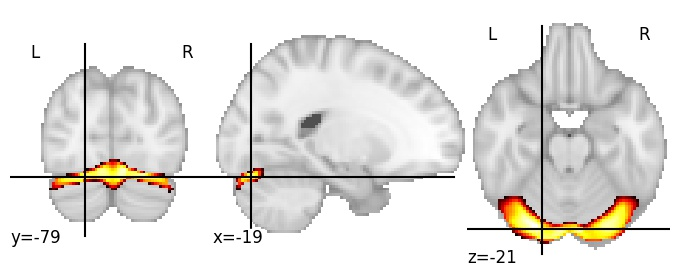](https://parietal-inria.github.io/MODL_atlas/64/html/11.html) |

| Component 12: Paracentral gyrus RH | 
|:---:|
| [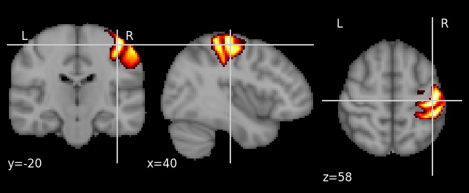](https://parietal-inria.github.io/MODL_atlas/64/html/12.html) |

| Component 13: Superior occipital gyrus |
|:---:|
| [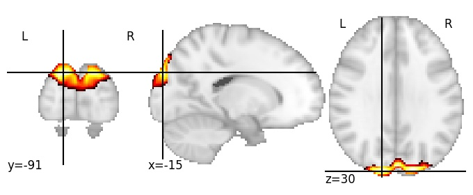](https://parietal-inria.github.io/MODL_atlas/64/html/13.html) |

| Component 14: Mid-posterior cingulate gyrus |
|:---:|
| [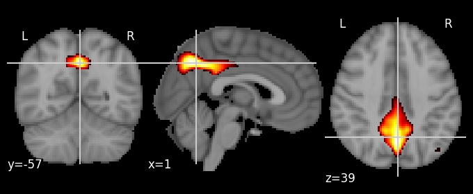](https://parietal-inria.github.io/MODL_atlas/64/html/14.html) |

| Component 15: Ventricles |
|:---:|
| [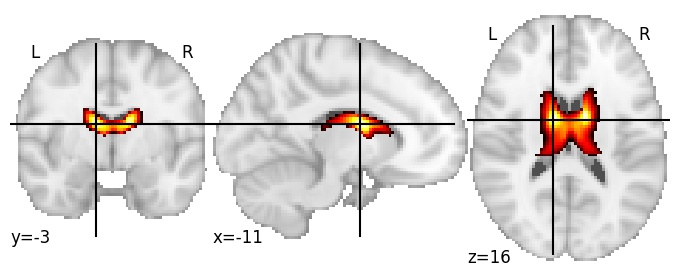](https://parietal-inria.github.io/MODL_atlas/64/html/15.html) |

| Component 16: Posterior fusiform gyrus |
|:---:|
| [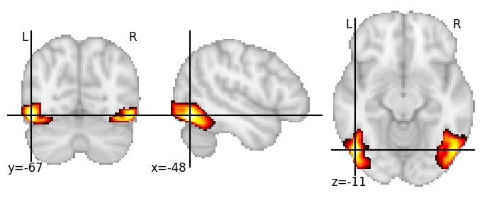](https://parietal-inria.github.io/MODL_atlas/64/html/16.html) |

| Component 17: Superior frontal gyrus medial |
|:---:|
| [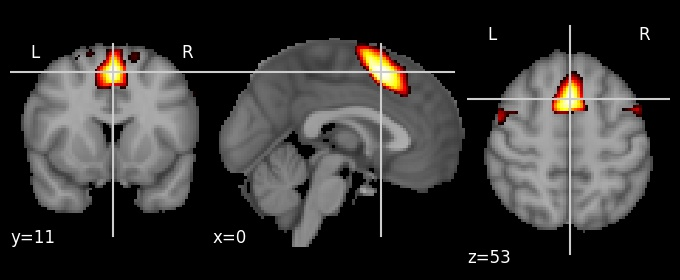](https://parietal-inria.github.io/MODL_atlas/64/html/17.html) |

| Component 18: Precuneus superior |
|:---:|
| [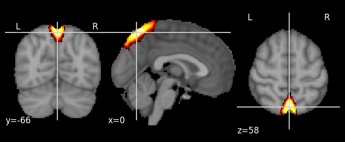](https://parietal-inria.github.io/MODL_atlas/64/html/18.html) |

| Component 19: Planum polare |
|:---:|
| [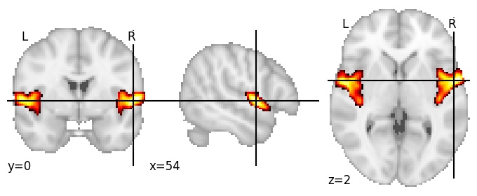](https://parietal-inria.github.io/MODL_atlas/64/html/19.html) |

| Component 20: Central parieto-occipital sulcus |
|:---:|
|  |

| Component 21: Cerebellum I-V |
|:---:|
| [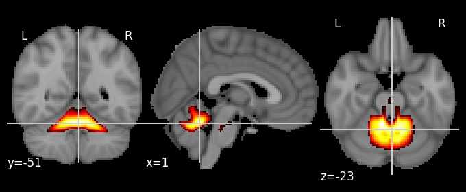](https://parietal-inria.github.io/MODL_atlas/64/html/21.html) |

| Component 22: Superior fornix and isthmus |
|:---:|
| [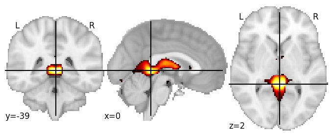](https://parietal-inria.github.io/MODL_atlas/64/html/22.html) |

| Component 23: Anterior Cingulate Cortex |
|:---:|
| [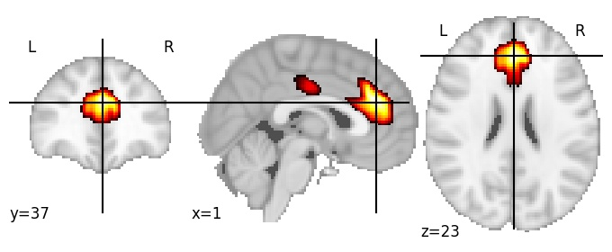](https://parietal-inria.github.io/MODL_atlas/64/html/23.html) |

| Component 24: Descending occipital gyrus |
|:---:|
| [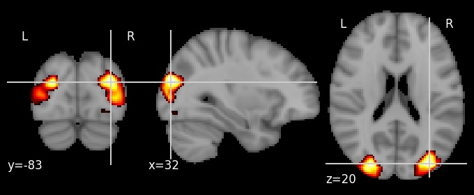](https://parietal-inria.github.io/MODL_atlas/64/html/24.html) |

| Component 25: Putamen |
|:---:|
| [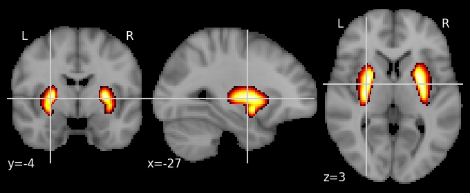](https://parietal-inria.github.io/MODL_atlas/64/html/25.html) |

| Component 26: Mid-anterior Cingulate cortex |
|:---:|
| [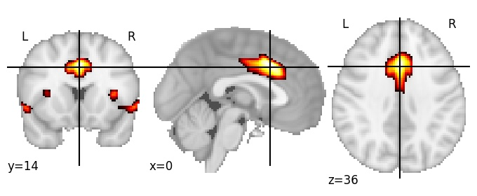](https://parietal-inria.github.io/MODL_atlas/64/html/26.html) |

| Component 27: Superior parietal lobule posterior |
|:---:|
| [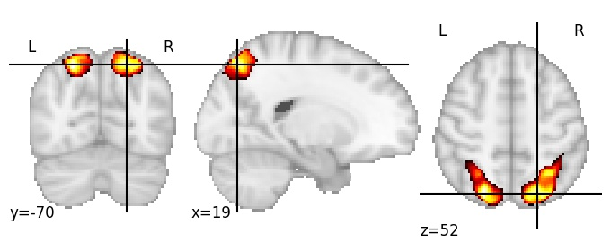](https://parietal-inria.github.io/MODL_atlas/64/html/27.html) |

| Component 28: Paracentral lobule |
|:---:|
| [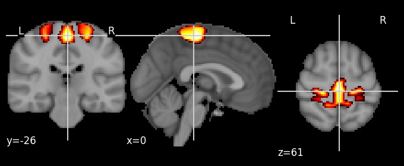](https://parietal-inria.github.io/MODL_atlas/64/html/28.html) |

| Component 29: Inferior occipital gyrus |
|:---:|
|  |

| Component 30: Superior rostral gyrus |
|:---:|
| [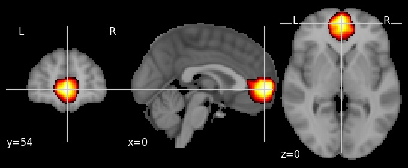](https://parietal-inria.github.io/MODL_atlas/64/html/30.html) |

| Component 31: Calcarine sulcus anterior |
|:---:|
| [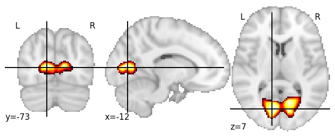](https://parietal-inria.github.io/MODL_atlas/64/html/31.html) |

| Component 32: Intraparietal sulcus |
|:---:|
| [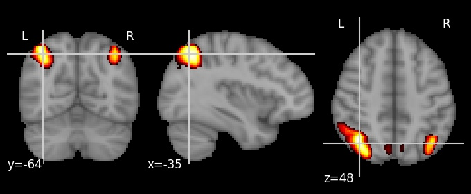](https://parietal-inria.github.io/MODL_atlas/64/html/32.html) |

| Component 33: Superior parietal lobule anterior |
|:---:|
| [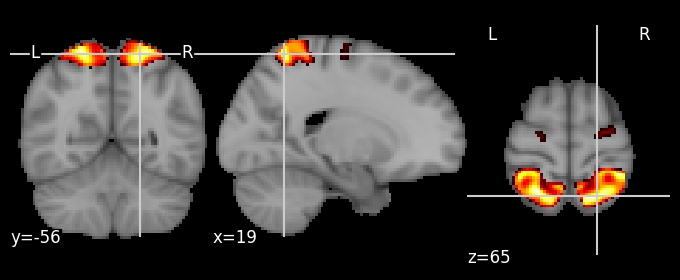](https://parietal-inria.github.io/MODL_atlas/64/html/33.html) |

| Component 34: Precentral gyrus medial |
|:---:|
| [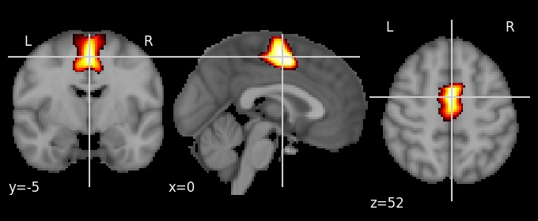](https://parietal-inria.github.io/MODL_atlas/64/html/34.html) |

| Component 35: Lingual gyrus anterior |
|:---:|
| [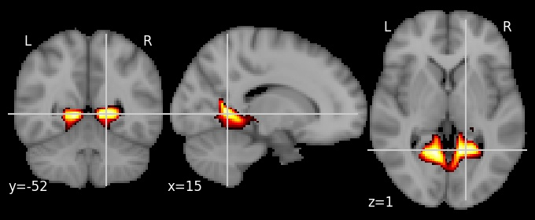](https://parietal-inria.github.io/MODL_atlas/64/html/35.html) |

| Component 36: Angular gyrus |
|:---:|
| [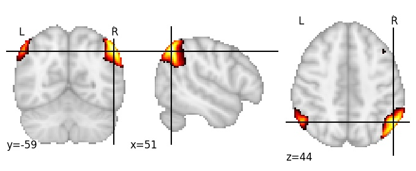](https://parietal-inria.github.io/MODL_atlas/64/html/36.html) |

| Component 37: Supramarginal gyrus |
|:---:|
|  |

| Component 38: Intraparietal sulcus LH |
|:---:|
| [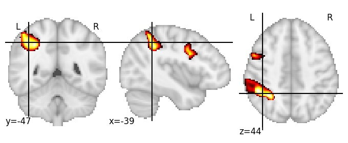](https://parietal-inria.github.io/MODL_atlas/64/html/38.html) |

| Component 39: Dorsomedial Prefrontal cortex antero-caudal |
|:---:|
| [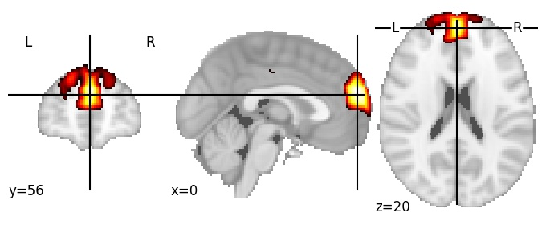](https://parietal-inria.github.io/MODL_atlas/64/html/39.html) |

| Component 40: Precentral gyrus superior |
|:---:|
| [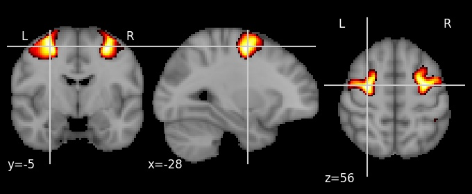](https://parietal-inria.github.io/MODL_atlas/64/html/40.html) |

| Component 41: Postcentral gyrus inferior |
|:---:|
| [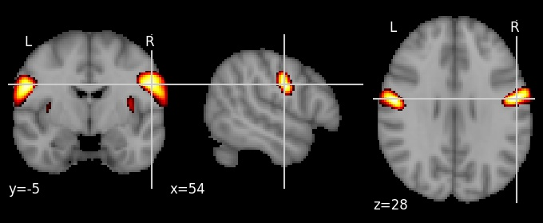](https://parietal-inria.github.io/MODL_atlas/64/html/41.html) |

| Component 42: Lateral occipital cortex |
|:---:|
| [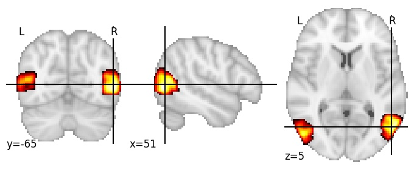](https://parietal-inria.github.io/MODL_atlas/64/html/42.html) |

| Component 43: Callosomarginal sulcus |
|:---:|
| [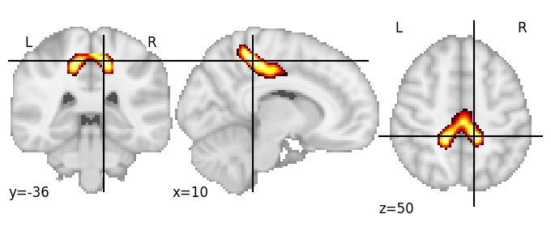](https://parietal-inria.github.io/MODL_atlas/64/html/43.html) |

| Component 44: Paracentral lobule superior |
|:---:|
| [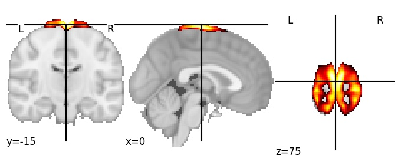](https://parietal-inria.github.io/MODL_atlas/64/html/44.html) |

| Heschl's gyrus |
|:---:|
| [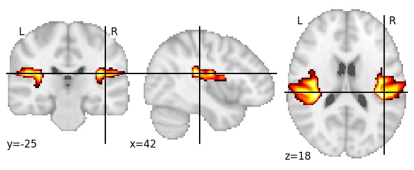](https://parietal-inria.github.io/MODL_atlas/64/html/45.html) |

| Occipital pole |
|:---:|
| [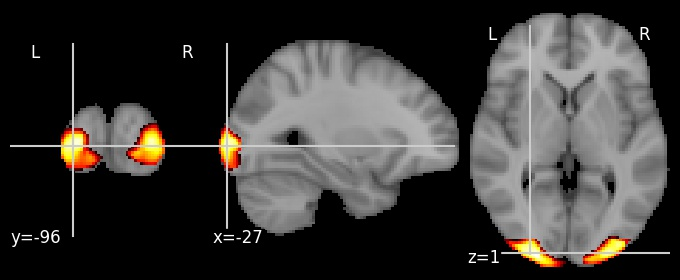](https://parietal-inria.github.io/MODL_atlas/64/html/46.html) |

| Thalamus |
|:---:|
| [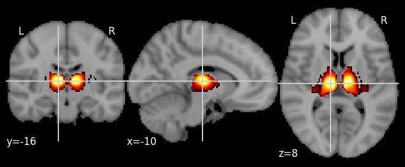](https://parietal-inria.github.io/MODL_atlas/64/html/47.html) |

| Intraparietal sulcus RH |
|:---:|
|  |

| Inferior frontal sulcus |
|:---:|
| [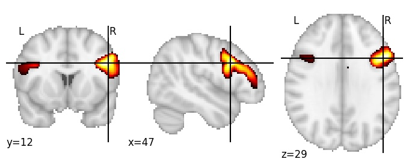](https://parietal-inria.github.io/MODL_atlas/64/html/49.html) |

| Postcentral gyrus LH |
|:---:|
| [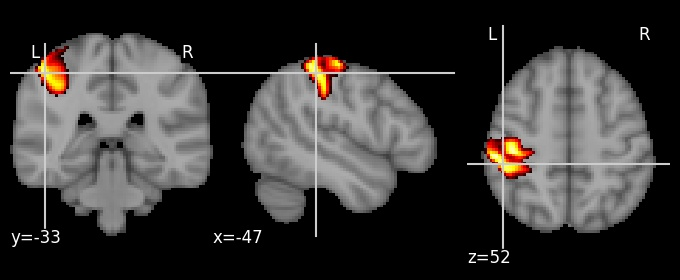](https://parietal-inria.github.io/MODL_atlas/64/html/50.html) |

| Middle frontal gyrus |
|:---:|
| [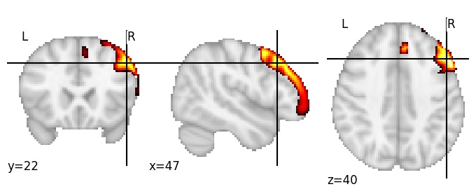](https://parietal-inria.github.io/MODL_atlas/64/html/51.html) |

| Inferior frontal gyrus |
|:---:|
| [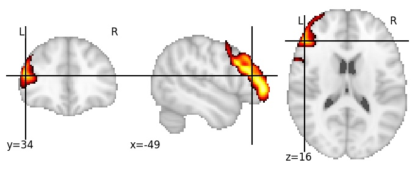](https://parietal-inria.github.io/MODL_atlas/64/html/52.html) |

| Parieto occipital sulcus anterior |
|:---:|
| [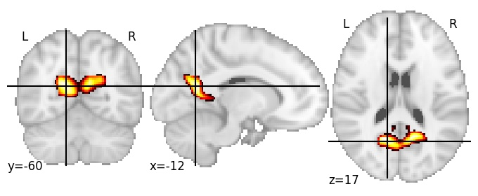](https://parietal-inria.github.io/MODL_atlas/64/html/53.html) |

| Precuneus superior |
|:---:|
| [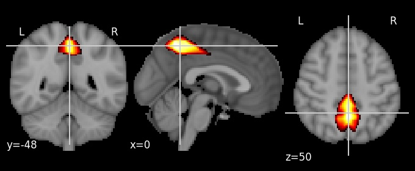](https://parietal-inria.github.io/MODL_atlas/64/html/54.html) |

| Lingual gyrus |
|:---:|
|  |

| Superior occipital sulcus |
|:---:|
|  |

| Superior parietal lobule |
|:---:|
|  |

| Middle frontal gyrus anterior |
|:---:|
|  |

| Angular gyrus |
|:---:|
|  |

| Cuneus |
|:---:|
|  |

| Middle temporal gyrus |
|:---:|
|  |

| Superior frontal gyrus |
|:---:|
|  |

| Central sulcus |
|:---:|
|  |

| Caudate |
|:---:|
|  |
