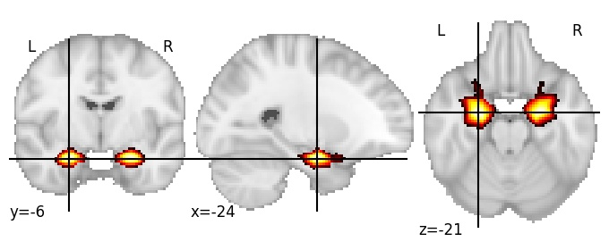

| **Amygdala** identified on various resolutions |

| 256 resolution, the component index number is 20|  
|:---:|  
|  |

| 512 resolution, the component index number is 104|  
|:---:|  
|  |

| 1024 resolution, the component index number is 8|  
|:---:|  
|  |

| 1024 resolution, the component index number is 8|  
|:---:|  
|  |

| 1024 resolution, the component index number is 8|  
|:---:|  
|  |

| 1024 resolution, the component index number is 8|  
|:---:|  
|  |