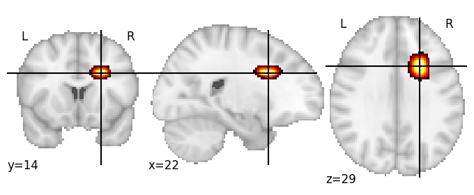

| **Anterior corona radiata RH** identified on various resolutions |

| 1024 resolution, the component index number is 370|  
|:---:|  
|  |

| 1024 resolution, the component index number is 370|  
|:---:|  
|  |

| 1024 resolution, the component index number is 370|  
|:---:|  
|  |