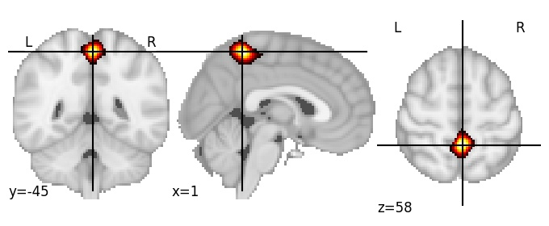

| **Callosomarginal sulcus** identified on various resolutions |

| 64 resolution, the component index number is 42|  
|:---:|  
|  |

| 256 resolution, the component index number is 122|  
|:---:|  
|  |

| 1024 resolution, the component index number is 954|  
|:---:|  
|  |