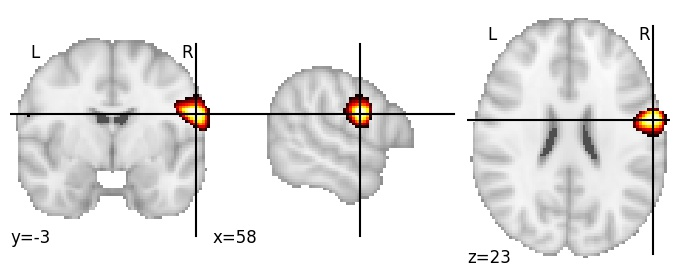
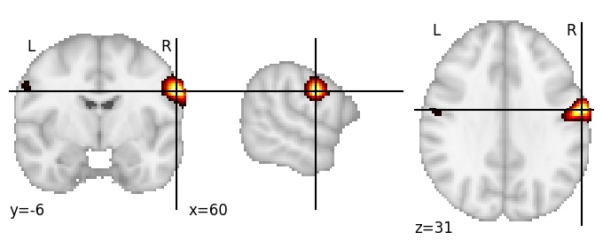

| **Central sulcus inferior RH** identified on various resolutions |

| 512 resolution, the component index number is 308|  
|:---:|  
|  |

| 1024 resolution, the component index number is 509|  
|:---:|  
|  |

| 1024 resolution, the component index number is 509|  
|:---:|  
|  |