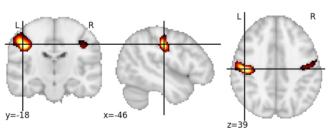

| **Central sulcus middle** identified on various resolutions |

| 256 resolution, the component index number is 99|  
|:---:|  
|  |

| 512 resolution, the component index number is 337|  
|:---:|  
|  |