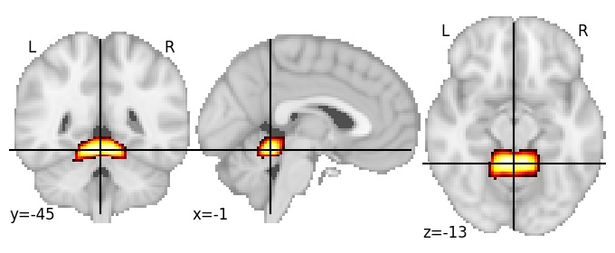
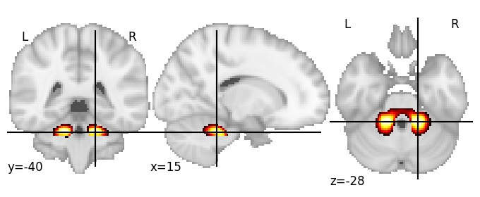
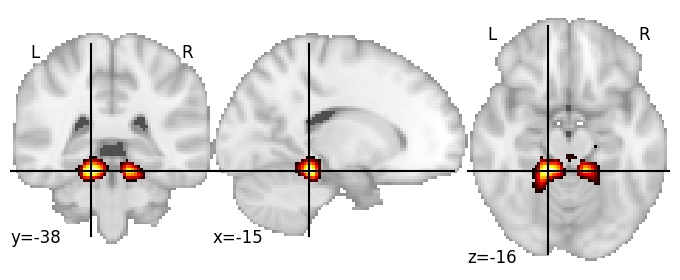

| **Cerebellum IV** identified on various resolutions |

| 256 resolution, the component index number is 95|  
|:---:|  
|  |

| 512 resolution, the component index number is 163|  
|:---:|  
|  |

| 512 resolution, the component index number is 163|  
|:---:|  
|  |

| 1024 resolution, the component index number is 301|  
|:---:|  
|  |

| 1024 resolution, the component index number is 301|  
|:---:|  
|  |

| 1024 resolution, the component index number is 301|  
|:---:|  
|  |

| 1024 resolution, the component index number is 301|  
|:---:|  
|  |

| 1024 resolution, the component index number is 301|  
|:---:|  
|  |