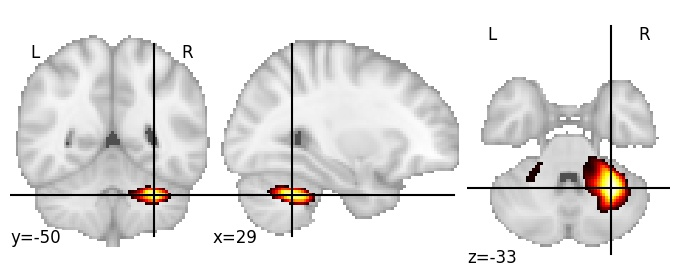
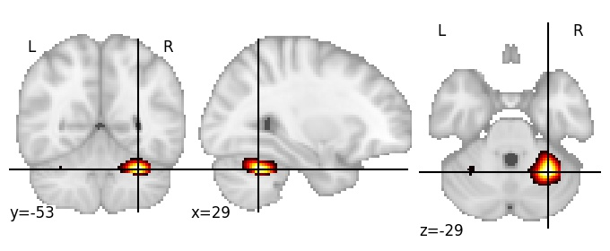

| **Cerebellum VI RH** identified on various resolutions |

| 256 resolution, the component index number is 210|  
|:---:|  
|  |

| 512 resolution, the component index number is 13|  
|:---:|  
|  |

| 512 resolution, the component index number is 13|  
|:---:|  
|  |

| 512 resolution, the component index number is 13|  
|:---:|  
|  |

| 1024 resolution, the component index number is 634|  
|:---:|  
|  |

| 1024 resolution, the component index number is 634|  
|:---:|  
|  |

| 1024 resolution, the component index number is 634|  
|:---:|  
|  |

| 1024 resolution, the component index number is 634|  
|:---:|  
|  |

| 1024 resolution, the component index number is 634|  
|:---:|  
|  |