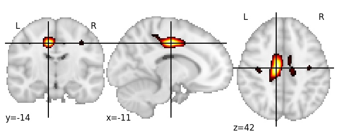

| **Cingulate sulcus posterior LH** identified on various resolutions |

| 512 resolution, the component index number is 492|  
|:---:|  
|  |

| 1024 resolution, the component index number is 430|  
|:---:|  
|  |