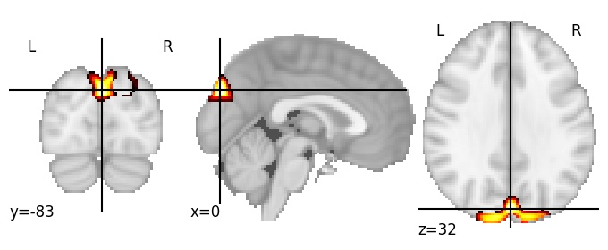
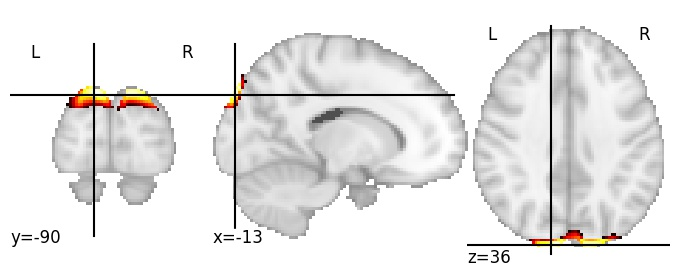
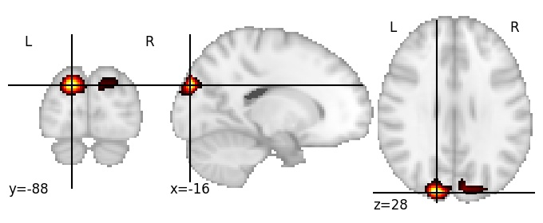

| **Cuneus superior** identified on various resolutions |

| 128 resolution, the component index number is 77|  
|:---:|  
|  |

| 256 resolution, the component index number is 183|  
|:---:|  
|  |

| 512 resolution, the component index number is 227|  
|:---:|  
|  |

| 1024 resolution, the component index number is 287|  
|:---:|  
|  |

| 1024 resolution, the component index number is 287|  
|:---:|  
|  |

| 1024 resolution, the component index number is 287|  
|:---:|  
|  |