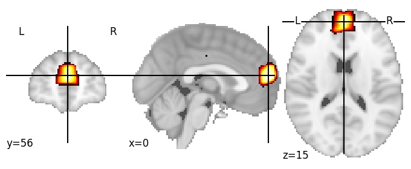
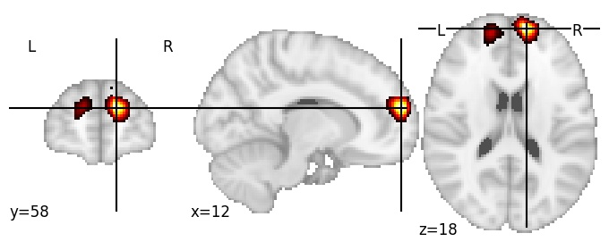

| **Dorsomedial prefrontal cortex, anterocaudal** identified on various resolutions |

| 128 resolution, the component index number is 34|  
|:---:|  
|  |

| 1024 resolution, the component index number is 174|  
|:---:|  
|  |

| 1024 resolution, the component index number is 174|  
|:---:|  
|  |