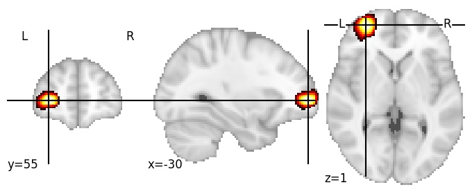

| **Frontomarginal sulcus LH** identified on various resolutions |

| 512 resolution, the component index number is 367|  
|:---:|  
|  |

| 1024 resolution, the component index number is 368|  
|:---:|  
|  |