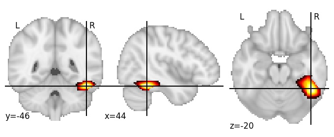
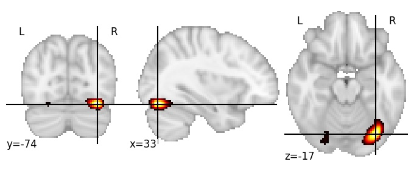

| **Fusiform gyrus RH** identified on various resolutions |

| 256 resolution, the component index number is 202|  
|:---:|  
|  |

| 512 resolution, the component index number is 11|  
|:---:|  
|  |

| 512 resolution, the component index number is 11|  
|:---:|  
|  |

| 512 resolution, the component index number is 11|  
|:---:|  
|  |

| 1024 resolution, the component index number is 22|  
|:---:|  
|  |

| 1024 resolution, the component index number is 22|  
|:---:|  
|  |