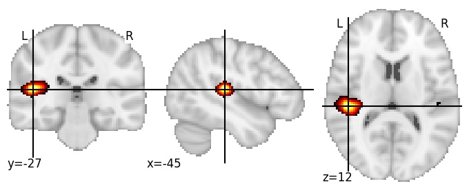

| **Heschl’s gyrus LH** identified on various resolutions |

| 1024 resolution, the component index number is 70|  
|:---:|  
|  |

| 1024 resolution, the component index number is 70|  
|:---:|  
|  |

| 1024 resolution, the component index number is 70|  
|:---:|  
|  |

| 1024 resolution, the component index number is 70|  
|:---:|  
|  |