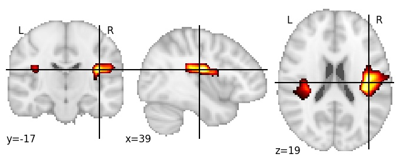
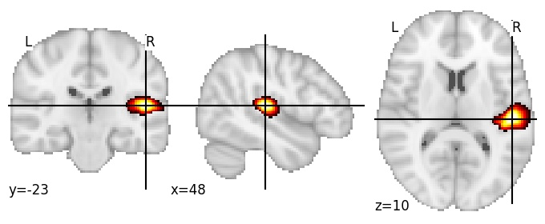
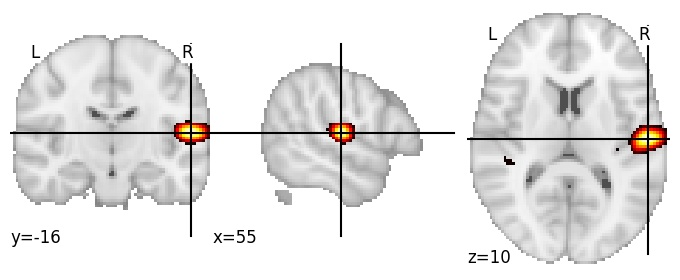

| **Heschl’s gyrus RH** identified on various resolutions |

| 256 resolution, the component index number is 254|  
|:---:|  
|  |

| 512 resolution, the component index number is 470|  
|:---:|  
|  |

| 1024 resolution, the component index number is 44|  
|:---:|  
|  |

| 1024 resolution, the component index number is 44|  
|:---:|  
|  |

| 1024 resolution, the component index number is 44|  
|:---:|  
|  |