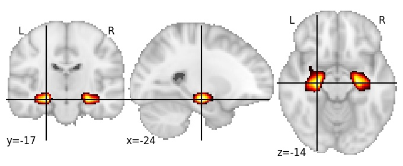
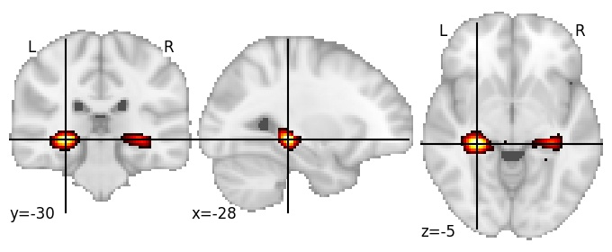

| **Hippocampus** identified on various resolutions |

| 256 resolution, the component index number is 94|  
|:---:|  
|  |

| 256 resolution, the component index number is 94|  
|:---:|  
|  |

| 512 resolution, the component index number is 82|  
|:---:|  
|  |

| 512 resolution, the component index number is 82|  
|:---:|  
|  |

| 1024 resolution, the component index number is 171|  
|:---:|  
|  |

| 1024 resolution, the component index number is 171|  
|:---:|  
|  |