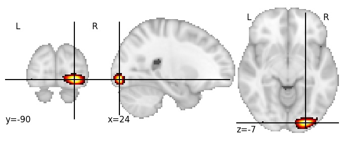

| **Inferior occipital gyrus posterior RH** identified on various resolutions |

| 512 resolution, the component index number is 497|  
|:---:|  
|  |

| 1024 resolution, the component index number is 0|  
|:---:|  
|  |