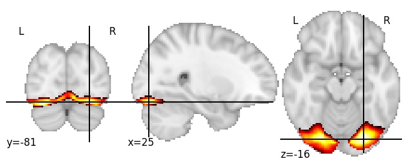
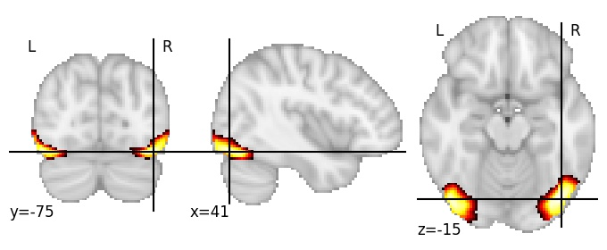
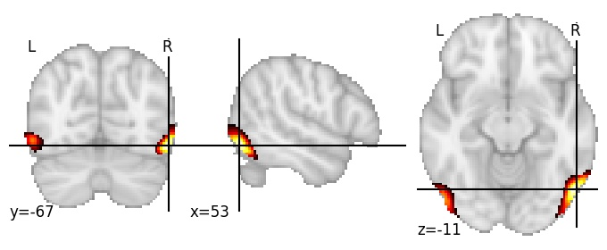

| **Inferior occipital gyrus** identified on various resolutions |

| 64 resolution, the component index number is 28|  
|:---:|  
|  |

| 128 resolution, the component index number is 107|  
|:---:|  
|  |

| 256 resolution, the component index number is 27|  
|:---:|  
|  |

| 512 resolution, the component index number is 186|  
|:---:|  
|  |