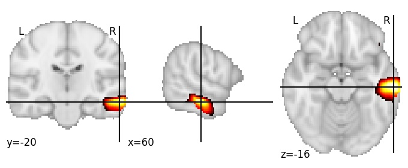
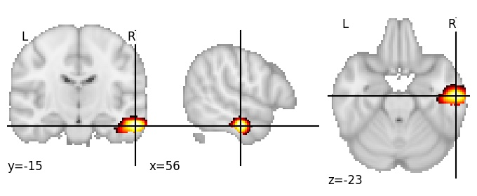

| **Inferior temporal sulcus middle RH** identified on various resolutions |

| 512 resolution, the component index number is 291|  
|:---:|  
|  |

| 1024 resolution, the component index number is 245|  
|:---:|  
|  |