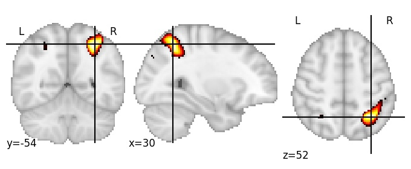

| **Intraparietal sulcus, RH** identified on various resolutions |

| 128 resolution, the component index number is 45|  
|:---:|  
|  |

| 256 resolution, the component index number is 62|  
|:---:|  
|  |