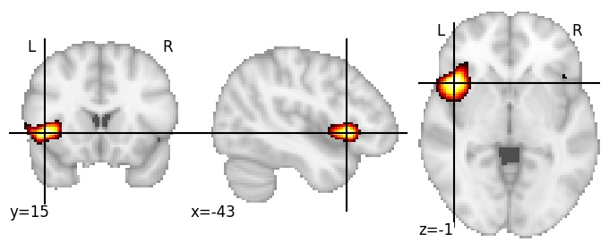

| **Lateral fissure anterior LH** identified on various resolutions |

| 512 resolution, the component index number is 248|  
|:---:|  
|  |

| 1024 resolution, the component index number is 493|  
|:---:|  
|  |

| 1024 resolution, the component index number is 493|  
|:---:|  
|  |