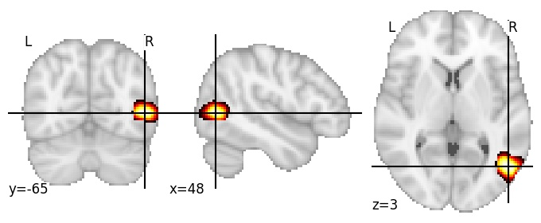
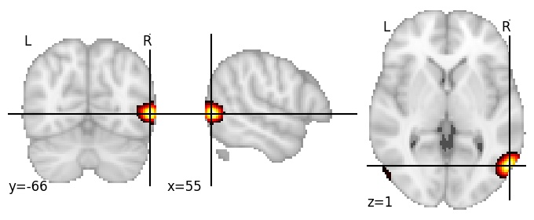

| **Lateral occipital cortex anterior RH** identified on various resolutions |

| 512 resolution, the component index number is 267|  
|:---:|  
|  |

| 1024 resolution, the component index number is 30|  
|:---:|  
|  |

| 1024 resolution, the component index number is 30|  
|:---:|  
|  |