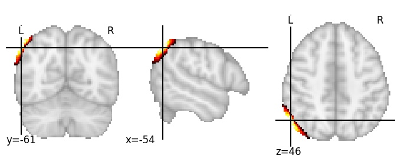

| **Lateral occipital cortex superior LH** identified on various resolutions |

| 512 resolution, the component index number is 153|  
|:---:|  
|  |

| 512 resolution, the component index number is 153|  
|:---:|  
|  |

| 1024 resolution, the component index number is 187|  
|:---:|  
|  |

| 1024 resolution, the component index number is 187|  
|:---:|  
|  |

| 1024 resolution, the component index number is 187|  
|:---:|  
|  |

| 1024 resolution, the component index number is 187|  
|:---:|  
|  |