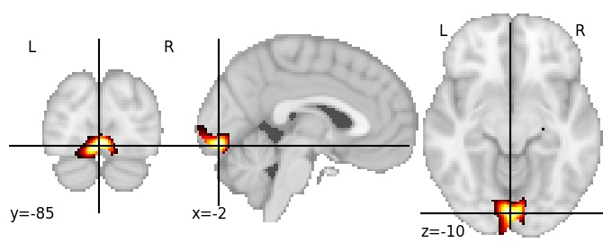
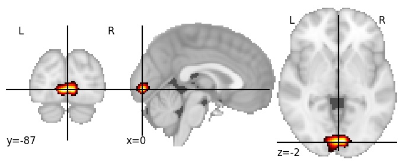

| **Lingual gyrus posterior** identified on various resolutions |

| 128 resolution, the component index number is 11|  
|:---:|  
|  |

| 512 resolution, the component index number is 51|  
|:---:|  
|  |

| 1024 resolution, the component index number is 620|  
|:---:|  
|  |