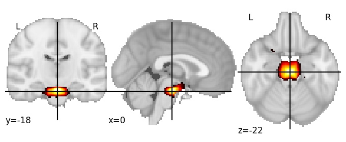
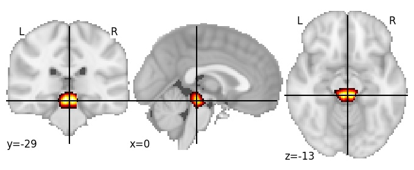

| **Midbrain** identified on various resolutions |

| 512 resolution, the component index number is 147|  
|:---:|  
|  |

| 512 resolution, the component index number is 147|  
|:---:|  
|  |

| 1024 resolution, the component index number is 745|  
|:---:|  
|  |