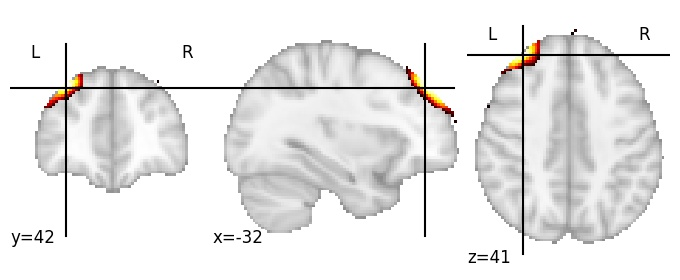

| **Middle frontal gyrus anterior LH** identified on various resolutions |

| 512 resolution, the component index number is 281|  
|:---:|  
|  |

| 512 resolution, the component index number is 281|  
|:---:|  
|  |

| 1024 resolution, the component index number is 108|  
|:---:|  
|  |

| 1024 resolution, the component index number is 108|  
|:---:|  
|  |

| 1024 resolution, the component index number is 108|  
|:---:|  
|  |