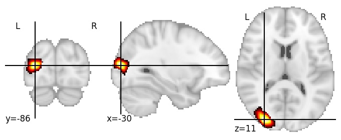

| **Middle occipital sulcus LH** identified on various resolutions |

| 512 resolution, the component index number is 277|  
|:---:|  
|  |

| 512 resolution, the component index number is 277|  
|:---:|  
|  |