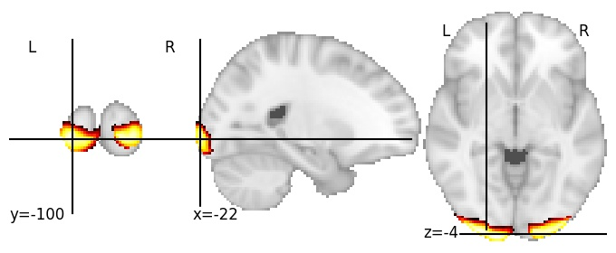

| **Occipital pole, inferior** identified on various resolutions |

| 128 resolution, the component index number is 115|  
|:---:|  
|  |

| 256 resolution, the component index number is 24|  
|:---:|  
|  |