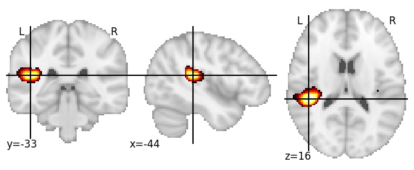

| **Parietal operculum LH** identified on various resolutions |

| 256 resolution, the component index number is 226|  
|:---:|  
|  |

| 512 resolution, the component index number is 294|  
|:---:|  
|  |

| 512 resolution, the component index number is 294|  
|:---:|  
|  |

| 1024 resolution, the component index number is 836|  
|:---:|  
|  |