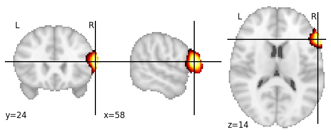
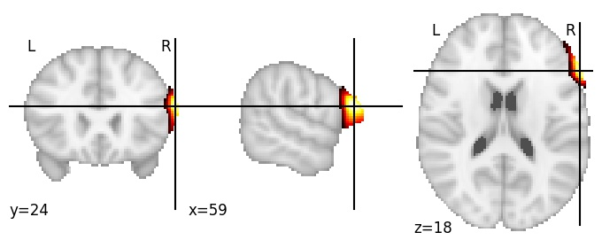

| **Pars triangularis RH** identified on various resolutions |

| 512 resolution, the component index number is 238|  
|:---:|  
|  |

| 1024 resolution, the component index number is 117|  
|:---:|  
|  |

| 1024 resolution, the component index number is 117|  
|:---:|  
|  |