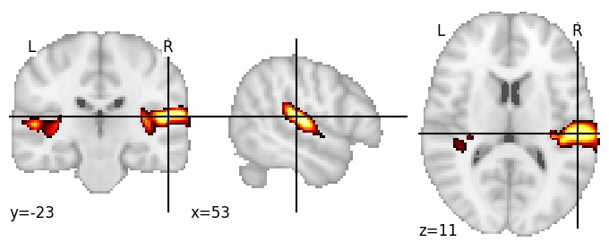
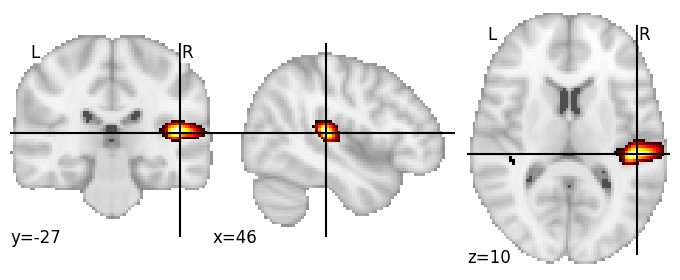

| **Planum temporale RH** identified on various resolutions |

| 128 resolution, the component index number is 67|  
|:---:|  
|  |

| 256 resolution, the component index number is 203|  
|:---:|  
|  |

| 1024 resolution, the component index number is 557|  
|:---:|  
|  |