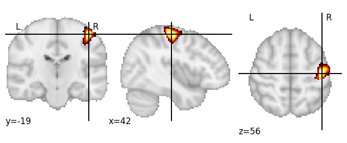
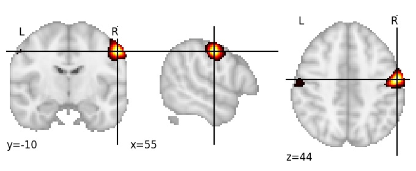

| **Postcentral gyrus middle RH** identified on various resolutions |

| 512 resolution, the component index number is 40|  
|:---:|  
|  |

| 512 resolution, the component index number is 40|  
|:---:|  
|  |

| 1024 resolution, the component index number is 635|  
|:---:|  
|  |

| 1024 resolution, the component index number is 635|  
|:---:|  
|  |