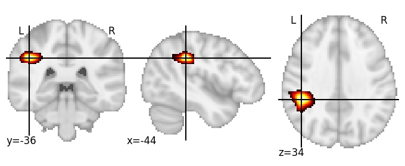

| **Postcentral sulcus inferior LH** identified on various resolutions |

| 512 resolution, the component index number is 371|  
|:---:|  
|  |

| 1024 resolution, the component index number is 197|  
|:---:|  
|  |

| 1024 resolution, the component index number is 197|  
|:---:|  
|  |