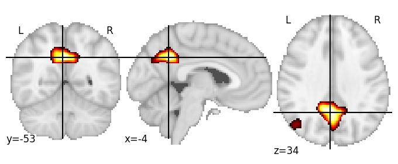
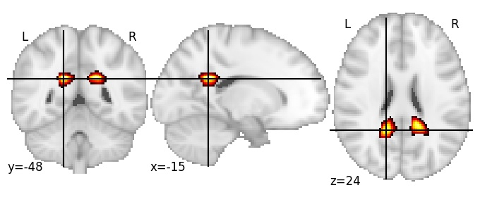

# **Posterior cingulate cortex**

| 64 resolution, the component index number is 3|
|:---:|
|  |

| 128 resolution, the component index number is 32|
|:---:|
|  |

| 256 resolution, the component index number is 14|
|:---:|
|  |

| 1024 resolution, the component index number is 27|
|:---:|
|  |
