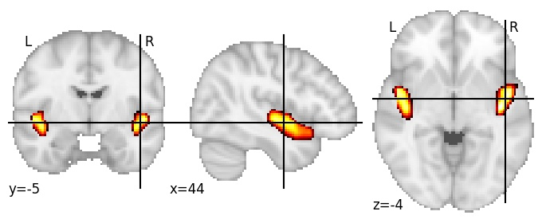

| **Posterior insula ventral** identified on various resolutions |

| 128 resolution, the component index number is 98|  
|:---:|  
|  |

| 1024 resolution, the component index number is 512|  
|:---:|  
|  |