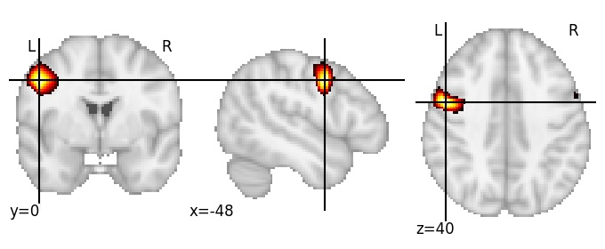
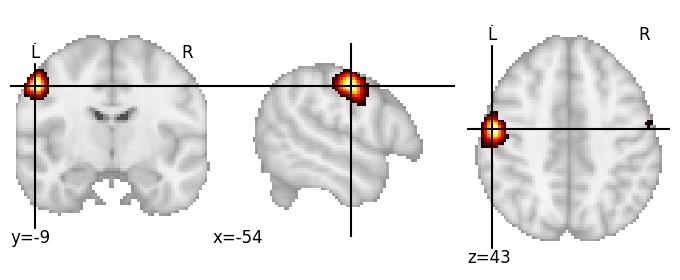

| **Precentral gyrus middle LH** identified on various resolutions |

| 512 resolution, the component index number is 168|  
|:---:|  
|  |

| 1024 resolution, the component index number is 435|  
|:---:|  
|  |

| 1024 resolution, the component index number is 435|  
|:---:|  
|  |

| 1024 resolution, the component index number is 435|  
|:---:|  
|  |