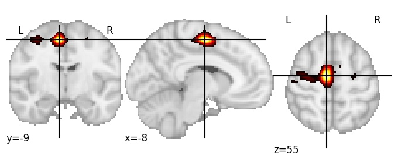

| **Precentral sulcus medial LH** identified on various resolutions |

| 1024 resolution, the component index number is 326|  
|:---:|  
|  |

| 1024 resolution, the component index number is 326|  
|:---:|  
|  |