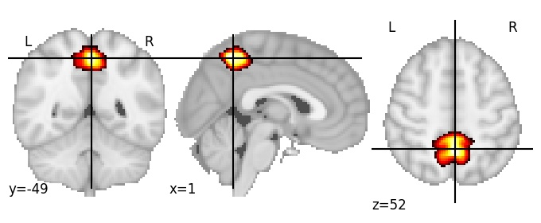
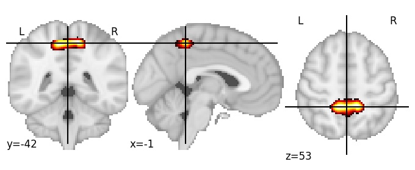
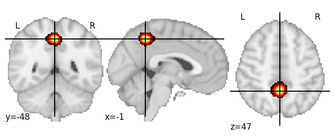

| **Precuneus anterior** identified on various resolutions |

| 128 resolution, the component index number is 91|  
|:---:|  
|  |

| 256 resolution, the component index number is 64|  
|:---:|  
|  |

| 512 resolution, the component index number is 142|  
|:---:|  
|  |

| 1024 resolution, the component index number is 902|  
|:---:|  
|  |