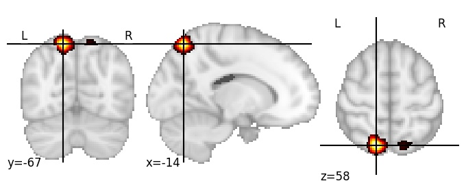

| **Precuneus posterior LH** identified on various resolutions |

| 1024 resolution, the component index number is 188|  
|:---:|  
|  |

| 1024 resolution, the component index number is 188|  
|:---:|  
|  |