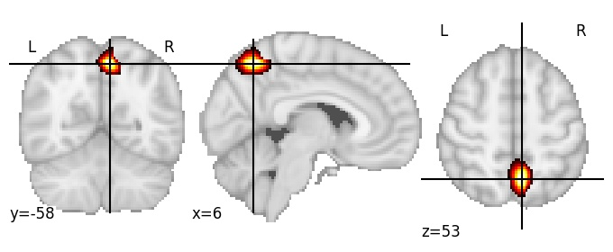

| **Precuneus superior RH** identified on various resolutions |

| 512 resolution, the component index number is 412|  
|:---:|  
|  |

| 1024 resolution, the component index number is 335|  
|:---:|  
|  |

| 1024 resolution, the component index number is 335|  
|:---:|  
|  |