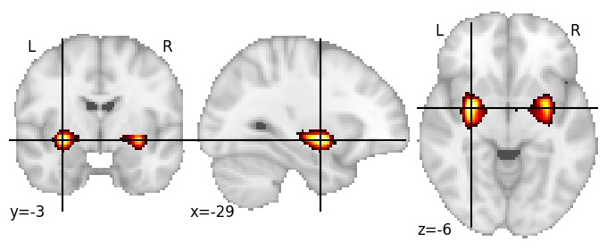

| **Putamen posterior** identified on various resolutions |

| 512 resolution, the component index number is 315|  
|:---:|  
|  |

| 512 resolution, the component index number is 315|  
|:---:|  
|  |